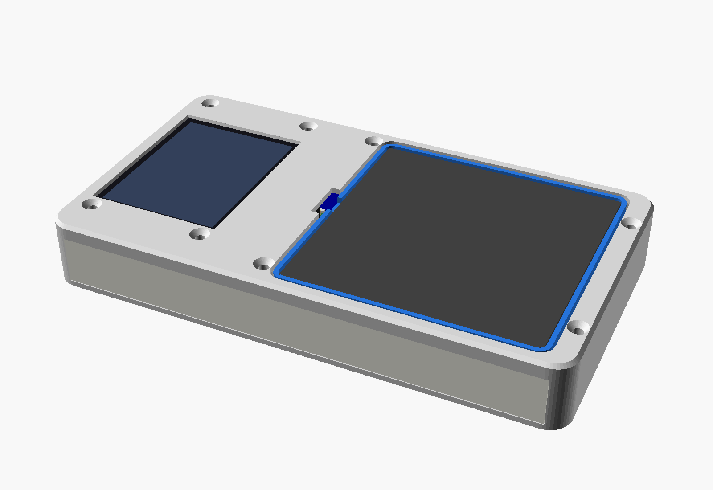
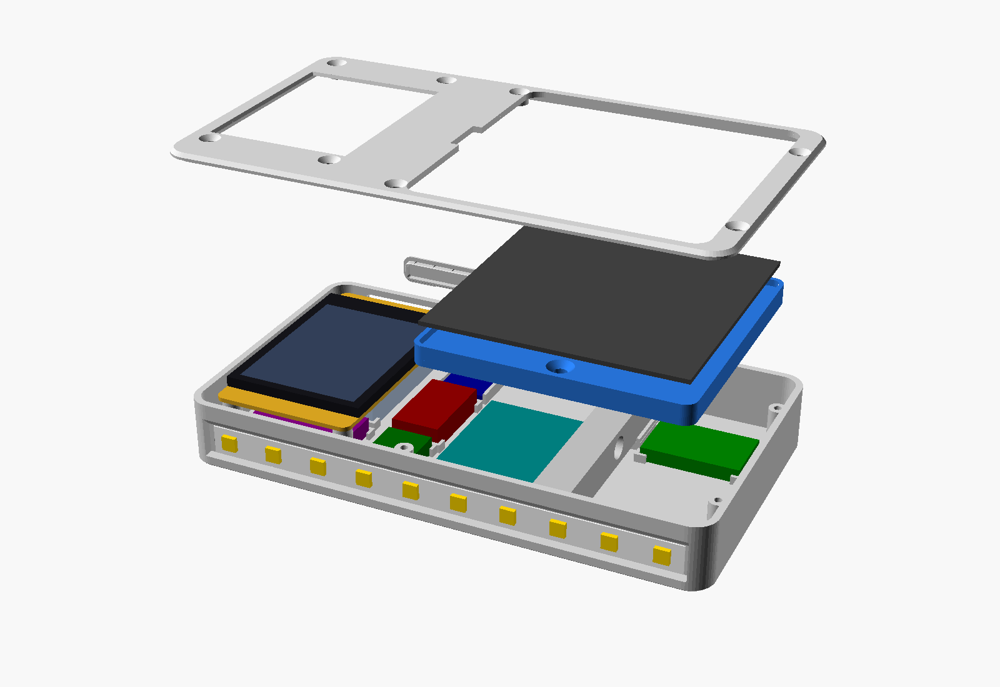
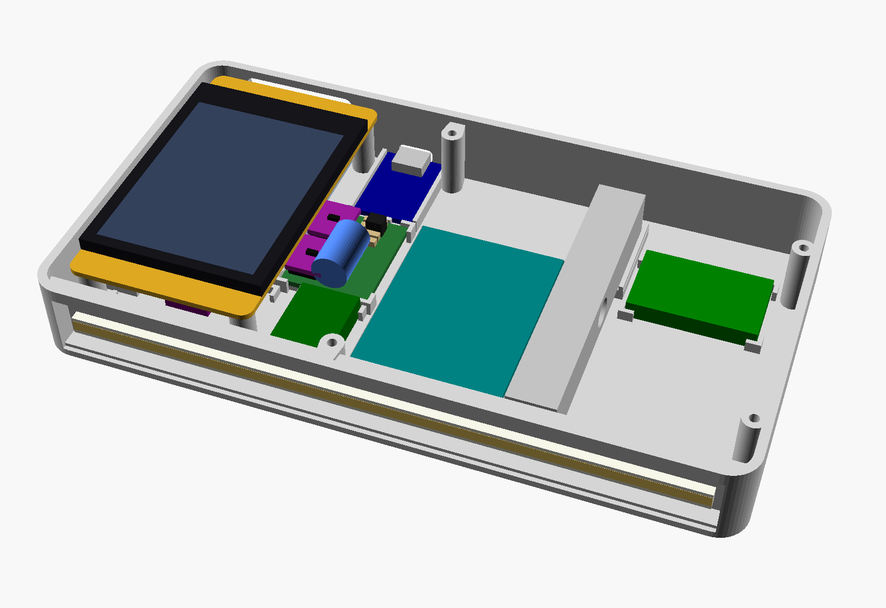

# 💧 HydroDesk Base

**Smarter Trinkmengen-Untersetzer für den Schreibtisch** – ESP32 mit Touch-Display, Wägezelle und LED-Leiste.
Schulprojekt im Ausbildungsberuf Fachinformatiker/-in für Anwendungsentwicklung (FI-AE), 2 Auszubildende.

HydroDesk Base ist ein flaches, rechteckiges Gerät (180 × 100 × 25 mm), auf das man **jede beliebige Wasserflasche** stellt.
Eine 5-kg-Wägezelle misst das Gewicht und rechnet es in getrunkene Milliliter um.
Das eingebaute 2,8"-Touch-Display zeigt Tagesziel, Fortschritt und Erinnerungen – eine LED-Leiste an der Vorderkante erinnert ans Trinken.



## ✨ Funktionen

- **Jede Flasche passt** – keine teure Smart-Flasche nötig
- **Gewicht → ml**: 5-kg-Wägezelle + HX711 unter einem schwimmend gelagerten 90 × 90 mm Flaschen-Pad
- **Touch-Presets** für die Flaschengröße: Leer / 300 / 500 / 750 / 1000 / 1500 ml / Voll
- **Tagesziel, Fortschritt und nächste Erinnerung** immer sichtbar auf dem Display
- **LED-Leiste (WS2812)** an der Vorderkante:
  - 🔵 blau = trinken
  - 🟢 grün = Ziel erreicht
  - 🔴 rot = Akku niedrig / Fehler
  - 🟠 amber = Wasser erkannt
- **Wasser-Sicherheitsabschaltung**: Regensensor + FET-Modul schalten bei Nässe den Strom ab → Sperrbildschirm **„WASSER ERKANNT · STROM AUS“**
- **Akkubetrieb**: LiPo 2000 mAh, Laden per USB-C (TC4056), 5-V-Step-up
- **Optional: Telegram-Bot** für Erinnerungen und Status (`/status`, `/ziel`, `/hilfe`)
- **3D-gedrucktes Gehäuse** (OpenSCAD, parametrisch, vier Teile: Bodenwanne, Deckel, Pad, steckbare USB-Abdeckkappe; ohne Stützmaterial druckbar)
- **Android-App** ([`app-android/`](app-android/)): Login (Supabase), Bluetooth-LE-Verbindung zum Gerät,
  Tagesziel aus Körperdaten, Verlauf mit Wochendiagramm, offline-fähig mit Sync, Admin-Übersicht, Demo-Modus

## 📐 Aufbau / Layout

```
+----------------------------------------------------------+
|  [ DISPLAY  ]  |  Mittel-  |  [                       ]  |
|  [ Hochform.]  |  streifen |  [   FLASCHEN-PAD 90x90  ]  |
|  [  2,8"    ]  |           |  [   (schwimmend auf der ]  |
|  [  Touch   ]  |           |  [    Wägezelle)         ]  |
+----------------------------------------------------------+
|  WS2812-LED-Leiste entlang der Vorderkante (10 LEDs)     |
```

- **Links:** ESP32-Touch-Display („Cheap Yellow Display“ ESP32-2432S028R) im Hochformat, darunter Akku und Step-up-Wandler
- **Mitte:** TC4056-USB-C-Lader an der Rückwand, FET-Schaltmodul, Auswertemodul des Regensensors
- **Rechts:** 90 × 90 mm Flaschen-Pad, liegt nur auf der Wägezelle (1 mm Spalt rundherum); darunter Wägezelle, HX711 und Regensensor
- **Hinten:** USB-Öffnungen – Programmier-Öffnung des CYD mit **steckbarer Abdeckkappe**, USB-C zum Laden offen; **vorne:** LED-Rille

| Explosionsansicht | Innenansicht ohne Deckel |
|---|---|
|  |  |

Details zu Druck, Schrauben und Zusammenbau: [`gehaeuse/ANLEITUNG.md`](gehaeuse/ANLEITUNG.md)

## 🧰 Hardware / Stückliste

Zusammenfassung aus der [Vorkalkulation](doku/Vorkalkulation_HydroDesk_Base.xlsx) (Preise Amazon.de, Stand Oktober 2026 – Preise können sich ändern).

| Pos. | Bauteil | Produkt | Packung | Preis |
|---:|---|---|---|---:|
| 1 | ESP32 + Touch-Display | Fastsaw ESP32 mit 2,8" ILI9341 Touch (ESP32-2432S028R, ASIN B0G1N16Q16) | 1 Stk. | 17,99 € |
| 2 | Wägezelle + Verstärker | DIYmalls Wägezelle 5 kg + HX711 | 1 Set | 8,97 € |
| 3 | LED-Leiste | BTF-LIGHTING WS2812 ECO, 1 m, 60 LED/m, 5 V | 1 m | 6,86 € |
| 4 | Feuchtigkeitssensor | Aihasd Regensensor LM393 | 2 Stk. | 5,99 € |
| 5 | Strom-Abschaltung | GERUI FET-Schaltmodul DC 5–36 V | 8 Stk. | 6,49 € |
| 6 | Akku | EEMB LiPo 3,7 V 2000 mAh | 1 Stk. | 10,99 € |
| 7 | Lademodul | TC4056 USB-C Lademodul mit Schutz | 10 Stk. | 6,99 € |
| 8 | Kabel | Elegoo Jumperkabel-Set | 1 Set | 6,99 € |
| 9 | Gummifüße | InLine Gummipuffer 12 mm, selbstklebend | 20 Stk. | 5,45 € |
| 10 | Flaschen-Pad | FICOFISE Silikonmatte 40 × 30 cm (auf 86 × 86 mm zuschneiden) | 1 Stk. | 7,59 € |
| 11 | Gehäuse-Material | SUNLU PLA 1,75 mm | 1 kg | 11,29 € |
| | **Summe Bauteile** | | | **≈ 95,60 €** |
| | Puffer 10 % (Verschnitt, Ersatz, Versand) | | | 9,56 € |
| | **Gesamt geplant** | | | **≈ 105,16 €** |

Hinweis: Für den Akkubetrieb wird zusätzlich ein 5-V-Step-up-Wandler (z. B. MT3608) benötigt (noch nicht eingepreist).
Dazu kommen Kleinteile (M3/M4/M5-Senkkopfschrauben), siehe [Anleitung](gehaeuse/ANLEITUNG.md#4-einkaufsliste-schrauben-und-kleinteile).

## 📁 Ordnerstruktur

```
hydrodesk-base/
├── doku/
│   ├── Steckbrief_HydroDesk_Base.docx      # Projekt-Steckbrief
│   └── Vorkalkulation_HydroDesk_Base.xlsx  # Kostenkalkulation / Stückliste
├── design/
│   ├── claude_design_prompt_aufbau.md      # Prompt für Aufbau-/Teile-Illustrationen
│   ├── visualisierung/                     # Gerenderte Bilder: Explosion, Innen, Teile, Produkt
│   └── 3d_modell/                          # Komplettes 3D-Modell (GLB/STL/3MF) zum Anschauen
├── gehaeuse/
│   ├── hydrodesk_base.scad                 # Parametrisches OpenSCAD-Modell
│   ├── ANLEITUNG.md                        # Druck- und Montageanleitung
│   ├── QUELLEN.md                          # Quellen der Bauteil-Maße
│   ├── render.sh                           # Erzeugt die Vorschaubilder neu
│   ├── stl/                                # Druckfertige Teile: base, cover, pad, kappe_usb
│   └── preview/                            # Vorschaubilder
├── firmware/                               # PlatformIO-Firmware (folgt)
│   └── secrets.example.h                   # Vorlage für Zugangsdaten
├── wokwi/                                  # Wokwi-Simulation (Sketch, Diagramm, Anleitung)
├── app-android/                            # Android-App (Kotlin, Compose) – eigene Anleitung
│   ├── README.md                           # Einrichtung Schritt für Schritt (Supabase, Android Studio)
│   └── supabase/schema.sql                 # Datenbank-Schema mit Row Level Security
├── LICENSE
└── README.md
```

## 🗺️ Status / Roadmap

| Schritt | Status |
|---|---|
| Steckbrief | ✅ fertig |
| Vorkalkulation | ✅ fertig |
| Gehäuse-CAD (OpenSCAD, STL) | ✅ fertig |
| Wokwi-Simulation | ✅ Version 3 fertig (kompiliert, PC-Logiktest OK, auf wokwi.com testen) – inkl. Bluetooth-Symbol und LED-Status |
| Android-App (Kotlin, Compose, Supabase) | ✅ Version 1.0 – baut (`assembleDebug`), Unit-Tests grün, Demo-Modus; BLE mit echtem Gerät noch zu testen – siehe [`app-android/README.md`](app-android/README.md) |
| Firmware (PlatformIO) | ⏳ offen |
| Bau / Integration / Tests | ⏳ offen |

## 🔐 Zugangsdaten

WLAN-Daten und der optionale Telegram-Bot-Token kommen in `firmware/secrets.h` – diese Datei ist per `.gitignore` ausgeschlossen.
Als Vorlage dient [`firmware/secrets.example.h`](firmware/secrets.example.h).

Supabase-URL und -Key der App kommen in `app-android/local.properties` (ebenfalls nicht im Git),
Vorlage: [`app-android/local.properties.example`](app-android/local.properties.example).

## 👥 Team

| Person | Schwerpunkt |
|---|---|
| Person A | Hardware, Verkabelung, Wägezelle (HX711), Feuchtigkeitssensor, Stromversorgung, Gehäuse (CAD + 3D-Druck), Zustandsautomat |
| Person B | Touch-Display und Bedienoberfläche, WLAN/NTP, optionale Telegram-Anbindung, Kalibrierungs- und Preset-Logik, Doku-Leitung |

Gemeinsam: Planung, Integration, Tests, Bericht, Präsentation.

## 📄 Lizenz

[MIT](LICENSE) © 2026 bekuz007

Die Maßzeichnungen und Datenblätter Dritter, die für die Konstruktion verwendet wurden, sind nicht Teil dieses Repositorys – siehe [`gehaeuse/QUELLEN.md`](gehaeuse/QUELLEN.md).
