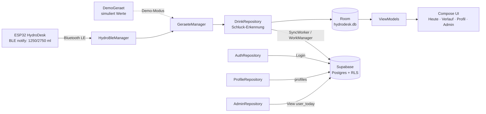
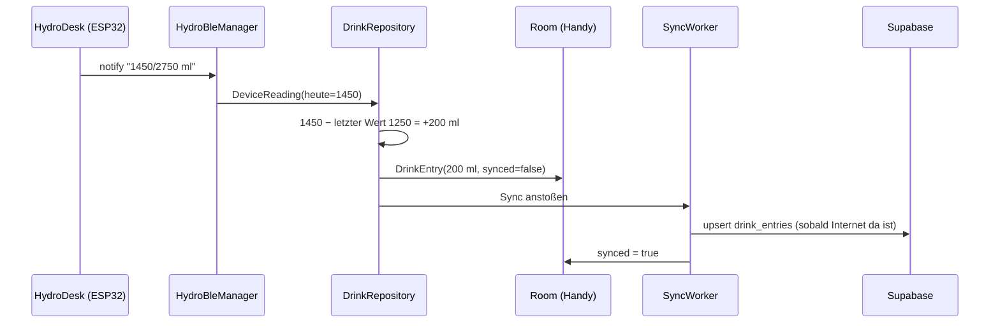

# 📱 HydroDesk App (Android)

Begleit-App zum **HydroDesk Base**: Das ESP32-Gerät misst mit einer Wägezelle, wie viel du aus deiner
Flasche trinkst, und schickt den Tagesstand per **Bluetooth Low Energy (BLE)** ans Handy.
Die App speichert jeden Schluck, zeigt Fortschritt und Verlauf und synchronisiert alles mit **Supabase**
(Login + Cloud-Datenbank).

> Schulprojekt FI-AE · Kotlin · Jetpack Compose (Material 3) · MVVM · Room · WorkManager · Supabase

---

## Inhalt

1. [Was kann die App?](#1-was-kann-die-app)
2. [Architektur](#2-architektur)
3. [Projektstruktur](#3-projektstruktur)
4. [Einrichtung Schritt für Schritt](#4-einrichtung-schritt-für-schritt)
5. [Testen mit dem ESP32](#5-testen-mit-dem-esp32)
6. [Testen ohne Hardware: Demo-Modus](#6-testen-ohne-hardware-demo-modus)
7. [Admin: zentrale Verwaltung](#7-admin-zentrale-verwaltung)
8. [So funktioniert es (Erklärungen)](#8-so-funktioniert-es-erklärungen)
9. [Test-Checkliste](#9-test-checkliste)
10. [Fehlerbehebung](#10-fehlerbehebung)
11. [Versionen](#11-versionen)

---

## 1. Was kann die App?

| Bildschirm | Inhalt |
|---|---|
| **Anmelden / Registrieren** | E-Mail + Passwort (Supabase Auth). Die Sitzung bleibt gespeichert – nach dem Neustart ist man weiter angemeldet. Zusätzlich „Ohne Konto testen“ (nur lokal, ohne Supabase). |
| **Heute** | Große Anzeige *heute getrunken / Tagesziel* mit Fortschrittsring, „noch … ml“ bzw. „Ziel erreicht ✓“, Bluetooth-Status (**Suchen … / Verbunden / Getrennt**), Taste *Verbinden/Trennen*, letzter Schluck und Liste der heutigen Schlucke, Sync-Status. |
| **Verlauf** | Balkendiagramm der letzten 7 Tage (selbst gezeichnet mit Compose `Canvas`, gestrichelte Ziel-Linie) und Liste pro Tag (30 Tage) mit Summe, Anzahl Schlucke, Fortschrittsbalken. |
| **Profil** | Name, Gewicht (kg), Größe (cm) → **Tagesziel wird live berechnet** (gleiche Formel wie die Firmware). Demo-Modus-Schalter, „Jetzt synchronisieren“, Abmelden. |
| **Admin** (nur Rolle `admin`) | Alle Nutzer mit heutiger Trinkmenge und Ziel. |

**Tagesziel** (wie in `wokwi/sketch.ino`, Funktion `zielBerechnen()`):

```
Körperoberfläche (Mosteller)  KOF = √(cm × kg / 3600)
Tagesziel                    = KOF × 1500 ml, auf 50 ml gerundet, Grenzen 1500 … 3500 ml
Beispiel: 70 kg, 175 cm  →  KOF 1,845 m²  →  2767 ml  →  2750 ml
```

*Richtwert, keine medizinische Empfehlung.*

---

## 2. Architektur

Einfaches **MVVM** (Model – View – ViewModel) mit Repositories und „manueller Dependency Injection“
(`AppContainer` erzeugt alle Objekte genau einmal – kein Hilt nötig).



**Datenfluss bei einem Schluck:**



---

## 3. Projektstruktur

```
app-android/
├── README.md                     ← diese Anleitung
├── local.properties.example      ← Vorlage für Supabase-URL + Key
├── supabase/schema.sql           ← Tabellen, RLS, Trigger, Views (im SQL Editor ausführen)
├── build.gradle.kts, settings.gradle.kts, gradle/libs.versions.toml  ← Build + Versionen
├── gradlew, gradle/wrapper/      ← Gradle-Wrapper (Android Studio nutzt ihn automatisch)
└── app/
    ├── build.gradle.kts          ← liest local.properties → BuildConfig
    └── src/main/java/de/hydrodesk/app/
        ├── HydroDeskApp.kt       ← Application, erzeugt den AppContainer
        ├── AppContainer.kt       ← „manuelle DI“: alle Repositories an einer Stelle
        ├── MainActivity.kt
        ├── domain/               ← GoalCalculator (Tagesziel), Formatierung
        ├── ble/                  ← BLE-Verbindung, Parser, Demo-Gerät, Berechtigungen
        ├── data/local/           ← Room: DrinkEntry, DailySummary, DrinkDao, AppDatabase
        ├── data/remote/          ← Supabase-Client + DTOs
        ├── data/repository/      ← Auth-, Profile-, Drink-, Admin-Repository
        ├── data/settings/        ← kleine Einstellungen (SharedPreferences)
        ├── sync/SyncWorker.kt    ← Hochladen im Hintergrund (WorkManager)
        └── ui/                   ← Compose-Bildschirme + ViewModels (auth, today, history, profile, admin)
    └── src/test/                 ← Unit-Tests (Tagesziel, BLE-Parser)
```

---

## 4. Einrichtung Schritt für Schritt

### Voraussetzungen

* **Android Studio** in einer aktuellen Version (mindestens **Quail 4 | 2026.1.4**, empfohlen die neueste),
  Download: <https://developer.android.com/studio> – auf dem MacBook Air M2 die Version **„Mac with Apple chip“**.
  Ein JDK ist in Android Studio schon enthalten.
* Ein **echtes Android-Handy** (Android 8.0 oder neuer) mit USB-Kabel.
  ⚠️ Der Android-Emulator kann **kein Bluetooth LE** – dort nur der Demo-Modus.
* Ein kostenloses **Supabase**-Konto: <https://supabase.com>

### Schritt 1 – Supabase-Projekt anlegen

1. Auf <https://supabase.com> anmelden (z. B. mit GitHub) → **New project**.
2. Name z. B. `hydrodesk`, ein **Datenbank-Passwort** vergeben (gut aufheben), Region **Frankfurt (eu-central-1)**.
3. **Create new project** – nach ca. 1–2 Minuten ist das Projekt bereit.

### Schritt 2 – Datenbank-Schema einspielen

1. Im Projekt links **SQL Editor** öffnen → **New query**.
2. Den kompletten Inhalt von [`supabase/schema.sql`](supabase/schema.sql) hineinkopieren → **Run**.
3. Kontrolle: links **Table Editor** → es gibt die Tabellen `profiles` und `drink_entries`
   (beide mit „RLS enabled“) und die Views `daily_totals` und `user_today`.

Das Skript darf man gefahrlos mehrmals ausführen.

### Schritt 3 – E-Mail-Bestätigung (wichtig!)

Supabase verlangt standardmäßig, dass neue Nutzer ihre E-Mail über einen Link bestätigen.

* **Für das Schulprojekt / Tests einfacher:** *Authentication → Sign In / Providers → Email* →
  **„Confirm email“ ausschalten** → Save. Dann ist man nach dem Registrieren sofort angemeldet.
* **Lässt man es an:** Nach dem Registrieren zeigt die App „Bitte den Bestätigungslink in der E-Mail öffnen“.
  Link öffnen (die Seite danach darf ruhig „localhost“ anzeigen), dann in der App **anmelden**.
  Hinweis: Der kostenlose Supabase-Mailversand ist auf wenige Mails pro Stunde begrenzt.

### Schritt 4 – URL und Key in `local.properties` eintragen

1. In Supabase: **Project Settings → API Keys** (bzw. **Data API**):
   * **Project URL**, z. B. `https://abcdefghijkl.supabase.co`
   * **anon / public** Key (beginnt mit `eyJ…`) **oder** der neue **Publishable key** (`sb_publishable_…`) – beide funktionieren.
   * ⚠️ **Niemals** den `service_role`- bzw. *Secret*-Key in die App eintragen!
2. Im Ordner `app-android/` die Datei `local.properties.example` kopieren und `local.properties` nennen:

   ```bash
   cd app-android
   cp local.properties.example local.properties
   ```
3. `local.properties` öffnen und die Werte eintragen:

   ```properties
   SUPABASE_URL=https://abcdefghijkl.supabase.co
   SUPABASE_ANON_KEY=eyJhbGciOi...
   ```

`local.properties` steht in der `.gitignore` und landet **nicht** auf GitHub. Android Studio ergänzt dort
beim ersten Öffnen selbst die Zeile `sdk.dir=…` – die eigenen Zeilen bleiben erhalten.
Nach jeder Änderung an `local.properties` die App **neu bauen** (die Werte werden beim Bauen in `BuildConfig` geschrieben).

### Schritt 5 – Projekt in Android Studio öffnen

1. Android Studio starten → **Open** → den Ordner **`app-android`** auswählen (nicht den ganzen Repo-Ordner!).
2. Android Studio führt automatisch den **Gradle Sync** aus (beim ersten Mal einige Minuten, lädt Gradle und Bibliotheken).
3. Falls Android Studio fehlende SDK-Pakete meldet (z. B. *Android SDK Platform 37*): auf den Link
   **„Install missing …“** klicken.
4. Fehlerfrei? Unten in der Leiste steht „Gradle sync finished“.

### Schritt 6 – App auf dem Handy starten

1. Am Handy die **Entwickleroptionen** freischalten: *Einstellungen → Über das Telefon → 7× auf „Build-Nummer“ tippen*.
2. *Einstellungen → System → Entwickleroptionen →* **USB-Debugging** einschalten.
3. Handy per USB an den Mac, Abfrage „USB-Debugging zulassen?“ mit **Zulassen** bestätigen.
4. In Android Studio oben das Handy auswählen und auf ▶ **Run 'app'** klicken.
5. In der App **Registrieren** (Name, E-Mail, Passwort ≥ 6 Zeichen).
6. **Profil** öffnen: Gewicht und Größe eintragen → **Speichern** → das Tagesziel erscheint auf „Heute“.

Alternativ ohne Android Studio: `./gradlew assembleDebug` erzeugt `app/build/outputs/apk/debug/app-debug.apk`.

---

## 5. Testen mit dem ESP32

1. Firmware mit **echtem BLE** bauen: in `wokwi/sketch.ino` (bzw. der späteren PlatformIO-Firmware)
   `HYDRO_CYD 1` und `HYDRO_BLE 1`, Bibliothek **NimBLE-Arduino**, Partition **Huge APP**
   (Details: [`../firmware/README.md`](../firmware/README.md)).
2. ESP32 einschalten – er ist **2 Minuten lang sichtbar** (LEDs blinken weiß, BT-Symbol blinkt).
3. In der App auf **Heute → Verbinden**. Beim ersten Mal fragt Android nach der Berechtigung
   **„Geräte in der Nähe“** (Android 12+) bzw. **Standort** (Android 8–11) → erlauben.
   Bei Android 8–11 muss außerdem der **Standort (GPS) eingeschaltet** sein, sonst findet der Scan nichts.
4. Status wechselt **Suchen … → Verbinden … → Verbunden**, der ESP32 blinkt 2× lila.
5. Flasche anheben, trinken, zurückstellen → nach ca. 2 s erscheint der Schluck in der App.

**Technische Daten (müssen zur Firmware passen):**

| | Wert |
|---|---|
| Gerätename | `HydroDesk` |
| Dienst (Service) UUID | `4f9a0001-6c1e-4b8e-9d6a-2b7c1e0a4d10` |
| Characteristic UUID | `4f9a0002-6c1e-4b8e-9d6a-2b7c1e0a4d10` (read + notify) |
| Inhalt | Text `heute/Ziel ml`, z. B. `1250/2750 ml` – notify bei Änderung, höchstens 1× pro Sekunde |
| Ebenfalls verstanden | JSON `{"heute":1250,"ziel":2750,"akku":88}` (für eine mögliche spätere Firmware) |

Die App scannt nach der Dienst-UUID **oder** dem Namen. Wird nichts gefunden, versucht sie es alle 15 s
erneut; nach einer Trennung verbindet sie nach 3 s automatisch neu (solange man nicht „Trennen“ gedrückt hat).
Ist das 2-Minuten-Fenster des ESP32 abgelaufen: ESP32 kurz neu starten oder per Serial `bt suchen` senden.

---

## 6. Testen ohne Hardware: Demo-Modus

Für Vorführungen in der Schule oder im Emulator:

1. **Profil → Demo-Modus** einschalten.
2. Auf **Heute** steht „Verbunden (Demo)“. Alle 15–40 s wird zufällig ein Schluck (50–300 ml) simuliert,
   zusätzlich gibt es die Taste **„Schluck simulieren (+200 ml)“**.
3. Die Demo-Werte laufen durch **denselben Parser und dieselbe Schluck-Erkennung** wie echte BLE-Daten
   und werden mit Quelle `Demo` gespeichert und synchronisiert.

Ganz ohne Supabase: auf dem Login-Bildschirm **„Ohne Konto testen“** – dann werden die Daten nur
auf dem Handy gespeichert (kein Sync, kein Admin).

---

## 7. Admin: zentrale Verwaltung

**Alles verwalten im Supabase-Dashboard:**

* **Table Editor → `profiles`**: Nutzer, Körperdaten, Tagesziel, Rolle ansehen und ändern.
* **Table Editor → `drink_entries`**: alle Trink-Einträge ansehen, korrigieren, löschen.
* **Authentication → Users**: Konten anlegen, sperren, löschen, Passwort-Reset schicken
  (beim Löschen eines Kontos werden Profil und Einträge automatisch mitgelöscht – `on delete cascade`).
* Das Dashboard umgeht die Row Level Security – dort sieht man immer alles.

**Sich selbst zum Admin machen** (SQL Editor, E-Mail anpassen):

```sql
update public.profiles set role = 'admin' where email = 'deine@mail.de';
```

Danach in der App unter **Profil** (evtl. App neu starten) die Taste **„Admin: alle Nutzer anzeigen“** →
Liste aller Nutzer mit heutiger Trinkmenge. Zurück zum normalen Nutzer: `set role = 'user'`.

**Sicherheit (Row Level Security, siehe `schema.sql`):**

| Wer | `profiles` | `drink_entries` |
|---|---|---|
| nicht angemeldet (`anon`) | nichts | nichts |
| Nutzer | eigene Zeile lesen/anlegen/ändern | eigene Zeilen lesen/anlegen/ändern/löschen |
| Admin | **alle lesen**, eigene ändern | **alle lesen**, eigene ändern |
| Dashboard / SQL Editor | alles | alles |

* Die Funktion `is_admin()` ist `security definer` – sonst würde die Policy auf `profiles` beim Prüfen
  der Rolle wieder `profiles` lesen (Endlos-Rekursion).
* Ein Trigger verhindert, dass sich ein Nutzer selbst `role = 'admin'` setzt.
* Die Views `daily_totals` und `user_today` sind `security_invoker` – sie halten sich an dieselben Regeln.
* Das Schema wurde vor dem Commit mit PostgreSQL 17 getestet (Supabase-`auth` nachgebildet):
  Selbst-Beförderung geblockt, fremde Einträge geblockt, doppeltes Hochladen ignoriert, Admin sieht alle.

---

## 8. So funktioniert es (Erklärungen)

### Schluck-Erkennung

Das Gerät schickt immer nur den **Tagesstand** („heute 1450 ml“). Die App merkt sich den letzten Wert:

* **Wert steigt** (1250 → 1450): neuer Eintrag mit **+200 ml**.
* **Erster Wert des Tages / nach dem Verbinden:** Vergleich mit der Summe, die für dieses Gerät heute schon
  gespeichert ist. Was ohne Verbindung getrunken wurde, wird so **als ein Eintrag nachgetragen**.
* **Wert sinkt** (Gerät zurückgesetzt, z. B. Serial-Befehl `reset`): nur neuer Ausgangswert, kein Eintrag.
* Änderungen unter 5 ml werden ignoriert.

### Offline-first + Synchronisierung

1. Jeder Schluck wird **zuerst lokal** in Room gespeichert (`synced = false`) – funktioniert auch ohne Internet.
2. Danach wird der **SyncWorker** (WorkManager) angestoßen. Er läuft, **sobald Internet da ist**, lädt alle
   offenen Einträge hoch (`upsert` mit derselben UUID → keine Duplikate) und setzt `synced = true`.
3. Außerdem holt er die Einträge der letzten 30 Tage aus Supabase (z. B. nach einem Handywechsel).
4. Zusätzlich läuft der Abgleich stündlich im Hintergrund.

Auf „Heute“ zeigt ein ⟳ hinter einem Eintrag, dass er noch nicht hochgeladen ist.

### Geheimnisse

`SUPABASE_URL` und `SUPABASE_ANON_KEY` stehen nur in `local.properties` (nicht im Git) und werden beim Bauen
nach `BuildConfig` geschrieben (`app/build.gradle.kts`). Der anon-Key darf in einer App stehen –
geschützt werden die Daten durch die **Row Level Security**, nicht durch den Key.

---

## 9. Test-Checkliste

**Build**
- [ ] Projekt in Android Studio geöffnet, Gradle Sync ohne Fehler
- [ ] `./gradlew test` – Unit-Tests (Tagesziel, BLE-Parser) grün
- [ ] App startet auf dem Handy

**Login / Konto**
- [ ] Registrieren mit neuer E-Mail → angemeldet (bzw. Bestätigungs-Hinweis)
- [ ] In Supabase *Table Editor → profiles* gibt es die neue Zeile mit Name und E-Mail
- [ ] Falsches Passwort → Meldung „E-Mail oder Passwort ist falsch.“
- [ ] App schließen und neu öffnen → weiterhin angemeldet
- [ ] Abmelden → Login-Bildschirm

**Profil**
- [ ] 70 kg / 175 cm → Vorschau „Tagesziel: 2.750 ml“
- [ ] Speichern → Meldung, Ziel erscheint auf „Heute“, in Supabase `daily_goal_ml = 2750`
- [ ] Ungültige Werte (z. B. 20 kg) → Fehlermeldung

**Demo-Modus**
- [ ] Demo an → „Verbunden (Demo)“, „Schluck simulieren“ → +200 ml auf „Heute“
- [ ] Neuer Eintrag erscheint in Supabase `drink_entries` (Quelle `Demo`)
- [ ] Flugmodus an → Schluck simulieren → ⟳ beim Eintrag → Flugmodus aus → ⟳ verschwindet

**Bluetooth (echtes Gerät)**
- [ ] Erste Verbindung fragt nach Berechtigung; nach „Zulassen“ Status „Suchen …“
- [ ] Status „Verbunden“, „Gerät meldet: …“ zeigt den Text vom ESP32
- [ ] Trinken am Gerät → neuer Eintrag mit der richtigen Menge
- [ ] ESP32 ausschalten → „Getrennt“, wieder einschalten → automatisch „Verbunden“
- [ ] Bluetooth am Handy aus → „Bluetooth ist aus“, Taste „Bluetooth einschalten“ funktioniert
- [ ] Ohne Verbindung trinken, dann verbinden → Menge wird nachgetragen

**Verlauf**
- [ ] Balken für heute passt zur Anzeige auf „Heute“, Ziel-Linie sichtbar, grün bei erreichtem Ziel
- [ ] Liste zeigt Tage mit Summe und Anzahl

**Admin**
- [ ] Normaler Nutzer: keine Admin-Taste
- [ ] Nach `update profiles set role='admin' …` + App-Neustart: Admin-Taste, Liste zeigt alle Nutzer
- [ ] Zweites Konto sieht die Einträge des ersten **nicht**

---

## 10. Fehlerbehebung

| Problem | Lösung |
|---|---|
| „Supabase ist noch nicht eingerichtet“ | `local.properties` fehlt oder enthält noch die Platzhalter. Eintragen, dann **Build → Rebuild Project**. |
| „Keine Verbindung zum Server“ | Internet am Handy prüfen; URL in `local.properties` korrekt (mit `https://`)? |
| „E-Mail noch nicht bestätigt“ | Link in der Mail öffnen oder in Supabase „Confirm email“ ausschalten (Schritt 3). |
| Profil speichern: „nicht in Supabase“ | `schema.sql` ausgeführt? Fehlermeldung genau lesen (z. B. „relation profiles does not exist“). |
| Status bleibt „Suchen …“ | ESP32 erst nach dem Einschalten 2 min sichtbar → neu starten. Firmware mit `HYDRO_BLE 1` gebaut? Android 8–11: Standort einschalten. |
| „Keine Berechtigung“ | Taste „App-Einstellungen öffnen“ → Berechtigungen → „Geräte in der Nähe“ erlauben. |
| Gradle Sync: „requires a newer Android Studio“ | Android Studio aktualisieren (mind. Quail 4 / 2026.1.4). |
| Gradle Sync: SDK fehlt | Den angebotenen Link „Install missing SDK package(s)“ anklicken. |

Logs ansehen: Android Studio → **Logcat**, Filter `tag:HydroBle | tag:DrinkRepository`.

---

## 11. Versionen

Stand Oktober 2026 (jeweils aktuelle stabile Versionen, alle in `gradle/libs.versions.toml`):

| Komponente | Version |
|---|---|
| Android Gradle Plugin | 9.4.1 (Kotlin ist eingebaut) |
| Gradle (Wrapper) | 9.8.0 |
| Kotlin / Compose-Compiler | 2.4.20 |
| KSP (für Room) | 2.3.12 |
| Compose BOM | 2026.09.00 (Material 3 1.4.0) |
| Room | 2.8.5 |
| WorkManager | 2.12.0 |
| Navigation Compose | 2.10.2 |
| Lifecycle | 2.11.0 |
| supabase-kt (auth-kt, postgrest-kt) | 3.8.0 |
| Ktor Client (OkHttp) | 3.6.0 |
| kotlinx.serialization | 1.11.0 |
| compileSdk / targetSdk / minSdk | 37 / 37 / 26 (Android 8.0) |
| JDK | 17 (oder das in Android Studio enthaltene JDK) |

### Bekannte Grenzen / Ideen für später

* Die BLE-Verbindung lebt, solange die App läuft (kein Vordergrund-Dienst). Das ist unkritisch:
  Der ESP32 zählt selbst weiter, beim nächsten Verbinden werden fehlende ml nachgetragen.
* Das Tagesziel wird (noch) nicht ans Gerät übertragen – dafür bräuchte die Firmware eine
  beschreibbare Characteristic.
* Einträge können in der App nicht gelöscht werden (geht im Supabase-Dashboard).
