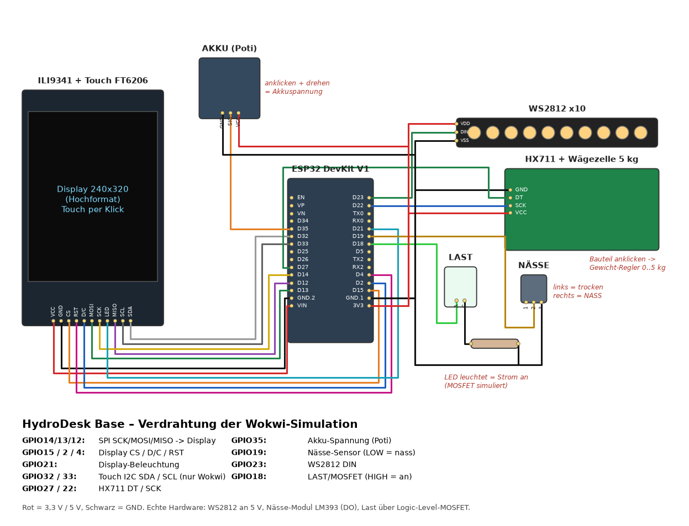
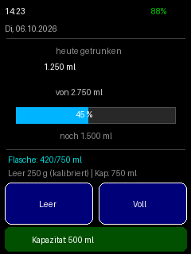
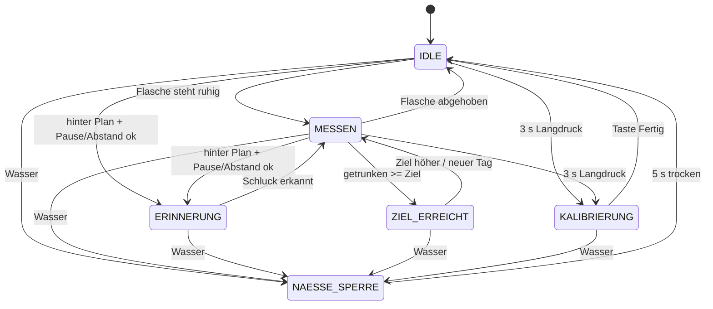

# HydroDesk Base – Wokwi-Simulation (ESP32) · Version 3

Mit dieser Simulation könnt ihr die komplette Logik von **HydroDesk Base** im Browser testen,
**bevor** ihr Teile kauft. Ihr braucht nur einen Browser und die Seite **wokwi.com**.

**Neu in Version 3 (Erinnerung + Flaschen-Kalibrierung):**

- **Erinnerungslogik:** Nach einem Schluck von ≥100 ml (im ~10-min-Fenster) startet eine
  **75-min-Pause** (keine Erinnerung, kein blaues LED, kein Telegram-Stub). Schlucke unter
  40 ml zählen zum Tagesstand, setzen die Pause aber nicht. Erinnerung nur, wenn ihr
  **hinter dem Tagesplan** liegt, die Pause vorbei ist, der Mindestabstand (90 min) eingehalten
  ist, höchstens 6×/Tag, und **außerhalb der Ruhezeit 22:00–07:00**. Plan: bis 12:00 ≈40 %,
  bis 16:00 ≈70 %, bis 20:00 (ca. 2 h vor Ruhezeit) 100 % des Ziels.
- **Wokwi-Demo-Zeiten:** `#define WOKWI_DEMO_ERINNERUNG 1` (Standard in der Simulation) nutzt
  kurze Zeiten (Pause 90 s, Abstand 60 s, Fenster 20 s), damit Tests machbar sind. Auf dem
  echten Gerät: `WOKWI_DEMO_ERINNERUNG 0` → lange Zeiten. Der alte ~30-s-Trigger ist entfernt.
- **Flaschen-Kalibrierung:** Service-Modus (3 s Langdruck oder Serial `kalib`):
  „Leere Flasche aufstellen“ → bestätigen (`leer` / Taste / 3 s) → „Volle Flasche aufstellen“
  → bestätigen (`voll`) → Anzeige „Kapazität: X ml“. Leergewicht und Kapazität werden in
  Preferences gespeichert und haben Vorrang vor dem automatischen Lernen.
- **Bluetooth-Symbol** und LED-Status wie bisher (Suchen weiß, verbunden 2× lila). Wokwi:
  `bt suchen` / `bt verbunden` / `bt getrennt` / `bt aus`. Echtes BLE: `HYDRO_BLE 1`.

**Neu in Version 2:**

- **Keine Tasten** mehr auf dem Hauptbildschirm. Den Flascheninhalt rechnet das Gerät selbst aus,
  das Leergewicht der Flasche **lernt** es automatisch.
- Das **Tagesziel** wird aus Körpergewicht und Körpergröße berechnet (Mosteller-Formel).
- **Neues Hochformat-Layout** mit Uhrzeit, Datum, Akku, Menge, Fortschritt, Flasche und Erinnerung.
- **Echte Uhrzeit** über WLAN + NTP, mit automatischem Reset um Mitternacht.
- **LEDs ruhig:** im Normalbetrieb aus, bei Ereignissen Dauerlicht. Nur die Akku-Warnung
  blitzt kurz (2× oder 4× rot). (Seit Version 3 blinken außerdem Bluetooth-Suche und -Verbindung.)
- Die Wasser-Sperre hebt sich nach **5 s trocken** von selbst auf. Den Service-Modus öffnet
  ein **versteckter Langdruck**.



---

## 1. Was zeigt die Simulation?

| Echtes Gerät | In der Simulation |
|---|---|
| CYD-Board (ESP32-2432S028R) mit 2,8"-Touch-Display | ESP32 DevKit + ILI9341-Display mit **kapazitivem** Touch (FT6206) |
| Wägezelle 5 kg + HX711 unter dem Flaschen-Pad | HX711-Bauteil, Gewicht per **Schieberegler** (0–5 kg) |
| Nässe-/Regensensor (LM393-Modul, Ausgang DO) | **Schiebeschalter** „NÄSSE“ (links = trocken, rechts = nass) |
| MOSFET, der die Last (Strom) abschaltet | grüne **LED „LAST“** (leuchtet = Strom an) |
| Akku-Spannung über Spannungsteiler | **Drehregler** (Potentiometer) „AKKU“ (ganz links = 0 %, ganz rechts = 100 %) |
| LED-Streifen WS2812 (10 LEDs) | LED-Streifen mit 10 LEDs |
| Heim-/Schul-WLAN + NTP | Wokwi-Gast-WLAN **„Wokwi-GUEST“** + `pool.ntp.org` |
| Telegram-Nachricht | nur Text im Seriellen Monitor: `[TELEGRAM-STUB] würde senden: ...` |

---

## 2. Der Bildschirm (240 × 320, Hochformat)



```
┌──────────────────────────────┐
│ 14:23             BT [▮▮▮ ]  │  Uhrzeit groß   Bluetooth + Akku-Symbol
│ Di, 06.10.2026          88%  │  Datum                Akku in %
│──────────────────────────────│
│        heute getrunken       │
│        1.250 ml              │  größtes Element
│        von 2.750 ml          │  Tagesziel
│ [██████████░░░░░░░░░] 45 %   │  Fortschrittsbalken
│         noch 1.500 ml        │  bzw. grün „Ziel erreicht ✓“
│──────────────────────────────│
│ Flasche: 420 ml              │  oder „Keine Flasche“
│ Leer 250 g (kalibriert) | Kap. 750 ml │  oder „(gelernt)“ / „(Schätzwert)“
│ Zuletzt getrunken: vor 12 min│
│ Nächste Erinnerung: 14:30    │  unter 2 min: „in 45 s“
│ ┌──────────────────────────┐ │
│ │  MESSEN | WLAN ok | NTP  │ │  Statusfeld (siehe unten)
│ └──────────────────────────┘ │
└──────────────────────────────┘
```

- **Uhrzeit:** weiß = NTP-Zeit, **gelb** = Ersatzuhr (ohne Internet), grau „--:--“ = noch keine Zeit.
  Bei der Ersatzuhr steht hinter dem Datum „(ohne NTP)“.
- **Akku oben rechts:** grün = ok, **orange unter 20 %**, **rot unter 10 %**
  (3,0 V = 0 %, 4,2 V = 100 %, gerade Linie).
- **Bluetooth-Symbol** (neu in V3) direkt **links neben dem Akku-Symbol**, aus Linien gezeichnet
  (klassische Bluetooth-Rune, 11 × 19 Pixel):

  | Zustand | Symbol |
  |---|---|
  | aus (`bt aus`) | wird **nicht gezeichnet** |
  | sucht | **blinkt** weiß/blau im Takt der LEDs (500 ms) |
  | verbunden | **fest blau**, links und rechts ein kleiner Punkt (siehe Bild oben) |
  | nicht verbunden (Suche nach 2 min beendet) | **grau** |

  Platz in der oberen Zeile: Uhrzeit x 6–126, Bluetooth x 168–191, Akku-Symbol x 196–231,
  Prozent darunter (y 28–43). Nichts überlappt, auch nicht bei „100%“ oder dem längsten Datum
  „Di, 06.10.2026 (ohne NTP)“ (endet bei x 158).
- **Statusfeld unten**, wichtigste Meldung zuerst:
  1. „Service-Modus: noch X s halten“ (während des Langdrucks)
  2. roter Balken **„Bitte laden“**, solange der Akku unter 10 % ist (bleibt stehen)
  3. „Fehler: Waage antwortet nicht“ / „Gewicht negativ: Kalibrierung!“
  4. blau „Zeit zu trinken!“ (Erinnerung)
  5. orange „Akku unter 20 %“ (5 s nach dem Unterschreiten)
  6. sonst grau: Zustand | WLAN | Uhrquelle
- Es wird **nur neu gezeichnet, was sich geändert hat** (jeder Bereich merkt sich seinen letzten Text).
  Das verhindert Flackern.
- Bei Wasser erscheint weiterhin das **rote Vollbild** „WASSER ERKANNT · STROM AUS“, nach dem
  Abtrocknen mit dem Countdown „Freigabe in X s“.

---

## 3. Tagesziel aus Körpergewicht und Körpergröße

Das Tagesziel ist **nicht mehr fest**. Das Gerät berechnet es aus der **Körperoberfläche (KOF)**
nach der Formel von **Mosteller**:

```
KOF [m²]  = √( Größe [cm] × Gewicht [kg] / 3600 )
Ziel [ml] = KOF × 1500 ml/m²   → auf 50 ml gerundet → begrenzt auf 1500 … 3500 ml
```

**Beispiel (Standardwerte im Sketch: 70 kg, 175 cm):**

```
KOF  = √(175 × 70 / 3600) = √3,403 = 1,845 m²
Ziel = 1,845 × 1500 = 2767 ml  → gerundet 2750 ml
```

Weitere Beispiele (genau so im PC-Test geprüft):

| Gewicht | Größe | KOF | Ziel |
|---|---|---|---|
| 70 kg | 175 cm | 1,845 m² | **2750 ml** |
| 80 kg | 180 cm | 2,000 m² | **3000 ml** |
| 45 kg | 150 cm | 1,369 m² | **2050 ml** |
| 30 kg | 120 cm | 1,000 m² | **1500 ml** (Untergrenze) |
| 200 kg | 210 cm | 3,416 m² | **3500 ml** (Obergrenze) |

Werte ändern:
- dauerhaft im Sketch: `KOERPERGEWICHT_KG` und `KOERPERGROESSE_CM`, ganz oben;
- im laufenden Betrieb über den Seriellen Monitor: `gewicht 75` und `groesse 180`.
  Die Werte werden in `Preferences` gespeichert, das Ziel wird sofort neu berechnet.

> **Hinweis:** Das ist ein **Richtwert** für ein Schulprojekt und **keine medizinische Empfehlung**.
> Hitze, Sport, Krankheit oder ärztliche Vorgaben ändern den Bedarf.

---

## 4. Flascheninhalt und automatisch gelerntes Leergewicht

```
Flascheninhalt [ml] = ruhiges Gewicht auf dem Pad − Leergewicht der Flasche   (1 g Wasser ≈ 1 ml)
```

Das Leergewicht kennt das Gerät am Anfang nicht. Es startet mit **150 g**
(`LEERGEWICHT_START_G`; übliche Trinkflaschen wiegen leer etwa 100–400 g).
**Besser:** im Service-Modus kalibrieren (leere + volle Flasche). Kalibrierte Werte aus dem
Flash haben Vorrang; das automatische Lernen ist nur Fallback, solange nie kalibriert wurde.
Danach lernt es selbst:

| Regel | Was passiert |
|---|---|
| **1. Nachfüllen** | Wird nachgefüllt, war die Flasche davor meist (fast) leer. Das ruhige Gewicht **direkt vor dem Nachfüllen** ist ein Kandidat. Das Gerät nimmt den **kleinsten** Kandidaten als Leergewicht (Anzeige „(gelernt)“). |
| **2. Untergrenze** | Steht die Flasche einmal **leichter** da als das Leergewicht, ist dieses zu hoch. Es wird auf das gemessene Gewicht gesenkt. |
| **3. Andere Flasche** | Ist das Pad **länger als 60 s leer** und steht danach ein **deutlich anderes** Gewicht da (≥ 250 g Unterschied oder klar unter dem Leergewicht), gilt das als neue Flasche. Das Leergewicht geht zurück auf 150 g, die Referenz wird neu gesetzt, und es wird **nichts** als getrunken gezählt. |

Beispiel (echte Flasche wiegt leer 230 g, enthält 500 ml):
Abstellen 730 g → Anzeige „Flasche: 580 ml“ (mit dem Schätzwert 150 g, noch ungenau).
Austrinken bis 250 g, dann nachfüllen auf 780 g. Das Gerät lernt **250 g**, die Anzeige zeigt
„Flasche: 530 ml“. Später einmal bis 240 g ausgetrunken: Das Leergewicht sinkt auf **240 g**.

### Wie wird „getrunken“ berechnet? (unverändert)

Das Programm merkt sich das letzte **ruhige** Gewicht der Flasche („Referenz“). Wird die Flasche
abgehoben (Gewicht fast 0), werden alle Änderungen **ignoriert**. Steht sie wieder da und ist das
Gewicht **1,5 s ruhig**, wird verglichen:

- leichter als vorher (mind. 15 g) → Differenz zählt als **getrunken**
- schwerer als vorher (mind. 20 g) → **nachgefüllt**, zählt **nicht** (nicht negativ) → Regel 1
- kleine Schwankungen → werden ignoriert

---

## 5. LEDs (WS2812)

Im Normalbetrieb sind **alle LEDs aus**. Sie leuchten in ruhigen Farben mit mittlerer Helligkeit
(`LED_HELLIGKEIT = 60` von 255), immer **alle 10 gleich**.
**Dauerlicht, kein Blinken** – geblinkt wird **nur** in drei Fällen: Akku-Warnung (rot),
Bluetooth sucht (weiß) und Handy verbunden (2× lila). In der **Pause** eines Blinkmusters sind die
LEDs aus (keine Mischfarbe).

| Priorität | Farbe | Wann | Wie lange |
|---|---|---|---|
| 1 (höchste) | **bernstein** | Wasser erkannt (`NAESSE_SPERRE`) | solange die Sperre aktiv ist |
| 2 | **rot, 2× blitzen** (300 ms an / 300 ms aus) | Akku fällt **unter 20 %** | einmal, dann aus |
| 2 | **rot, 4× blitzen** (300 ms an / 300 ms aus) | Akku fällt **unter 10 %** | einmal, dann aus |
| 3 | **lila, 2× blinken** (300 ms an / 300 ms aus) | Handy hat sich per Bluetooth verbunden | einmal, dann normal |
| 4 | **weiß blinken, gedimmt** (500 ms an / 500 ms aus) | Bluetooth sucht das Handy | bis verbunden, höchstens **2 min** |
| 5 | rot (Dauerlicht) | Fehler beginnt (Waage antwortet nicht / Gewicht negativ) | 5 s, dann aus |
| 6 | **blau** | Erinnerung („trink was!“) | bis getrunken wurde |
| 7 | **grün** | Tagesziel erreicht | 10 s, dann aus |
| – | aus | sonst | – |

**Akku-Warnung genauer:**

- Sie kommt **einmal beim Unterschreiten** der Schwelle, nicht dauernd.
- **Hysterese 2 %:** „unter 20 %“ gilt erst ab **22 %** als vorbei, „unter 10 %“ ab **12 %**.
  Wackelt der Wert um die Schwelle, blitzt es also nicht ständig.
- Solange der Akku unter der Schwelle bleibt, wiederholt sich das Blinkmuster **alle 10 min**
  (`AKKU_WIEDERHOLUNG_MS`, `0` = nie wiederholen).
- **Display unter 20 %:** Akku-Anzeige orange und 5 s lang ein oranger Hinweis „Akku unter 20 %“.
- **Display unter 10 %:** Akku-Anzeige rot und unten **dauerhaft** ein roter Balken
  **„Bitte laden“**. Er verschwindet erst, wenn der Akku wieder über 12 % liegt (geladen).
- Fällt der Akku direkt von „ok“ auf unter 10 %, blitzt es nur **4×**, nicht 2× + 4×.
- Wasser hat Vorrang: Während der Sperre bleibt der Streifen bernstein.

**Bluetooth-Blinken genauer (neu in V3):**

- **Akku vor Bluetooth:** Während die Akku-Warnung blitzt, gibt es kein Weiß und kein Lila.
  Verbindet sich das Handy genau dann, **wartet** das 2× Lila, bis das Rot fertig ist.
- **Bernstein vor allem:** Während der Wasser-Sperre bleibt der Streifen bernstein. Danach blinkt
  er wieder weiß, falls die Suche noch läuft.
- **Weiß verdeckt blau/grün/rot (Fehler):** Solange die Suche läuft, sieht man die ruhigen Farben
  nicht. Darum endet die Suche nach `BT_SUCH_TIMEOUT_MS` (2 min). Danach erscheinen z. B. die
  blaue Erinnerung oder das Grün wieder.
- Das Weiß ist **gedimmt**: Farbwert `BT_WEISS_WERT = 90` je Kanal, zusätzlich `LED_HELLIGKEIT`.
- Der Serielle Monitor meldet nur, **wer** die LEDs gerade steuert (z. B.
  `[LED] weiß blinken (Bluetooth sucht)`), nicht jedes einzelne An/Aus.

---

## 6. Bluetooth (neu in Version 3)

### Zustände

| Zustand | Bedeutung | Symbol | LEDs |
|---|---|---|---|
| `aus` | Bluetooth ausgeschaltet (`bt aus`) | nicht gezeichnet | – |
| `suchen` | Gerät ist sichtbar und wartet auf das Handy | blinkt weiß/blau | **weiß blinken** |
| `verbunden` | Handy verbunden | fest blau + 2 Punkte | **2× lila**, dann normal |
| `nicht verbunden` | 2 min lang hat sich niemand verbunden | grau | – |

```
Start / "bt suchen" ──► suchen ──Handy verbindet──► verbunden
                         │  ▲                          │
          2 min niemand  │  └──────Handy getrennt──────┘
                         ▼
                  nicht verbunden ──"bt suchen"──► suchen
jeder Zustand ──"bt aus"──► aus
```

- Beim Einschalten sucht das Gerät sofort (`BT_START_SUCHEN = true`, für die Vorführung).
- Trennt sich das Handy, sucht das Gerät **wieder** (weiß blinken, wieder max. 2 min).
- `bt suchen` startet die Suche neu, auch wenn sie schon läuft (der 2-min-Timer beginnt von vorn).

### Simulation (Wokwi, `HYDRO_BLE 0` = Standard)

Wokwi kann **kein Bluetooth** simulieren. Den Zustand stellt ihr im Seriellen Monitor ein:

| Befehl | Wirkung |
|---|---|
| `bt suchen` | Suche starten (sichtbar, weiß blinken, max. 2 min) |
| `bt verbunden` | so tun, als hätte sich ein Handy verbunden → 2× lila, Symbol blau. Geht nur, wenn gerade gesucht wird. |
| `bt getrennt` | Handy weg → wieder suchen |
| `bt aus` | Bluetooth aus, Symbol weg |

`status` zeigt am Ende z. B. `BT=suchen (noch 87 s) [simuliert]`.

### Echtes Gerät (`HYDRO_BLE 1`)

- Bibliothek **NimBLE-Arduino** (h2zero, getestet mit 2.5.1) im Library Manager installieren.
  Sie braucht viel weniger Flash als die eingebaute ESP32-BLE-Bibliothek (Bluedroid).
- Ganz oben im Sketch `#define HYDRO_BLE 1` setzen (für das CYD zusätzlich `HYDRO_CYD 1`).
- Das Gerät wirbt als **„HydroDesk“** (Name in der Scan-Antwort) mit einem eigenen Dienst:

  | | UUID | Eigenschaft | Inhalt |
  |---|---|---|---|
  | Dienst | `4f9a0001-6c1e-4b8e-9d6a-2b7c1e0a4d10` | – | HydroDesk |
  | Werte | `4f9a0002-6c1e-4b8e-9d6a-2b7c1e0a4d10` | lesen + notify | Text, z. B. `1250/2750 ml` (heute/Ziel) |

  Testen z. B. mit der App **nRF Connect**: „HydroDesk“ verbinden, Werte lesen, Notify
  einschalten, trinken → der neue Wert kommt (höchstens 1× pro Sekunde, `BT_NOTIFY_MS`).
- Verbinden und Trennen melden die NimBLE-**Callbacks** (`onConnect`/`onDisconnect`). Sie laufen
  in einer eigenen Task und setzen nur einen Merker. Ausgewertet wird er in `btVerwalten()` im
  `loop()`. Nach 2 min ohne Verbindung wird die Werbung (Advertising) gestoppt.
- `bt suchen` und `bt aus` gehen auch am echten Gerät, `bt verbunden`/`bt getrennt` nicht
  (das meldet das Handy selbst).
- **Speicher / Partition:** Mit WLAN + NimBLE belegt der Sketch **96 %** der Standard-Partition
  „Default 4MB with spiffs (1.2MB APP)“. Das passt, aber es bleiben nur ca. 42 KB frei. Kommt
  später Telegram (TLS) dazu, wird es zu knapp. Darum fürs echte Gerät **„Huge APP (3MB No
  OTA/1MB SPIFFS)“** wählen (dann 40 %):
  - Arduino-IDE: *Werkzeuge → Partition Scheme → Huge APP (3MB No OTA/1MB SPIFFS)*
  - arduino-cli: `-b esp32:esp32:esp32:PartitionScheme=huge_app`
  - PlatformIO: `board_build.partitions = huge_app.csv`
  - Wer Updates über WLAN (OTA) behalten will: „Minimal SPIFFS (1.9MB APP with OTA)“ (`min_spiffs`).

  Zum Vergleich: Mit der eingebauten Bluedroid-BLE-Bibliothek ist schon ein kleiner Test (nur
  WLAN + BLE-Dienst) **1,62 MB groß (123 %)** und passt nicht in die Standard-Partition.
- WLAN und Bluetooth teilen sich am ESP32 **eine Antenne** (Coexistence). Das geht, beide werden
  aber etwas langsamer. Am echten Gerät testen!

## 7. Uhrzeit, WLAN und Tageswechsel

- Der ESP32 verbindet sich mit **„Wokwi-GUEST“** (kein Passwort, Kanal 6) und holt die Zeit von
  `pool.ntp.org`. Die Zeitzone ist `CET-1CEST,M3.5.0,M10.5.0/3`, also Deutschland mit
  automatischer Sommer-/Winterzeit.
- Die Zugangsdaten stehen in der Simulation als Konstanten im Sketch. **Beim echten Gerät** gehören
  sie in eine Datei `secrets.h`, die **nicht** ins Git kommt (`.gitignore`):
  ```cpp
  // secrets.h
  #define WLAN_SSID_GEHEIM "MeinWLAN"
  #define WLAN_PASS_GEHEIM "geheim"
  ```
- **Ohne NTP:** Kommt nach ca. **10 s** keine Zeit, startet eine **Ersatzuhr um 12:00**. Das Datum
  ist dann der Tag, an dem der Sketch kompiliert wurde. Die Uhrzeit ist gelb, hinter dem Datum
  steht „(ohne NTP)“. Bis dahin zeigt das Display „--:--“. Kommt NTP später doch noch, wird die
  Uhr korrigiert.
- **Mitternacht:** Beim Datumswechsel setzt sich der Tageszähler **automatisch auf 0**. Der Befehl
  `reset` geht weiterhin.
- Nach einem Neustart am **selben Tag** zählt das Gerät mit dem gespeicherten Stand weiter
  (Preferences-Schlüssel `heuteMl`/`heuteTag`).

---

## 8. Bedienung in der Simulation

| Was | Wie |
|---|---|
| **Gewicht** ändern (Flasche abstellen / abheben) | Auf das **HX711-Bauteil** klicken → Schieberegler. 0,70 kg = 700 g. **0 kg = Flasche abgehoben.** |
| **Touch** | Es gibt **keine Tasten** auf dem Hauptbildschirm. **3 s irgendwo gedrückt halten** öffnet den Service-Modus „Waage“. Nach 1 s erscheint unten „Service-Modus: noch X s halten“. |
| **Service-Modus** | Tasten „1. Pad leer: Tara“, „2. 500 g liegt: OK“, „Fertig“. Nur hier gibt es Tasten. |
| **Wasser** simulieren | Schiebeschalter **NÄSSE** nach **rechts** = nass. Nach links = trocken, nach **5 s** trocken gibt das Gerät **von selbst** frei (kein Quittieren mehr). |
| **Akku** | Auf den Drehregler **AKKU** klicken und drehen. Ganz links = 0 %. 20 % ≈ ein Fünftel aufgedreht, 10 % ≈ ein Zehntel. |
| **Befehle** | Im Seriellen Monitor eintippen + Enter (siehe Tabelle) |

**Serielle Befehle (115200 Baud):**

| Befehl | Wirkung |
|---|---|
| `status` | eine Zeile mit allen Werten (inkl. Soll-Plan, Erinnerungen, leer/voll/Kapazität) |
| `reset` | Tageszähler auf 0 (auch Erinnerungszähler) |
| `gewicht 75` | Körpergewicht in kg (30–250, Komma oder Punkt), Ziel neu, wird gespeichert |
| `groesse 180` | Körpergröße in cm (120–230), Ziel neu, wird gespeichert |
| `zeit 23:59` | Uhr von Hand stellen, z. B. um den Mitternachts-Reset / die Ruhezeit zu testen |
| `kalib` | Service-Modus Flaschen-Kalibrierung öffnen |
| `leer` | leere Flasche bestätigen (speichert Leergewicht) |
| `voll` | volle Flasche bestätigen (Kapazität = voll − leer) |
| `bt suchen` | Bluetooth-Suche starten (weiß blinken, max. 2 min), siehe Abschnitt 6 |
| `bt verbunden` | (nur Simulation) Handy verbunden → 2× lila, Symbol fest blau |
| `bt getrennt` | (nur Simulation) Handy getrennt → wieder suchen |
| `bt aus` | Bluetooth aus, Symbol verschwindet |
| `hilfe` | Befehlsliste |

**Erinnerung in Wokwi:** Mit `WOKWI_DEMO_ERINNERUNG 1` sind Pause **90 s** und Mindestabstand
**60 s** (echt: 75 min / 90 min). Zusätzlich müsst ihr **hinter dem Plan** liegen (z. B. mittags
mit 0 ml) und außerhalb 22:00–07:00. Nach ≥100 ml im Fenster startet die Pause.

### Simulation auf wokwi.com starten

1. **https://wokwi.com/projects/new/esp32** öffnen.
2. Tab `sketch.ino`: alles ersetzen durch unsere `sketch.ino`.
3. Tab `diagram.json`: alles ersetzen durch unsere `diagram.json` (gleich wie Version 1).
4. **Library Manager** → „+“ → `Adafruit GFX Library`, `Adafruit ILI9341`, `Adafruit FT6206 Library`,
   `Adafruit BusIO`, `Adafruit NeoPixel`, `HX711` (wie `libraries.txt`). WLAN und Zeit sind im
   ESP32-Kern enthalten, dafür braucht ihr **keine** weitere Bibliothek. NimBLE-Arduino braucht
   Wokwi **nicht** (nur das echte Gerät mit `HYDRO_BLE 1`).
5. ▶ drücken. Der Waagen-Regler muss beim Start auf **0** stehen (automatische Tara).
6. Im Seriellen Monitor erscheint u. a.:
   ```
   === HydroDesk Base – Wokwi-Simulation (V3) ===
   [+00:00] [ZIEL] Profil 70.0 kg, 175 cm -> KOF 1.845 m² -> Tagesziel 2750 ml (Richtwert)
   [+00:00] [UHR] Verbinde mit WLAN "Wokwi-GUEST" ...
   [+00:00] [BT] Bluetooth wird nur simuliert (Befehle: bt suchen | bt verbunden | bt getrennt | bt aus)
   [+00:00] [BT] aus -> suchen  (Start, max. 120 s)
   [+00:00] [LED] weiß blinken (Bluetooth sucht)
   [+00:02] [UHR] WLAN verbunden
   [14:23:05] [UHR] NTP-Zeit empfangen
   ```

---

## 9. Testfälle (zum Abhaken und für die Doku)

Startzustand: Simulation neu gestartet, Waage 0 kg, NÄSSE links, AKKU-Regler wie geladen (88 %).

> **Wichtig seit V3:** Nach dem Start sucht Bluetooth 2 min lang und die LEDs blinken weiß. Das
> Weiß verdeckt Blau, Grün und das Fehler-Rot. Für **T1–T24** deshalb zuerst `bt aus` eingeben
> (oder 2 min warten). Die Bluetooth-Tests stehen in **T25–T36**.

| Nr. | Aktion | Erwartet (Display / LEDs / Serieller Monitor) |
|---|---|---|
| T1 | Start abwarten | `Tagesziel 2750 ml`, `WLAN verbunden`, `NTP-Zeit empfangen`, oben links echte Uhrzeit (weiß) + Datum. LEDs **aus**. |
| T2 | (ohne Internet) 10 s warten | `keine NTP-Zeit nach 10 s -> Ersatzuhr ab 12:00`, Uhrzeit **gelb**, „(ohne NTP)“ |
| T3 | `gewicht 80`, dann `groesse 180` | `Tagesziel 3000 ml`, Anzeige „von 3.000 ml“. Danach `gewicht 70` + `groesse 175` → 2750 |
| T4 | Waage **0,73 kg** | `Flasche steht`, Anzeige „Flasche: 580 ml“, „Leer 150 g (Schätzwert)“ |
| T5 | Waage 0, dann **0,53 kg** | `+200 ml getrunken`, „200 ml“, „Zuletzt getrunken: vor 0 s“ |
| T6 | Waage 0 → 0,33 → 0 → **0,25 kg** | insgesamt ca. 480 ml getrunken (±2 g Auflösung der Wokwi-Waage) |
| T7 | Waage 0, dann **0,78 kg** (nachgefüllt) | `Nachgefüllt ... zählt nicht`, `Leergewicht gelernt: 250 g`, „Flasche: 530 ml“, „(gelernt)“ |
| T8 | Waage 0, dann **0,24 kg** | `Flasche leichter als Leergewicht -> Leergewicht = 240 g` |
| T9 | `bt aus`, Uhr z. B. 12:00, 0 ml, **>90 s** warten (Demo-Pause/Abstand) | `-> ERINNERUNG` (hinter Plan), LEDs **blau**, Status „Zeit zu trinken!“ |
| T10 | ≥100 ml trinken (z. B. zwei Schlucke ≥40 ml) | Pause startet, `ERINNERUNG -> MESSEN`, LEDs aus; für ~90 s (Demo) keine neue Erinnerung |
| T10b | nur ~30 ml trinken während Erinnerung | zählt zum Tag, **keine** Pause; Erinnerung endet trotzdem |
| T11 | `gewicht 30` + `groesse 120` (Ziel 1500) und trinken, bis Ziel erreicht | `-> ZIEL_ERREICHT`, LEDs **grün 10 s, dann aus**, grün „Ziel erreicht ✓“, Balken grün |
| T12 | Waage 0, **> 60 s warten**, dann **1,10 kg** | `andere Flasche, Leergewicht zurück auf 150 g`, nichts gezählt |
| T13 | NÄSSE **rechts** | sofort `NAESSE_SPERRE`, LED „LAST“ aus, LEDs **bernstein**, rotes Vollbild. Langdruck tut nichts. |
| T14 | NÄSSE **links** | „Freigabe in 5 s ...“, nach 5 s automatisch `-> IDLE`, `[LAST] wieder AN`, LEDs aus |
| T15 | AKKU auf **19 %** drehen | `[AKKU] NIEDRIG ... -> LEDs 2x rot`: genau **2 rote Blitze**, dann aus. Akku-Anzeige **orange**, 5 s oranger Hinweis „Akku unter 20 %“ |
| T16 | AKKU bei 18–21 % hin und her | **keine** weiteren Blitze (Hysterese bis 22 %) |
| T17 | AKKU auf **9 %** | `KRITISCH ... -> LEDs 4x rot`: genau **4 rote Blitze**, dann aus. Akku **rot**, unten dauerhaft roter Balken **„Bitte laden“** |
| T18 | AKKU auf 11 %, dann 12 % | bei 11 % bleibt „Bitte laden“; ab 12 % verschwindet der Balken (ohne Blitzen) |
| T19 | 10 min unter 20 % lassen | Blinkmuster wiederholt sich (2× bzw. 4× unter 10 %) |
| T20 | AKKU auf 30 % | `wieder ok`, Akku-Anzeige grün |
| T21 | 1 s aufs Display drücken | nichts (nur „Service-Modus: noch 2 s halten“) |
| T22 | **3 s** drücken (oder `kalib`) → leere Flasche auflegen → `leer` / Taste → volle Flasche → `voll` → „Fertig“ | `KALIBRIERUNG`, Leer/Voll/Kapazität gespeichert, Anzeige „Kapazität: X ml“, zurück zum Hauptbildschirm |
| T23 | etwas trinken, dann `zeit 23:59` und 1 min warten | um 00:00 `Tageszähler auf 0 (neuer Tag)`, Datum springt weiter |
| T24 | `status` | eine Zeile mit allen Werten |
| T25 | Simulation neu starten, nichts tun | `[BT] aus -> suchen  (Start, max. 120 s)`, Bluetooth-Symbol links neben dem Akku **blinkt weiß/blau**, LEDs **blinken weiß (gedimmt)** 500 ms an / 500 ms aus |
| T26 | `bt verbunden` | `suchen -> verbunden`, Symbol **fest blau mit 2 Punkten**, LEDs **genau 2× lila**, dann aus |
| T27 | `bt getrennt` | `verbunden -> suchen`, Symbol blinkt wieder, LEDs blinken wieder weiß |
| T28 | 2 min warten, ohne zu verbinden | `120 s kein Handy -> Suche beendet`, `suchen -> nicht verbunden`, Symbol **grau**, LEDs aus (oder blau, falls inzwischen die Erinnerung läuft) |
| T29 | `bt verbunden` (Suche ist beendet) | Meldung „Nicht sichtbar - erst "bt suchen" …“, nichts ändert sich |
| T30 | `bt suchen`, 1 min warten, nochmal `bt suchen`, `status` | `Suche neu gestartet`, `status` zeigt z. B. `BT=suchen (noch 118 s) [simuliert]` (Timer wieder fast 120 s) |
| T31 | während der Suche AKKU auf **19 %** | genau **2 rote Blitze ohne Weiß** dazwischen, danach wieder weiß blinken. AKKU zurück auf 88 %. |
| T32 | während der Suche AKKU auf **9 %**, sofort `bt verbunden` | erst **4× rot**, danach **2× lila**, dann aus. Unten „Bitte laden“. AKKU zurück auf 88 %. |
| T33 | `bt getrennt`, dann NÄSSE **rechts** | LEDs **durchgehend bernstein** (kein Weiß). NÄSSE links: nach 5 s Freigabe, danach wieder weiß blinken |
| T34 | `bt aus` | `-> aus`, Symbol **verschwindet**, LEDs aus. `status` endet mit `BT=aus [simuliert]` |
| T35 | `hilfe` | zweite Zeile: `Bluetooth (simuliert):  bt suchen \| bt verbunden \| bt getrennt \| bt aus` |
| T36 | **nur echtes Gerät** (`HYDRO_BLE 1`): Handy-App nRF Connect, „HydroDesk“ verbinden, Werte lesen, Notify an, trinken, trennen | verbinden: 2× lila + Symbol blau. Werte `1250/2750 ml`, nach dem Trinken neuer Wert per Notify. Trennen: wieder weiß blinken. Nach 2 min ohne Handy: grau, „HydroDesk“ verschwindet aus der Liste. |

---

## 10. Der Zustandsautomat

| Zustand | Bedeutung | LEDs |
|---|---|---|
| `IDLE` | Keine Flasche auf dem Pad (oder gerade abgehoben). Änderungen werden ignoriert. | aus |
| `MESSEN` | Flasche steht, Trinken wird gezählt. | aus |
| `ERINNERUNG` | Hinter Plan, Pause/Abstand ok, max. 6/Tag, nicht Ruhezeit, Ziel offen. | blau (Dauerlicht) |
| `ZIEL_ERREICHT` | Tagesziel erreicht, keine Erinnerungen mehr (zählt weiter). | 10 s grün, dann aus |
| `NAESSE_SPERRE` | Wasser erkannt: Strom aus, Touch gesperrt. | bernstein |
| `KALIBRIERUNG` | Service-Modus: leere → volle Flasche → Kapazität. Messung pausiert. | aus |

Akku-Warnung und Fehler sind **keine eigenen Zustände**. Sie werden zusätzlich angezeigt, weil
das Gerät dabei weiter messen soll. **Bluetooth** hat einen eigenen kleinen Automaten
(`btZustand`: aus / suchen / verbunden / nicht verbunden, siehe Abschnitt 6). Er läuft unabhängig
vom Haupt-Zustand weiter, auch während der Wasser-Sperre.



Ablauf in `loop()` (Sicherheit zuerst):
`naesseLesen()` → `akkuLesen()` → `waageLesen()` → `uhrVerwalten()` → `btVerwalten()` → `touchAuswerten()` →
`zustandAktualisieren()` → `ledsAktualisieren()` → `drawUI()` → `serielleBefehle()`.

---

## 11. Pin-Tabelle (unverändert gegenüber Version 1)

| Signal | Bauteil in Wokwi (Pin) | Wokwi-Pin (ESP32) | Vorschlag CYD-Pin | Bemerkung |
|---|---|---|---|---|
| Display SCK | Display `SCK` | GPIO14 | GPIO14 (fest verdrahtet) | gleich wie CYD |
| Display MOSI | Display `MOSI` | GPIO13 | GPIO13 (fest) | gleich wie CYD |
| Display MISO | Display `MISO` | GPIO12 | GPIO12 (fest) | gleich wie CYD |
| Display CS | Display `CS` | GPIO15 | GPIO15 (fest) | gleich wie CYD |
| Display D/C | Display `D/C` | GPIO2 | GPIO2 (fest) | gleich wie CYD |
| Display Reset | Display `RST` | GPIO4 | – (an EN, `TFT_RST = -1`) | am CYD ist GPIO4 die rote RGB-LED |
| Hintergrundlicht | Display `LED` | GPIO21 | GPIO21 (fest) | am CYD **belegt** (Backlight), obwohl auf P3 herausgeführt |
| Touch SDA | Display `SDA` | GPIO32 | – | nur Wokwi (FT6206 über I2C) |
| Touch SCL | Display `SCL` | GPIO33 | – | nur Wokwi |
| Touch (CYD) | – | – | CLK 25, MOSI 32, MISO 39, CS 33, IRQ 36 (fest) | XPT2046, eigener SPI-Bus |
| HX711 DT | HX711 `DT` | GPIO27 | **GPIO27** (Stecker CN1) | |
| HX711 SCK | HX711 `SCK` | GPIO22 | **GPIO22** (CN1 / P3) | |
| Akku-Spannung | Poti `SIG` | GPIO35 | **GPIO35** (P3) | nur Eingang, ADC1 (geht auch mit WLAN); echt über Spannungsteiler 100k/100k |
| Nässe-Sensor DO | Schalter Mitte (`2`), rechts (`3`) an GND | GPIO19 | **GPIO19** (SD-Slot MISO) | LOW = nass; nur wenn SD-Karte nicht benutzt wird |
| WS2812 DIN | Streifen `DIN` | GPIO23 | **GPIO23** (SD-Slot MOSI) | nur ohne SD-Karte; Streifen echt an **5 V** |
| Last / MOSFET-Gate | LED „LAST“ (Anode) | GPIO18 | **GPIO18** (SD-Slot SCK) | HIGH = Strom an; nur ohne SD-Karte |
| 3,3 V | HX711 VCC, Poti VCC, Streifen VDD | 3V3 | 3,3 V (CN1) | |
| 5 V | Display VCC | VIN | 5 V (P1 VIN) | |
| GND | alle GND | GND.1 / GND.2 | GND | |
| Serieller Monitor | – | TX0/RX0 (GPIO1/3) | GPIO1/3 (P1) | |

**Hinweis CYD-Pins:** Frei herausgeführt sind am CYD nur GPIO22, GPIO27 (CN1) und GPIO35 (P3).
GPIO21 auf P3 ist das Display-Licht. Für die restlichen drei Signale (Nässe, WS2812, MOSFET)
nutzen wir die **SD-Karten-Pins 19/23/18** (z. B. mit einem microSD-„Sniffer“-Adapter im SD-Slot
oder an den Lötpunkten). GPIO5 (SD-CS) lassen wir frei, weil er beim Booten HIGH sein muss.
Alternativen: GPIO16/17 (RGB-LED-Pads, die LED leuchtet dann mit) oder RX/TX (dann kein Serieller Monitor).
In Wokwi sind die Pin-Nummern **gleich** gewählt wie am CYD (außer Display-RST und Touch).

---

## 12. Unterschiede zur echten Hardware (CYD ESP32-2432S028R)

| Thema | Simulation | Echt (CYD) |
|---|---|---|
| Touch | kapazitiv, FT6206 über **I2C** (`Adafruit_FT6206`), liefert direkt Pixel | **resistiv**, XPT2046 über eigenen **SPI-Bus**, liefert Rohwerte 0–4095 → muss **kalibriert** werden |
| Display-Bibliothek | `Adafruit_ILI9341` | meist `TFT_eSPI` (schneller, Pins in `User_Setup.h`) |
| Display-Reset | GPIO4 | an EN, also `TFT_RST = -1` |
| Waage | Rohwert 0–2100 für 0–5 kg (0,42 pro Gramm, ca. 2,4 g Auflösung), kein Rauschen | viel größere Rohwerte (Hunderte pro Gramm), Rauschen, Temperaturdrift → **Kalibrieren** (Service-Modus) |
| Nässe | Schiebeschalter | LM393-Modul: DO an GPIO19, Empfindlichkeit am Poti des Moduls einstellen |
| Last | LED | Logic-Level-N-MOSFET (z. B. AO3400 / IRLZ44N), Gate über 100 Ω, 100 kΩ nach GND |
| Akku | Poti 0–4095 = 3,0–4,2 V (gerade Linie) | Spannungsteiler 100k/100k an GPIO35, `analogReadMilliVolts()` × 2 |
| WS2812 | Strom wird nicht simuliert | 10 LEDs bis ca. 600 mA bei voller Helligkeit → eigenes 5-V-Netzteil/USB, 330 Ω in DIN, 470–1000 µF am Streifen |
| Uhrzeit / Tageswechsel | WLAN „Wokwi-GUEST“ + NTP (im Browser meist nach wenigen Sekunden) | Heim-/Schul-WLAN aus `secrets.h` + NTP |
| Einstellungen | werden in `Preferences` (NVS) gespeichert, gehen beim Neustart der Simulation verloren | bleiben nach Stromausfall erhalten |
| Telegram | nur `[TELEGRAM-STUB]`-Text | WLAN + Bot (z. B. Bibliothek „UniversalTelegramBot“) in `telegramSenden()` |
| Bluetooth | nicht simulierbar → Befehle `bt suchen/verbunden/getrennt/aus` (`HYDRO_BLE 0`) | echtes BLE mit NimBLE-Arduino (`HYDRO_BLE 1`), Partition „Huge APP“ empfohlen |

---

## 13. Umstieg auf das CYD (später)

Das Programm ist so gebaut, dass sich nur **ein Block** ändert:
„HARDWARE-ABSTRAKTION DISPLAY + TOUCH“ mit `anzeigeInit()` und `readTouch()`.
Alles andere (Zustandsautomat, Waage, LEDs, Zeichnen) bleibt gleich, weil nur Zeichenfunktionen
benutzt werden, die **Adafruit_GFX und TFT_eSPI beide** kennen
(`fillScreen`, `fillRect`, `drawRect`, `fillRoundRect`, `drawRoundRect`, `drawLine`,
`drawFastHLine`, `setCursor`, `setTextSize`, `setTextColor`, `print`).

1. In der Arduino-IDE die Bibliotheken **TFT_eSPI** und **XPT2046_Touchscreen** installieren
   (dazu HX711 und Adafruit NeoPixel wie oben).
2. In `TFT_eSPI/User_Setup.h` für das CYD einstellen:
   ```cpp
   #define ILI9341_2_DRIVER
   #define TFT_WIDTH  240
   #define TFT_HEIGHT 320
   #define TFT_MISO 12
   #define TFT_MOSI 13
   #define TFT_SCLK 14
   #define TFT_CS   15
   #define TFT_DC    2
   #define TFT_RST  -1
   #define TFT_BL   21
   #define TFT_BACKLIGHT_ON HIGH
   #define USE_HSPI_PORT
   #define LOAD_GLCD
   #define SPI_FREQUENCY  55000000
   #define SPI_READ_FREQUENCY 20000000
   #define SPI_TOUCH_FREQUENCY 2500000
   ```
   (Manche CYD-Versionen mit zwei USB-Buchsen haben einen ST7789 statt ILI9341 → dort
   `ST7789_DRIVER` und ggf. `TFT_INVERSION_ON`.)
3. Im Sketch oben `#define HYDRO_CYD 1` setzen und als Board „ESP32 Dev Module“ wählen.
4. **Touch kalibrieren:** In `readTouch()` stehen `TOUCH_X_MIN/MAX`, `TOUCH_Y_MIN/MAX`
   (Startwerte 200/3700 und 240/3800). Die vier Ecken antippen, die Koordinaten im Seriellen Monitor
   (`[TOUCH] x=.. y=..`) ansehen und die Werte anpassen, bis die Tasten im Service-Modus stimmen.
   Evtl. `touch.setRotation(...)` ändern, wenn x/y vertauscht oder gespiegelt sind.
5. **Flasche kalibrieren:** 3 s auf das Display drücken (oder Serial `kalib`) → leere Flasche
   aufstellen → bestätigen → volle Flasche aufstellen → bestätigen → Kapazität wird gespeichert.
6. **WLAN:** Zugangsdaten in `secrets.h` (siehe Abschnitt 7), nicht in den Sketch.
7. **Bluetooth:** Bibliothek **NimBLE-Arduino** installieren, `#define HYDRO_BLE 1` setzen und als
   Partition **„Huge APP (3MB No OTA/1MB SPIFFS)“** wählen (siehe Abschnitt 6).

Die CYD-Variante und die BLE-Variante wurden **nur kompiliert** (siehe Abschnitt 16), nicht auf
echter Hardware getestet.

---

## 14. Einstellungen im Sketch (ganz oben)

| Konstante | Standard | Bedeutung |
|---|---|---|
| `KOERPERGEWICHT_KG` / `KOERPERGROESSE_CM` | 70 / 175 | Profil für das Tagesziel (Serial überschreibt) |
| `ML_PRO_M2`, `ZIEL_MIN_ML` / `ZIEL_MAX_ML` | 1500, 1500 / 3500 | Formel und Grenzen für das Tagesziel |
| `WOKWI_DEMO_ERINNERUNG` | 1 (Wokwi) | 1 = kurze Demo-Zeiten, 0 = Geräte-Zeiten (75 min / 90 min) |
| `ERINNERUNG_PAUSE_MS` | 90 s / 75 min | Pause nach ≥100 ml (keine Erinnerung/LED/Telegram) |
| `ERINNERUNG_MIN_ABSTAND_MS` | 60 s / 90 min | Mindestabstand zwischen Erinnerungen |
| `TRUNK_FENSTER_MS` | 20 s / 10 min | Fenster, in dem ≥100 ml die Pause auslösen |
| `TRUNK_RESET_MIN_ML` / `SCHLUCK_OHNE_PAUSE_ML` | 100 / 40 ml | Pause-Schwelle / Schluck ohne Pause |
| `ERINNERUNG_MAX_PRO_TAG` | 6 | höchstens so viele Erinnerungen pro Tag |
| `RUHE_START_STUNDE` / `RUHE_ENDE_STUNDE` | 22 / 7 | Ruhezeit ohne Erinnerungen |
| `WLAN_SSID` / `WLAN_PASS` / `WLAN_KANAL` | Wokwi-GUEST / „“ / 6 | WLAN (echt: `secrets.h`) |
| `ZEITZONE` / `NTP_SERVER` / `NTP_WARTEZEIT_MS` | CET/CEST / pool.ntp.org / 10 s | Uhrzeit, danach Ersatzuhr |
| `LEERGEWICHT_START_G` | 150 g | Startwert Leergewicht |
| `PAD_LEER_RESET_MS` / `ANDERE_FLASCHE_G` | 60 s / 250 g | Erkennung „andere Flasche“ |
| `TROCKEN_FREIGABE_MS` | 5 s | automatische Freigabe nach Wasser |
| `AKKU_WARN_PROZENT` / `AKKU_KRITISCH_PROZENT` / `AKKU_HYSTERESE_PROZENT` | 20 / 10 / 2 % | Akku-Schwellen |
| `AKKU_BLINK_WARN` / `AKKU_BLINK_KRITISCH` | 2 / 4 | Anzahl roter Blitze |
| `AKKU_BLINK_AN_MS` / `AKKU_BLINK_AUS_MS` | 300 / 300 ms | Blinktakt |
| `AKKU_WIEDERHOLUNG_MS` | 10 min | Blinkmuster wiederholen (0 = nie) |
| `AKKU_HINWEIS_MS` | 5 s | oranger Hinweis „Akku unter 20 %“ |
| `LED_HELLIGKEIT` / `LED_GRUEN_MS` / `LED_ROT_MS` | 60 / 10 s / 5 s | LED-Streifen |
| `LANGDRUCK_MS` | 3 s | Langdruck für den Service-Modus |
| `HYDRO_BLE` | 0 | 0 = Bluetooth simuliert (Wokwi), 1 = echtes BLE (NimBLE-Arduino) |
| `BT_START_SUCHEN` | true | beim Einschalten gleich suchen (Demo) |
| `BT_SUCH_TIMEOUT_MS` | 2 min | so lange suchen, dann „nicht verbunden“ (Symbol grau, LEDs aus) |
| `BT_WEISS_AN_MS` / `BT_WEISS_AUS_MS` | 500 / 500 ms | weißes Such-Blinken |
| `BT_WEISS_WERT` | 90 | Helligkeit des Weiß je Farbkanal (0–255, gedimmt) |
| `BT_LILA_ANZAHL` / `BT_LILA_AN_MS` / `BT_LILA_AUS_MS` | 2 / 300 / 300 ms | lila Blinken beim Verbinden |
| `BT_NOTIFY_MS` | 1 s | echtes BLE: Werte höchstens 1× pro Sekunde senden |
| `BT_NAME` / `BT_SERVICE_UUID` / `BT_WERTE_UUID` | HydroDesk / … | Name und UUIDs des BLE-Dienstes |
| `WOKWI_FAKTOR` | 0.42 | Rohwert pro Gramm (Wokwi-HX711 „5kg“) |
| `FLASCHE_DA_G` / `FLASCHE_WEG_G` | 40 / 25 g | ab wann die Flasche als „steht“ / „abgehoben“ gilt |
| `STABIL_MS` / `STABIL_TOLERANZ_G` | 1500 ms / 6 g | wann das Gewicht als „ruhig“ gilt |
| `MIN_SCHLUCK_G` / `MIN_NACHFUELL_G` | 15 / 20 g | Mindeständerung für „getrunken“ / „nachgefüllt“ |
| `TOUCH_SPIEGELN` | true | Touch-Koordinaten spiegeln (nur Wokwi) |

---

## 15. Grenzen / Problemlösung

- **Andere Flasche (Regel 3) ist eine Schätzung:** Trinkt oder füllt jemand mehr als 250 g
  nach, während die Flasche länger als 60 s weg ist, hält das Gerät das für eine **andere
  Flasche**. Der Schluck wird dann **nicht** gezählt, das Leergewicht wird neu gelernt.
  Kleinere Änderungen nach langer Pause zählen normal.
- **Leergewicht vor dem ersten Nachfüllen** ist nur ein Schätzwert (150 g). Der angezeigte
  Flascheninhalt kann dann um bis zu ±250 g danebenliegen. Die **getrunkene Menge** stimmt
  trotzdem, weil sie nur aus Differenzen berechnet wird.
- Wird die Flasche nie ganz leer getrunken, ist das gelernte Leergewicht etwas zu hoch
  (Rest in der Flasche). Es wird kleiner, sobald einmal weniger drin ist.
- **Ersatzuhr:** Ohne Internet stimmt die Uhrzeit erst nach `zeit HH:MM`. Das Datum ist der
  Kompiliertag. `zeit` wird von der nächsten NTP-Meldung (SNTP-Intervall ca. 1 h) wieder
  überschrieben.
- Wechselt das Datum zwischen Ersatzuhr und später ankommender NTP-Zeit, wird der Zähler dabei
  **nicht** zurückgesetzt (nur echte Mitternacht setzt zurück).
- **Akku in Wokwi:** Das Poti liefert eine gerade Linie 3,0–4,2 V. Ein echter LiPo ist nicht
  linear, die Prozentanzeige ist dort nur grob. Die Hysterese von 2 % verhindert Flackern bei
  ADC-Rauschen.
- **Einstellungen (NVS)** wie Profil, Leergewicht, Faktor und Tageszähler gehen beim Neustart der
  Simulation auf wokwi.com verloren. Am echten Gerät bleiben sie erhalten.
- Wokwi-Waage: 0,42 Rohwert pro Gramm, also ca. 2,4 g Auflösung. 730 g können als 731 g angezeigt
  werden.
- **Touch reagiert im Service-Modus falsch:** `TOUCH_SPIEGELN = false` setzen. Koordinaten stehen
  im Monitor (`[TOUCH] x=.. y=..`).
- **„HX711.h not found“:** Bibliothek `HX711` im Library Manager hinzufügen (funktioniert mit
  Rob Tillaart „HX711“ und bogde „HX711 Arduino Library“).
- **„Gewicht negativ: Kalibrierung!“:** Waage auf 0, Service-Modus (3 s drücken) → „1. Pad leer: Tara“.
- Das erste Kompilieren dauert durch WLAN länger (ca. 1 min). Das Display baut sich in der
  Simulation langsamer auf als in echt.
- **Bluetooth in Wokwi:** wird nur über die `bt`-Befehle simuliert. Ob ein echtes Handy sich
  verbindet, Notify ankommt und WLAN + BLE gleichzeitig stabil laufen, kann nur das echte Gerät
  zeigen (Test T36).
- **„NimBLEDevice.h not found“** (nur mit `HYDRO_BLE 1`): Bibliothek „NimBLE-Arduino“ installieren.
  Für Wokwi (`HYDRO_BLE 0`) wird sie **nicht** gebraucht.
- **„Sketch too big“** mit `HYDRO_BLE 1`: Partition „Huge APP“ wählen (Abschnitt 6).
- Falls `wokwi-led-strip` fehlt: in `diagram.json` durch `wokwi-led-ring` ersetzen (`VDD`→`VCC`,
  `VSS`→`GND`).

---

## 16. Nachweis: Kompilieren und PC-Test (Stand 06.10.2026, Version 3)

`arduino-cli 1.5.1`, Kern `esp32:esp32 3.3.12`, Board `esp32:esp32:esp32`, `--warnings all`:

```
Sketch uses 1009343 bytes (77%) of program storage space. Maximum is 1310720 bytes.
Global variables use 50372 bytes (15%) of dynamic memory, leaving 277308 bytes for local variables. Maximum is 327680 bytes.
```

**0 Fehler, 0 Warnungen** (Wokwi-Build, `HYDRO_BLE 0`). Der Speicher ist durch WLAN/NTP größer
als in Version 1 (28 % → 77 %), das passt aber gut.

| Variante | Partition | Flash | RAM (global) |
|---|---|---|---|
| Wokwi (Standard) | Default (1,25 MB App) | 1 009 343 B = **77 %** | 50 372 B (15 %) |
| CYD (`HYDRO_CYD=1`) | Default | 1 017 491 B = **77 %** | 49 676 B (15 %) |
| CYD + BLE (`HYDRO_CYD=1`, `HYDRO_BLE=1`) | Default | 1 268 223 B = **96 %** | 59 832 B (18 %) |
| CYD + BLE | **Huge APP** (3 MB App) | 1 268 255 B = **40 %** | 59 832 B (18 %) |
| Wokwi-Display + BLE (`HYDRO_BLE=1`) | Default | 1 260 167 B = **96 %** | 60 528 B (18 %) |

Die BLE-Varianten nutzen NimBLE-Arduino 2.5.1. Sketch und NimBLE kompilieren ohne Warnungen. Bibliotheken: Adafruit GFX 1.12.6, Adafruit ILI9341 1.6.4, Adafruit FT6206 1.1.1,
Adafruit BusIO 1.17.4, Adafruit NeoPixel 1.15.5, HX711 (Rob Tillaart) 0.6.5. WiFi, Preferences und
SNTP gehören zum ESP32-Kern.

CYD-Variante (`HYDRO_CYD=1`, TFT_eSPI 2.5.43 + XPT2046_Touchscreen 1.4): kompiliert, keine Warnung
aus dem Sketch. Die einzige Meldung `TOUCH_CS pin not defined` kommt aus der unveränderten
`User_Setup.h` von TFT_eSPI (wir nutzen für den Touch die XPT2046-Bibliothek, nicht TFT_eSPI). Sie
kam schon in Version 2 und verschwindet mit der CYD-`User_Setup.h` aus Abschnitt 13.

**PC-Logiktest:** Der Sketch wurde zusätzlich auf dem PC mit nachgebauten Bauteilen (Stubs)
übersetzt. Dann wurden Gewichte, Touch, Nässe, Akku, WLAN/NTP und die Uhr simuliert. Geprüft
wurden: Zielformel (5 Beispiele + ungültige Eingabe), Leergewicht-Regeln 1–3, NTP vs. Ersatzuhr,
Erinnerung blau, Ziel grün 10 s, Wasser bernstein + automatische Freigabe nach 5 s,
Akku 2×/4× rot inkl. Hysterese, „Bitte laden“ und 10-min-Wiederholung, Langdruck 1 s / 3 s,
Kalibrierung, Mitternachts-Reset.
Neu in V3 (Bluetooth): Suche beim Start (3× weiß in 3 s), `bt aus/suchen/verbunden/getrennt`,
genau 2× lila, Symbol weiß/blau pulsierend → blau mit Punkten → grau, 2-min-Timeout, Neustart des
Timers mit `bt suchen`, Verbinden ohne Suche abgelehnt, blaue Erinnerung nach dem Timeout sichtbar,
Akku-Rot ohne Weiß dazwischen, 4× rot und **danach** 2× lila, bernstein ohne Weiß.
Ergebnis: **alle 85 Prüfungen OK**. Ein Lauf im echten Wokwi-Simulator (wokwi-cli) war nicht
möglich (kein Wokwi-Token). Bitte einmal auf wokwi.com mit den Testfällen aus Abschnitt 9 prüfen.

---

## 17. VS Code (optional)

Mit der Erweiterung „Wokwi Simulator“: Ordner `sketch` mit `sketch.ino`, daneben `diagram.json` und
`wokwi.toml`, dann `arduino-cli compile -b esp32:esp32:esp32 --output-dir build sketch` und
F1 → „Wokwi: Start Simulator“. Das WLAN „Wokwi-GUEST“ funktioniert auch in VS Code (über das
öffentliche Wokwi-Gateway), NTP also ebenfalls.

---

## Dateien

| Datei | Inhalt |
|---|---|
| `sketch.ino` | Programm (Arduino, ESP32), Version 3, mit deutschen Kommentaren |
| `diagram.json` | Schaltung für Wokwi (unverändert seit Version 1) |
| `libraries.txt` | Bibliotheksliste für den Wokwi Library Manager |
| `wokwi.toml` | nur für Wokwi in VS Code |
| `verdrahtung.png` | Verdrahtungsplan als Bild |
| `screen_mockup.png` | Entwurf des Hauptbildschirms (mit Bluetooth-Symbol „verbunden“) |
| `README.md` | diese Anleitung |
