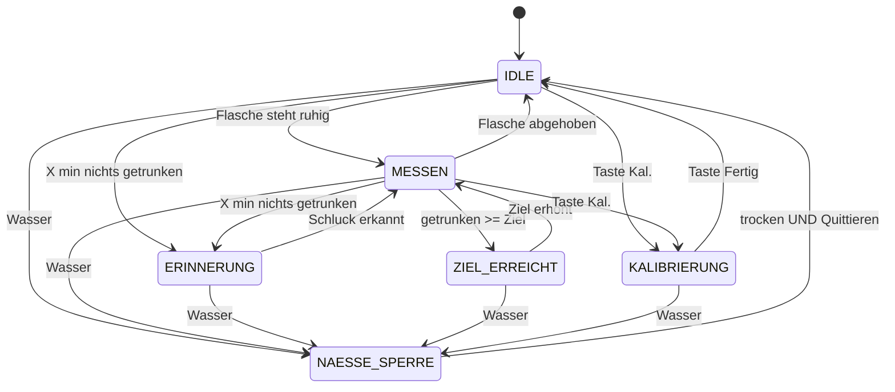

# HydroDesk Base – Wokwi-Simulation (ESP32)

Mit dieser Simulation könnt ihr die komplette Logik von **HydroDesk Base** im Browser testen,
**bevor** ihr Teile kauft. Ihr braucht nur einen Browser und die Seite **wokwi.com**.
Ihr müsst nichts installieren.


---

## 1. Was zeigt die Simulation?

| Echtes Gerät | In der Simulation |
|---|---|
| CYD-Board (ESP32-2432S028R) mit 2,8"-Touch-Display | ESP32 DevKit + ILI9341-Display mit **kapazitivem** Touch (FT6206) |
| Wägezelle 5 kg + HX711 unter dem Flaschen-Pad | HX711-Bauteil, Gewicht per **Schieberegler** (0–5 kg) |
| Nässe-/Regensensor (LM393-Modul, Ausgang DO) | **Schiebeschalter** „NÄSSE“ (links = trocken, rechts = nass) |
| MOSFET, der die Last (Strom) abschaltet | grüne **LED „LAST“** (leuchtet = Strom an) |
| Akku-Spannung über Spannungsteiler | **Drehregler** (Potentiometer) „AKKU“ |
| LED-Streifen WS2812 (10 LEDs) | LED-Streifen mit 10 LEDs |
| Telegram-Nachricht | nur Text im Seriellen Monitor: `[TELEGRAM-STUB] würde senden: ...` |

Das Display zeigt (Hochformat, wie im Gehäuse):

```
┌──────────────────────────┐
│ HydroDesk        [Akku]  │  Kopfzeile mit Akku-Anzeige
│ Status: MESSEN  Flasche… │  aktueller Zustand
│        550 ml            │  heute getrunken
│ [██████░░░░░░] 27 %      │  Fortschritt zum Tagesziel
│ Flasche 500 ml Gewicht…  │
│ Rest 320 ml (64 %)       │
│ ( Hinweis / Erinnerung ) │
│ [-]   Ziel 2000 ml   [+] │  Tagesziel ändern
│ [Leer][300][500][750]    │  Flaschen-Presets
│ [1000][1500][Voll][Kal.] │
└──────────────────────────┘
```

**LED-Farben:** blau = Erinnerung („trink was!“), grün = Ziel erreicht,
rot (blinkend) = Fehler / Akku niedrig, bernstein (blinkend) = Wasser erkannt.
Im Normalbetrieb zeigen schwach weiße LEDs den Fortschritt (1 LED = 10 % vom Ziel).

---

## 2. Simulation auf wokwi.com starten (Schritt für Schritt)

1. Öffnet **https://wokwi.com/projects/new/esp32**
   (oder auf wokwi.com: *„Start from scratch“* → *„ESP32“*).
   Es öffnet sich ein Projekt mit den Tabs `sketch.ino` und `diagram.json`.
2. **sketch.ino ersetzen:** Tab `sketch.ino` anklicken, alles markieren (Strg+A), löschen
   und den kompletten Inhalt unserer Datei `sketch.ino` einfügen (Strg+V).
3. **diagram.json ersetzen:** Tab `diagram.json` anklicken, Strg+A, löschen, Inhalt unserer
   `diagram.json` einfügen. Rechts erscheinen jetzt Display, ESP32, Waage, Schalter usw.
4. **Bibliotheken hinzufügen:** Tab **„Library Manager“** anklicken (wenn ihr ihn nicht seht:
   kleiner Pfeil ▾ neben den Tabs). Auf **„+“** klicken und nacheinander diese Namen suchen
   und anklicken (genau so wie in `libraries.txt`):
   - `Adafruit GFX Library`
   - `Adafruit ILI9341`
   - `Adafruit FT6206 Library`
   - `Adafruit BusIO`
   - `Adafruit NeoPixel`
   - `HX711` (der Eintrag, der genau „HX711“ heißt)

   Danach stehen die Namen im Library Manager – das ist dieselbe Liste wie in `libraries.txt`.
   *Alternative (falls euer Wokwi das anbietet):* Über den Pfeil ▾ neben den Tabs → „Upload file(s)…“
   könnt ihr `sketch.ino`, `diagram.json` und `libraries.txt` auch direkt hochladen.
5. Den grünen **Play-Knopf ▶** drücken. Das erste Kompilieren dauert ca. 20–60 Sekunden.
6. Unten öffnet sich der **Serielle Monitor**. Dort steht z. B.:
   ```
   === HydroDesk Base – Wokwi-Simulation ===
   [00:00] [SYSTEM] Display + Touch bereit
   [00:00] [WAAGE] HX711 gefunden, Rohwert 0
   [00:00] [WAAGE] Tara gesetzt (Rohwert 0.0)
   [00:00] [ZUSTAND] Start in IDLE
   ```
7. Zum Speichern („Save“) braucht ihr ein kostenloses Wokwi-Konto. Zum Ausprobieren nicht.

> Wichtig: Der Schieberegler der Waage muss beim Start auf **0** stehen, weil das Programm beim
> ersten Start automatisch „Tara“ (Nullpunkt) setzt.

---

## 3. So bedient ihr die Simulation

| Was | Wie |
|---|---|
| **Gewicht** ändern (Flasche abstellen / abheben) | Auf das **HX711-Bauteil** (grüne Platine mit Wägezelle) klicken → es erscheint ein Schieberegler. 0,70 kg = 700 g. **0 kg = Flasche abgehoben.** |
| **Touch** | Mit der Maus auf die Tasten im Display klicken (kurz gedrückt halten, ca. 0,2 s). |
| **Wasser** simulieren | Schiebeschalter **NÄSSE** nach **rechts** = nass, nach links = trocken. |
| **Akku** | Auf den Drehregler **AKKU** klicken und drehen (oder Pfeiltasten). Ganz links = leer. |
| **Befehle** | Im Seriellen Monitor eintippen + Enter: `status`, `reset` (Tageszähler auf 0), `hilfe` |

Die Erinnerung kommt in der Simulation schon nach **30 Sekunden** ohne Trinken
(Konstante `ERINNERUNG_MS` ganz oben im Sketch, echt z. B. 45 Minuten).

### Wie wird „getrunken“ berechnet?

1 g Wasser ≈ 1 ml. Das Programm merkt sich das letzte **ruhige** Gewicht der Flasche
(„Referenz“). Wird die Flasche abgehoben (Gewicht fast 0), werden alle Änderungen
**ignoriert**. Steht sie wieder da und ist das Gewicht **1,5 s ruhig**, wird verglichen:

- leichter als vorher (mind. 15 g) → Differenz zählt als **getrunken**
- schwerer als vorher (mind. 20 g) → **nachgefüllt**, zählt **nicht** (nicht negativ)
- kleine Schwankungen → werden ignoriert

---

## 4. Testfälle (zum Abhaken und für die Doku)

Startzustand: Simulation neu gestartet, Regler auf 0 kg, Schalter links, AKKU-Regler wie geladen.

| Nr. | Aktion | Erwartet (Display / LEDs / Serieller Monitor) |
|---|---|---|
| T1 | Waage auf **0,70 kg** | nach ca. 2 s: `Flasche steht (700 g)`, `Referenz gesetzt`, `IDLE -> MESSEN` |
| T2 | Taste **500** | Taste 500 wird türkis, `Flaschengröße 500 ml` |
| T3 | Taste **Voll** | `Vollgewicht 700 g gespeichert`, Anzeige „Rest 500 ml (100 %)“ |
| T4 | Waage auf **0** (abheben), dann auf **0,60 kg** | `Flasche abgehoben`, dann `+100 ml getrunken (700 g -> 600 g)`, große Zahl 100 ml |
| T5 | Waage auf 0, dann **0,65 kg** (nachgefüllt) | `Nachgefüllt (+50 g) – zählt nicht als Trinken`, Zahl bleibt 100 ml |
| T6 | Regler langsam hin- und herziehen und auf 0,55 kg loslassen | erst wenn das Gewicht 1,5 s ruhig ist: `+100 ml getrunken` |
| T7 | 30 s nichts tun | `MESSEN -> ERINNERUNG`, LEDs blinken **blau**, „Zeit zu trinken!“, `[TELEGRAM-STUB] ...` |
| T8 | Abheben, Waage auf **0,20 kg** | `+350 ml getrunken`, `ERINNERUNG -> MESSEN`, LEDs aus/weiß |
| T9 | Ziel mit **–** auf 500 ml stellen | `MESSEN -> ZIEL_ERREICHT`, LEDs **grün**, Balken grün, Telegram-Stub |
| T10 | Ziel mit **+** wieder erhöhen | `ZIEL_ERREICHT -> MESSEN  (Ziel erhöht)` |
| T11 | Schalter **NÄSSE nach rechts** | sofort `-> NAESSE_SPERRE`, `[LAST] AUS (WASSER ERKANNT · STROM AUS)`, LED „LAST“ aus, LEDs **bernstein**, rotes Vollbild „WASSER ERKANNT / STROM AUS“ |
| T12 | Auf **Quittieren** klicken, solange nass | `Quittieren abgelehnt – Sensor noch nass`, Sperre bleibt, andere Tasten tun nichts |
| T13 | Schalter nach links, dann **Quittieren** | `NAESSE_SPERRE -> IDLE`, `[LAST] wieder AN`, normales Display |
| T14 | AKKU-Regler weit nach links (< 3,4 V) | `[AKKU] NIEDRIG ...`, LEDs blinken **rot**, „Akku niedrig!“, Akku-Symbol rot |
| T15 | Taste **Kal.** → Waage 0 → „1. Pad leer: Tara“ → Waage 0,50 kg → „2. 500 g liegt: OK“ → „Fertig“ | `neuer Faktor 0.4200 Rohwert/g` (in Wokwi immer 0,42) |
| T16 | Flasche ab (0 kg), Taste **Leer** | `Tara gesetzt` (neuer Nullpunkt) |
| T17 | `status` eintippen | eine Zeile mit allen Werten |

---

## 5. Der Zustandsautomat (für die Dokumentation)

Das Gerät ist immer in **genau einem** Zustand (`enum Zustand` im Sketch):

| Zustand | Bedeutung | LEDs |
|---|---|---|
| `IDLE` | Keine Flasche auf dem Pad (oder gerade abgehoben). Änderungen werden ignoriert. | Fortschritt (weiß) |
| `MESSEN` | Flasche steht, Gewicht wird überwacht, Trinken wird gezählt. | Fortschritt (weiß) |
| `ERINNERUNG` | Seit `ERINNERUNG_MS` nichts getrunken, Ziel noch nicht erreicht. | blau blinkend |
| `ZIEL_ERREICHT` | Tagesziel erreicht, keine Erinnerungen mehr (zählt weiter). | grün |
| `NAESSE_SPERRE` | Wasser erkannt: Strom aus, Bedienung gesperrt. | bernstein blinkend |
| `KALIBRIERUNG` | Waage einstellen (Tara + 500-g-Gewicht). Messung pausiert. | schwach weiß |

„Fehler / Akku niedrig“ ist **kein eigener Zustand**, sondern eine Zusatzanzeige (LEDs rot),
weil das Gerät dabei weiter messen soll.



Ablauf in `loop()` (Reihenfolge ist Absicht: Sicherheit zuerst):
`naesseLesen()` → `akkuLesen()` → `waageLesen()` → `touchAuswerten()` →
`zustandAktualisieren()` → `ledsAktualisieren()` → `drawUI()`.
Jeder Zustandswechsel wird im Seriellen Monitor protokolliert, z. B.
`[00:49] [ZUSTAND] MESSEN -> ERINNERUNG  (30 s nichts getrunken)`.

---

## 6. Pin-Tabelle

| Signal | Bauteil in Wokwi (Pin) | Wokwi-Pin (ESP32) | Vorschlag CYD-Pin | Bemerkung |
|---|---|---|---|---|
| Display SCK | Display `SCK` | GPIO14 | GPIO14 (fest verdrahtet) | gleich wie CYD |
| Display MOSI | Display `MOSI` | GPIO13 | GPIO13 (fest) | gleich wie CYD |
| Display MISO | Display `MISO` | GPIO12 | GPIO12 (fest) | gleich wie CYD |
| Display CS | Display `CS` | GPIO15 | GPIO15 (fest) | gleich wie CYD |
| Display D/C | Display `D/C` | GPIO2 | GPIO2 (fest) | gleich wie CYD |
| Display Reset | Display `RST` | GPIO4 | – (an EN, `TFT_RST = -1`) | am CYD ist GPIO4 die rote RGB-LED |
| Hintergrundlicht | Display `LED` | GPIO21 | GPIO21 (fest) | am CYD **belegt** (Backlight), obwohl auf P3 herausgeführt |
| Touch SDA | Display `SDA` | GPIO32 | – | nur Wokwi (FT6206 über I2C) |
| Touch SCL | Display `SCL` | GPIO33 | – | nur Wokwi |
| Touch (CYD) | – | – | CLK 25, MOSI 32, MISO 39, CS 33, IRQ 36 (fest) | XPT2046, eigener SPI-Bus |
| HX711 DT | HX711 `DT` | GPIO27 | **GPIO27** (Stecker CN1) | |
| HX711 SCK | HX711 `SCK` | GPIO22 | **GPIO22** (CN1 / P3) | |
| Akku-Spannung | Poti `SIG` | GPIO35 | **GPIO35** (P3) | nur Eingang, ADC1 (geht auch mit WLAN); echt über Spannungsteiler 100k/100k |
| Nässe-Sensor DO | Schalter Mitte (`2`), rechts (`3`) an GND | GPIO19 | **GPIO19** (SD-Slot MISO) | LOW = nass; nur wenn SD-Karte nicht benutzt wird |
| WS2812 DIN | Streifen `DIN` | GPIO23 | **GPIO23** (SD-Slot MOSI) | nur ohne SD-Karte; Streifen echt an **5 V** |
| Last / MOSFET-Gate | LED „LAST“ (Anode) | GPIO18 | **GPIO18** (SD-Slot SCK) | HIGH = Strom an; nur ohne SD-Karte |
| 3,3 V | HX711 VCC, Poti VCC, Streifen VDD | 3V3 | 3,3 V (CN1) | |
| 5 V | Display VCC | VIN | 5 V (P1 VIN) | |
| GND | alle GND | GND.1 / GND.2 | GND | |
| Serieller Monitor | – | TX0/RX0 (GPIO1/3) | GPIO1/3 (P1) | |

**Hinweis CYD-Pins:** Frei herausgeführt sind am CYD nur GPIO22, GPIO27 (CN1) und GPIO35 (P3).
GPIO21 auf P3 ist das Display-Licht. Für die restlichen drei Signale (Nässe, WS2812, MOSFET)
nutzen wir die **SD-Karten-Pins 19/23/18** (z. B. mit einem microSD-„Sniffer“-Adapter im SD-Slot
oder an den Lötpunkten). GPIO5 (SD-CS) lassen wir frei, weil er beim Booten HIGH sein muss.
Alternativen: GPIO16/17 (RGB-LED-Pads, die LED leuchtet dann mit) oder RX/TX (dann kein Serieller Monitor).
In Wokwi sind die Pin-Nummern **gleich** gewählt wie am CYD (außer Display-RST und Touch).

---

## 7. Unterschiede zur echten Hardware (CYD ESP32-2432S028R)

| Thema | Simulation | Echt (CYD) |
|---|---|---|
| Touch | kapazitiv, FT6206 über **I2C** (`Adafruit_FT6206`), liefert direkt Pixel | **resistiv**, XPT2046 über eigenen **SPI-Bus**, liefert Rohwerte 0–4095 → muss **kalibriert** werden |
| Display-Bibliothek | `Adafruit_ILI9341` | meist `TFT_eSPI` (schneller, Pins in `User_Setup.h`) |
| Display-Reset | GPIO4 | an EN, also `TFT_RST = -1` |
| Waage | Rohwert 0–2100 für 0–5 kg (0,42 pro Gramm, ca. 2,4 g Auflösung), kein Rauschen | viel größere Rohwerte (Hunderte pro Gramm), Rauschen, Temperaturdrift → **Kalibrieren** (Taste „Kal.“) |
| Nässe | Schiebeschalter | LM393-Modul: DO an GPIO19, Empfindlichkeit am Poti des Moduls einstellen |
| Last | LED | Logic-Level-N-MOSFET (z. B. AO3400 / IRLZ44N), Gate über 100 Ω, 100 kΩ nach GND |
| Akku | Poti 0–4095 = 3,0–4,2 V (gerade Linie) | Spannungsteiler 100k/100k an GPIO35, `analogReadMilliVolts()` × 2 |
| WS2812 | Strom wird nicht simuliert | 10 LEDs bis ca. 600 mA bei Weiß → eigenes 5-V-Netzteil/USB, 330 Ω in DIN, 470–1000 µF am Streifen |
| Uhrzeit / Tageswechsel | keine Uhr → Befehl `reset` | per WLAN + NTP um Mitternacht zurücksetzen |
| Einstellungen | werden in `Preferences` (NVS) gespeichert, gehen beim Neustart der Simulation verloren | bleiben nach Stromausfall erhalten |
| Telegram | nur `[TELEGRAM-STUB]`-Text | WLAN + Bot (z. B. Bibliothek „UniversalTelegramBot“) in `telegramSenden()` |

---

## 8. Umstieg auf das CYD (später)

Das Programm ist so gebaut, dass sich nur **ein Block** ändert:
„HARDWARE-ABSTRAKTION DISPLAY + TOUCH“ mit `anzeigeInit()` und `readTouch()`.
Alles andere (Zustandsautomat, Waage, LEDs, Zeichnen) bleibt gleich, weil nur Zeichenfunktionen
benutzt werden, die **Adafruit_GFX und TFT_eSPI beide** kennen
(`fillScreen`, `fillRect`, `drawRect`, `fillRoundRect`, `drawRoundRect`, `setCursor`,
`setTextSize`, `setTextColor`, `print`).

1. In der Arduino-IDE die Bibliotheken **TFT_eSPI** und **XPT2046_Touchscreen** installieren
   (dazu HX711 und Adafruit NeoPixel wie oben).
2. In `TFT_eSPI/User_Setup.h` für das CYD einstellen:
   ```cpp
   #define ILI9341_2_DRIVER
   #define TFT_WIDTH  240
   #define TFT_HEIGHT 320
   #define TFT_MISO 12
   #define TFT_MOSI 13
   #define TFT_SCLK 14
   #define TFT_CS   15
   #define TFT_DC    2
   #define TFT_RST  -1
   #define TFT_BL   21
   #define TFT_BACKLIGHT_ON HIGH
   #define USE_HSPI_PORT
   #define LOAD_GLCD
   #define SPI_FREQUENCY  55000000
   #define SPI_READ_FREQUENCY 20000000
   #define SPI_TOUCH_FREQUENCY 2500000
   ```
   (Manche CYD-Versionen mit zwei USB-Buchsen haben einen ST7789 statt ILI9341 → dort
   `ST7789_DRIVER` und ggf. `TFT_INVERSION_ON`.)
3. Im Sketch oben `#define HYDRO_CYD 1` setzen und als Board „ESP32 Dev Module“ wählen.
4. **Touch kalibrieren:** In `readTouch()` stehen `TOUCH_X_MIN/MAX`, `TOUCH_Y_MIN/MAX`
   (Startwerte 200/3700 und 240/3800). Die vier Ecken antippen, die Koordinaten im Seriellen Monitor
   (`[TOUCH] x=.. y=..`) ansehen und die Werte anpassen, bis die Tasten stimmen.
   Evtl. `touch.setRotation(...)` ändern, wenn x/y vertauscht oder gespiegelt sind.
5. **Waage kalibrieren:** Taste „Kal.“ → Pad leer → Taste 1 → genau 500 g auflegen → Taste 2 → Fertig.
   Der Faktor wird gespeichert.

Die CYD-Variante wurde **nur kompiliert** (siehe Abschnitt 11), nicht auf echter Hardware getestet.

---

## 9. Einstellungen im Sketch (ganz oben)

| Konstante | Standard | Bedeutung |
|---|---|---|
| `ERINNERUNG_MS` | 30 s | Zeit ohne Trinken bis zur Erinnerung (echt z. B. 45 min) |
| `ZIEL_START_ML` | 2000 | Tagesziel beim ersten Start |
| `ZIEL_SCHRITT_ML` | 250 | Schrittweite der +/- Tasten |
| `WOKWI_FAKTOR` | 0.42 | Rohwert pro Gramm (Wokwi-HX711 „5kg“) |
| `FLASCHE_DA_G` / `FLASCHE_WEG_G` | 40 / 25 g | ab wann die Flasche als „steht“ / „abgehoben“ gilt |
| `STABIL_MS` / `STABIL_TOLERANZ_G` | 1500 ms / 6 g | wann das Gewicht als „ruhig“ gilt |
| `MIN_SCHLUCK_G` / `MIN_NACHFUELL_G` | 15 / 20 g | Mindeständerung für „getrunken“ / „nachgefüllt“ |
| `AKKU_NIEDRIG_V` / `AKKU_OK_V` | 3,4 / 3,5 V | Grenze für „Akku niedrig“ (mit Hysterese) |
| `LED_ANZAHL` / `LED_HELLIGKEIT` | 10 / 80 | LED-Streifen |
| `TOUCH_SPIEGELN` | true | Touch-Koordinaten spiegeln (nur Wokwi), siehe Problemlösung |

---

## 10. Grenzen der Simulation / Problemlösung

- **Tasten reagieren falsch** (z. B. oben statt unten): im Sketch `TOUCH_SPIEGELN = false` setzen.
  Jede Berührung steht mit Koordinaten im Seriellen Monitor (`[TOUCH] x=.. y=..`).
- **„Touch NICHT gefunden“** im Monitor: Bibliothek `Adafruit FT6206 Library` fehlt oder SDA/SCL
  (GPIO32/33) sind nicht verbunden.
- **Kompilierfehler „HX711.h not found“**: Bibliothek `HX711` im Library Manager hinzufügen.
  Der Sketch nutzt nur `begin()`, `is_ready()` und `read()` und funktioniert deshalb mit beiden
  bekannten HX711-Bibliotheken (Rob Tillaart „HX711“ und bogde „HX711 Arduino Library“).
- **Gewicht negativ / LEDs rot / „Pad leeren + Leer“**: Tara stimmt nicht → Regler auf 0, Taste „Leer“.
- Das Display baut sich in der Simulation langsamer auf als in echt. Kurz warten.
- Nach Abheben + gleichzeitigem Trinken **und** Nachfüllen sieht die Waage nur die Summe
  (z. B. „nachgefüllt“) – der Schluck geht dann verloren. Das ist auch beim echten Gerät so.
- Der LED-Streifen (`wokwi-led-strip`) ist ein neueres Wokwi-Bauteil. Falls er bei euch fehlt:
  in `diagram.json` `"wokwi-led-strip"` durch `"wokwi-led-ring"` ersetzen und die Pins
  `VDD`→`VCC`, `VSS`→`GND` umbenennen (der Code bleibt gleich).
- Die Lage der Pins am LED-Streifen ist von Wokwi nicht veröffentlicht; die Drähte dorthin können
  am Ende leicht schräg aussehen. Elektrisch ist das egal (verbunden wird über den Pin-Namen).
- Wokwi simuliert keine Ströme/Spannungen (Analog nur am Poti), keine Störungen und kein WLAN-Telegram.

---

## 11. Nachweis: Kompilieren (Stand 06.10.2026)

Kompiliert auf Linux mit `arduino-cli 1.5.1`, Kern `esp32:esp32 3.3.12`, Board `esp32:esp32:esp32`,
Option `--warnings all`:

```
Sketch uses 368009 bytes (28%) of program storage space. Maximum is 1310720 bytes.
Global variables use 24988 bytes (7%) of dynamic memory, leaving 302692 bytes for local variables. Maximum is 327680 bytes.
```

0 Fehler, 0 Warnungen. Benutzte Bibliotheken: Adafruit GFX Library 1.12.6, Adafruit ILI9341 1.6.4,
Adafruit FT6206 Library 1.1.1, Adafruit BusIO 1.17.4, Adafruit NeoPixel 1.15.5, HX711 (Rob Tillaart) 0.6.5.
Zusätzlich geprüft: mit „HX711 Arduino Library“ (bogde) 0.7.5 → kompiliert ebenfalls;
CYD-Variante (`HYDRO_CYD=1`, TFT_eSPI 2.5.43 + XPT2046_Touchscreen 1.4) → kompiliert ohne Warnungen
(352181 Bytes).

Die Logik (Trinken, Nachfüllen, Erinnerung, Ziel, Nässe-Sperre, Akku, Kalibrierung) wurde zusätzlich
mit einem PC-Testprogramm durchgespielt (simulierte Gewichte/Touches). Ein Lauf im echten
Wokwi-Simulator (wokwi-cli) war **nicht** möglich (kein Wokwi-Token vorhanden) – bitte einmal auf
wokwi.com mit den Testfällen aus Abschnitt 4 prüfen.

---

## 12. VS Code (optional)

Mit der Erweiterung „Wokwi Simulator“ in VS Code: Ordner `sketch` anlegen, `sketch.ino` hineinlegen,
`diagram.json` und `wokwi.toml` daneben, dann:

```
arduino-cli compile -b esp32:esp32:esp32 --output-dir build sketch
```

und F1 → „Wokwi: Start Simulator“. (Für wokwi.com im Browser ist `wokwi.toml` nicht nötig.)

---

## Dateien

| Datei | Inhalt |
|---|---|
| `sketch.ino` | Programm (Arduino, ESP32) mit deutschen Kommentaren |
| `diagram.json` | Schaltung für Wokwi (Bauteile, Positionen, farbige Drähte) |
| `libraries.txt` | Bibliotheksliste für den Wokwi Library Manager |
| `wokwi.toml` | nur für Wokwi in VS Code |
| `verdrahtung.png` | Verdrahtungsplan als Bild |
| `README.md` | diese Anleitung |
