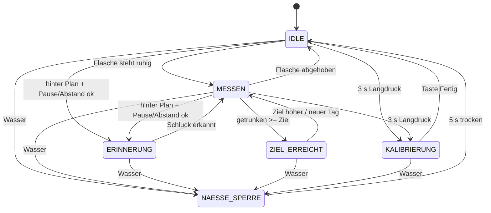

# HydroDesk Base – Wokwi-Simulation (ESP32) · Version 4

Mit dieser Simulation könnt ihr die komplette Logik von **HydroDesk Base** im Browser testen,
**bevor** ihr Teile kauft. Ihr braucht nur einen Browser und die Seite **wokwi.com**.

**Neu in Version 4 (Stromsparen, Details in [Kapitel 18](#18-stromsparen-neu-in-version-4)):**

- **Display:** nach 30 s ohne Aktivität **gedimmt**, nach 2 min **aus** (RUHE), nachts (22–7 Uhr)
  schon nach 15 s aus. Die erste Berührung im gedimmten/dunklen Zustand **weckt nur** (sie löst
  keine Taste aus). In Wokwi zeigt die neue Hilfs-LED **„LICHT“** an GPIO21 die Helligkeit.
- **WLAN nur zum Uhr-Abgleich** (beim Start, alle 6 h, Befehl `sync`, höchstens 20 s), danach aus.
  Die Abweichung der Uhr steht im Protokoll.
- **Bluetooth nur in Fenstern:** beim Start 2 min, **Antippen des Bluetooth-Symbols** 2 min
  (behebt: Gerät war nach der Suche nicht mehr sichtbar zu machen), 60 s still nach jedem Trinken.
- **LED-Streifen:** bekommt nur Strom, wenn er leuchtet (P-MOSFET an GPIO18). Die Erinnerung
  leuchtet 2 min voll blau, danach ruhiges **Sparblau**. Bei Wasser ist der Streifen **dunkel**
  (kein Bernstein mehr, er hat dann keinen Strom).
- **CPU 80 MHz**, auf dem echten CYD **Light-Sleep** in RUHE (Waage weiter 10×/s).
- **Akku-Prozent per LiPo-Tabelle** (typische Kurve) und **Schutzabschaltung** bei leerem Akku.
- Serieller Befehl **`stromsparen 0`** = Verhalten wie Version 3 (zum Vergleichen).

**Neu in Version 3 (Erinnerung + Flaschen-Kalibrierung):**

- **Erinnerungslogik:** Nach einem Schluck von ≥100 ml (im ~10-min-Fenster) startet eine
  **75-min-Pause** (keine Erinnerung, kein blaues LED, kein Telegram-Stub). Schlucke unter
  40 ml zählen zum Tagesstand, setzen die Pause aber nicht. Erinnerung nur, wenn ihr
  **hinter dem Tagesplan** liegt, die Pause vorbei ist, der Mindestabstand (90 min) eingehalten
  ist, höchstens 6×/Tag, und **außerhalb der Ruhezeit 22:00–07:00**. Plan: bis 12:00 ≈40 %,
  bis 16:00 ≈70 %, bis 20:00 (ca. 2 h vor Ruhezeit) 100 % des Ziels.
- **Wokwi-Demo-Zeiten:** `#define WOKWI_DEMO_ERINNERUNG 1` (Standard in der Simulation) nutzt
  kurze Zeiten (Pause 90 s, Abstand 60 s, Fenster 20 s), damit Tests machbar sind. Auf dem
  echten Gerät: `WOKWI_DEMO_ERINNERUNG 0` → lange Zeiten. Der alte ~30-s-Trigger ist entfernt.
- **Flaschen-Kalibrierung mit sichtbaren Touch-Tasten „Leer“ und „Voll“** (Hauptbildschirm
  und Kalibrier-Bildschirm, FT6206). Ablauf: leere Flasche aufstellen → **Leer** tippen
  (Gewicht ~1 s ruhig) → volle Flasche → **Voll** tippen → Kapazität = voll − leer (1 g ≈ 1 ml).
  Anzeige „Flasche x/y ml“. Fehler (kein Leer, Voll ≤ Leer, unruhig) erscheinen **auf dem
  Display** auf Deutsch. Serial `kalib` / `leer` / `voll` funktioniert weiter. Werte in Preferences.
- **Bluetooth-Symbol** und LED-Status wie bisher (Suchen weiß, verbunden 2× lila). Wokwi:
  `bt suchen` / `bt verbunden` / `bt getrennt` / `bt aus`. Echtes BLE: `HYDRO_BLE 1`.

**Neu in Version 2:**

- Den Flascheninhalt rechnet das Gerät selbst aus; das Leergewicht **lernt** es automatisch,
  oder ihr kalibriert es mit den Tasten **Leer** / **Voll**.
- Das **Tagesziel** wird aus Körpergewicht und Körpergröße berechnet (Mosteller-Formel).
- **Neues Hochformat-Layout** mit Uhrzeit, Datum, Akku, Menge, Fortschritt, Flasche und Erinnerung.
- **Echte Uhrzeit** über WLAN + NTP, mit automatischem Reset um Mitternacht.
- **LEDs ruhig:** im Normalbetrieb aus, bei Ereignissen Dauerlicht. Nur die Akku-Warnung
  blitzt kurz (2× oder 4× rot). (Seit Version 3 blinken außerdem Bluetooth-Suche und -Verbindung.)
- Die Wasser-Sperre hebt sich nach **5 s trocken** von selbst auf. Die Flaschen-Kalibrierung
  läuft über die sichtbaren Tasten **Leer** / **Voll** (optional Langdruck → Kalibrier-Bildschirm).


---

## 1. Was zeigt die Simulation?

| Echtes Gerät | In der Simulation |
|---|---|
| CYD-Board (ESP32-2432S028R) mit 2,8"-Touch-Display | ESP32 DevKit + ILI9341-Display mit **kapazitivem** Touch (FT6206) |
| Wägezelle 5 kg + HX711 unter dem Flaschen-Pad | HX711-Bauteil, Gewicht per **Schieberegler** (0–5 kg) |
| Nässe-/Regensensor (LM393-Modul, Ausgang DO) | **Schiebeschalter** „NÄSSE“ (links = trocken, rechts = nass) |
| P-MOSFET AO3401A, schaltet die 5 V des LED-Streifens (GPIO18) | grüne **LED „LAST“** (leuchtet = Streifen hat Strom) |
| Hintergrundlicht des Displays (PWM an GPIO21) | weiße **LED „LICHT“** (hell / gedimmt / aus), neu in V4 |
| Akku-Spannung über Spannungsteiler 2 × 10 kΩ | **Drehregler** (Potentiometer) „AKKU“ (ganz links = 3,0 V, ganz rechts = 4,2 V) |
| COB-LED-Streifen WS2812B (BTF-LIGHTING FCOB, 26 LEDs, hinter der Diffusor-Leiste) | LED-Streifen mit 26 kleinen LEDs (`wokwi-led-strip`, `pixels` 26) |
| Heim-/Schul-WLAN + NTP | Wokwi-Gast-WLAN **„Wokwi-GUEST“** + `pool.ntp.org` |
| Telegram-Nachricht | nur Text im Seriellen Monitor: `[TELEGRAM-STUB] würde senden: ...` |

---

## 2. Der Bildschirm (240 × 320, Hochformat)


```
┌──────────────────────────────┐
│ 14:23             BT [▮▮▮ ]  │  Uhrzeit groß   Bluetooth + Akku-Symbol
│ Di, 06.10.2026          88%  │  Datum                Akku in %
│──────────────────────────────│
│        heute getrunken       │
│        1.250 ml              │  größtes Element
│        von 2.750 ml          │  Tagesziel
│ [██████████░░░░░░░░░] 45 %   │  Fortschrittsbalken
│         noch 1.500 ml        │  bzw. grün „Ziel erreicht ✓“
│──────────────────────────────│
│ Flasche: 420/750 ml          │  oder „Keine Flasche“ / ohne Kap. nur ml
│ Leer 250 g (kalibriert) | Kap. 750 ml │  oder „(gelernt)“ / „(Schätzwert)“
│ ┌──────────┐  ┌──────────┐   │
│ │   Leer   │  │   Voll   │   │  große Touch-Tasten (FT6206 / Wokwi)
│ └──────────┘  └──────────┘   │
│ ┌──────────────────────────┐ │
│ │ Zuletzt: vor 12 min | …  │ │  Status: Kalib-Meldung / Erinnerung / Warnung
│ └──────────────────────────┘ │
└──────────────────────────────┘
```

- **Uhrzeit:** weiß = NTP-Zeit, **gelb** = Ersatzuhr (ohne Internet), grau „--:--“ = noch keine Zeit.
  Bei der Ersatzuhr steht hinter dem Datum „(ohne NTP)“.
- **Akku oben rechts:** grün = ok, **orange unter 20 %**, **rot unter 10 %**.
  Seit V4 kommt die Prozentzahl aus einer **LiPo-Tabelle** (typische Kurve, Kapitel 18), nicht mehr
  aus einer geraden Linie 3,0–4,2 V.
- **Bluetooth-Symbol** (neu in V3) direkt **links neben dem Akku-Symbol**, aus Linien gezeichnet
  (klassische Bluetooth-Rune, 11 × 19 Pixel):

  | Zustand | Symbol |
  |---|---|
  | aus (`bt aus`) | wird **nicht gezeichnet** |
  | sucht | **blinkt** weiß/blau im Takt der LEDs (500 ms) |
  | stilles Sync-Fenster nach dem Trinken (V4) | **fest blau**, ohne Punkte |
  | verbunden | **fest blau**, links und rechts ein kleiner Punkt (siehe Bild oben) |
  | nicht verbunden (Suche nach 2 min beendet) | **grau** |

  Platz in der oberen Zeile: Uhrzeit x 6–126, Bluetooth x 168–191, Akku-Symbol x 196–231,
  Prozent darunter (y 28–43). Nichts überlappt, auch nicht bei „100%“ oder dem längsten Datum
  „Di, 06.10.2026 (ohne NTP)“ (endet bei x 158).

  **Antippen des Symbols** (Fläche x 162–193, y 0–29) macht das Gerät **2 min sichtbar** (V4).
- **Touch-Tasten „Leer“ / „Voll“** immer sichtbar auf dem Hauptbildschirm (große Treffflächen).
- **Statusfeld unten**, wichtigste Meldung zuerst:
  1. Kalibrier-Feedback / Fehler (z. B. „Zuerst Leer kalibrieren“, „Gewicht unruhig …“)
  2. „Kalib-Screen: noch X s“ (während des optionalen Langdrucks)
  3. roter Balken **„Bitte laden“**, solange der Akku unter 10 % ist (bleibt stehen)
  4. „Fehler: Waage antwortet nicht“ / „Gewicht negativ: Kalibrierung!“
  5. blau „Zeit zu trinken!“ (Erinnerung)
  6. orange „Akku unter 20 %“ (5 s nach dem Unterschreiten)
  7. sonst: zuletzt getrunken | Erinnerungs-Kurzinfo
- Es wird **nur neu gezeichnet, was sich geändert hat** (jeder Bereich merkt sich seinen letzten Text).
  Das verhindert Flackern.
- Bei Wasser erscheint weiterhin das **rote Vollbild** „WASSER ERKANNT · STROM AUS“, nach dem
  Abtrocknen mit dem Countdown „Freigabe in X s“.

---

## 3. Tagesziel aus Körpergewicht und Körpergröße

Das Tagesziel ist **nicht mehr fest**. Das Gerät berechnet es aus der **Körperoberfläche (KOF)**
nach der Formel von **Mosteller**:

```
KOF [m²]  = √( Größe [cm] × Gewicht [kg] / 3600 )
Ziel [ml] = KOF × 1500 ml/m²   → auf 50 ml gerundet → begrenzt auf 1500 … 3500 ml
```

**Beispiel (Standardwerte im Sketch: 70 kg, 175 cm):**

```
KOF  = √(175 × 70 / 3600) = √3,403 = 1,845 m²
Ziel = 1,845 × 1500 = 2767 ml  → gerundet 2750 ml
```

Weitere Beispiele (genau so im PC-Test geprüft):

| Gewicht | Größe | KOF | Ziel |
|---|---|---|---|
| 70 kg | 175 cm | 1,845 m² | **2750 ml** |
| 80 kg | 180 cm | 2,000 m² | **3000 ml** |
| 45 kg | 150 cm | 1,369 m² | **2050 ml** |
| 30 kg | 120 cm | 1,000 m² | **1500 ml** (Untergrenze) |
| 200 kg | 210 cm | 3,416 m² | **3500 ml** (Obergrenze) |

Werte ändern:
- dauerhaft im Sketch: `KOERPERGEWICHT_KG` und `KOERPERGROESSE_CM`, ganz oben;
- im laufenden Betrieb über den Seriellen Monitor: `gewicht 75` und `groesse 180`.
  Die Werte werden in `Preferences` gespeichert, das Ziel wird sofort neu berechnet.

> **Hinweis:** Das ist ein **Richtwert** für ein Schulprojekt und **keine medizinische Empfehlung**.
> Hitze, Sport, Krankheit oder ärztliche Vorgaben ändern den Bedarf.

---

## 4. Flascheninhalt und automatisch gelerntes Leergewicht

```
Flascheninhalt [ml] = ruhiges Gewicht auf dem Pad − Leergewicht der Flasche   (1 g Wasser ≈ 1 ml)
```

Das Leergewicht kennt das Gerät am Anfang nicht. Es startet mit **150 g**
(`LEERGEWICHT_START_G`; übliche Trinkflaschen wiegen leer etwa 100–400 g).
**Besser:** im Service-Modus kalibrieren (leere + volle Flasche). Kalibrierte Werte aus dem
Flash haben Vorrang; das automatische Lernen ist nur Fallback, solange nie kalibriert wurde.
Danach lernt es selbst:

| Regel | Was passiert |
|---|---|
| **1. Nachfüllen** | Wird nachgefüllt, war die Flasche davor meist (fast) leer. Das ruhige Gewicht **direkt vor dem Nachfüllen** ist ein Kandidat. Das Gerät nimmt den **kleinsten** Kandidaten als Leergewicht (Anzeige „(gelernt)“). |
| **2. Untergrenze** | Steht die Flasche einmal **leichter** da als das Leergewicht, ist dieses zu hoch. Es wird auf das gemessene Gewicht gesenkt. |
| **3. Andere Flasche** | Ist das Pad **länger als 60 s leer** und steht danach ein **deutlich anderes** Gewicht da (≥ 250 g Unterschied oder klar unter dem Leergewicht), gilt das als neue Flasche. Das Leergewicht geht zurück auf 150 g, die Referenz wird neu gesetzt, und es wird **nichts** als getrunken gezählt. |

Beispiel (echte Flasche wiegt leer 230 g, enthält 500 ml):
Abstellen 730 g → Anzeige „Flasche: 580 ml“ (mit dem Schätzwert 150 g, noch ungenau).
Austrinken bis 250 g, dann nachfüllen auf 780 g. Das Gerät lernt **250 g**, die Anzeige zeigt
„Flasche: 530 ml“. Später einmal bis 240 g ausgetrunken: Das Leergewicht sinkt auf **240 g**.

### Wie wird „getrunken“ berechnet? (unverändert)

Das Programm merkt sich das letzte **ruhige** Gewicht der Flasche („Referenz“). Wird die Flasche
abgehoben (Gewicht fast 0), werden alle Änderungen **ignoriert**. Steht sie wieder da und ist das
Gewicht **1,5 s ruhig**, wird verglichen:

- leichter als vorher (mind. 15 g) → Differenz zählt als **getrunken**
- schwerer als vorher (mind. 20 g) → **nachgefüllt**, zählt **nicht** (nicht negativ) → Regel 1
- kleine Schwankungen → werden ignoriert

---

## 5. LEDs (COB-LED-Streifen WS2812B, 26 LEDs)

Im Normalbetrieb sind **alle LEDs aus**. Sie leuchten in ruhigen Farben mit mittlerer Helligkeit
(`LED_HELLIGKEIT = 60` von 255, **höchstens 80** – Strombudget, siehe unten), immer **alle 26 gleich**.
**Dauerlicht, kein Blinken** – geblinkt wird **nur** in drei Fällen: Akku-Warnung (rot),
Bluetooth sucht (weiß) und Handy verbunden (2× lila). In der **Pause** eines Blinkmusters sind die
LEDs aus (keine Mischfarbe).

| Priorität | Farbe | Wann | Wie lange |
|---|---|---|---|
| 1 (höchste) | **aus, Streifen ohne Strom** (V4, vorher bernstein) | Wasser erkannt (`NAESSE_SPERRE`) | solange die Sperre aktiv ist |
| 2 | **rot, 2× blitzen** (300 ms an / 300 ms aus) | Akku fällt **unter 20 %** | einmal, dann aus |
| 2 | **rot, 4× blitzen** (650 ms an / 650 ms aus) | Akku fällt **unter 10 %** | einmal, dann aus (langsamer/normaler Takt) |
| 3 | **lila, 2× blinken** (300 ms an / 300 ms aus) | Handy hat sich per Bluetooth verbunden | einmal, dann normal |
| 4 | **weiß blinken, gedimmt** (500 ms an / 500 ms aus) | Bluetooth sucht das Handy (Start, `bt suchen`, Symbol antippen) | bis verbunden, höchstens **2 min**. Das stille 60-s-Fenster nach dem Trinken blinkt **nicht** |
| 5 | rot (Dauerlicht) | Fehler beginnt (Waage antwortet nicht / Gewicht negativ) | 5 s, dann aus |
| 6 | **blau**, nach 2 min **Sparblau** (V4: Helligkeit 15 statt 60) | Erinnerung („trink was!“) | bis getrunken wurde |
| 7 | **grün** | Tagesziel erreicht | 10 s, dann aus |
| – | aus | sonst | – |

**Akku-Warnung genauer:**

- Sie kommt **einmal beim Unterschreiten** der Schwelle, nicht dauernd.
- **Hysterese 2 %:** „unter 20 %“ gilt erst ab **22 %** als vorbei, „unter 10 %“ ab **12 %**.
  Wackelt der Wert um die Schwelle, blitzt es also nicht ständig.
- Solange der Akku unter der Schwelle bleibt, wiederholt sich das Blinkmuster **alle 10 min**
  (`AKKU_WIEDERHOLUNG_MS`, `0` = nie wiederholen).
- **Display unter 20 %:** Akku-Anzeige orange und 5 s lang ein oranger Hinweis „Akku unter 20 %“.
- **Display unter 10 %:** Akku-Anzeige rot und unten **dauerhaft** ein roter Balken
  **„Bitte laden“**. Er verschwindet erst, wenn der Akku wieder über 12 % liegt (geladen).
  Die 4 roten Blitze laufen im **normalen** Takt (650 ms an / 650 ms aus), nicht im schnellen
  300-ms-Takt der 20-%-Warnung.
- Fällt der Akku direkt von „ok“ auf unter 10 %, blitzt es nur **4×**, nicht 2× + 4×.
- Wasser hat Vorrang: Während der Sperre ist der Streifen dunkel (ohne Strom), das Blinkmuster läuft unsichtbar weiter.

**Bluetooth-Blinken genauer (neu in V3):**

- **Akku vor Bluetooth:** Während die Akku-Warnung blitzt, gibt es kein Weiß und kein Lila.
  Verbindet sich das Handy genau dann, **wartet** das 2× Lila, bis das Rot fertig ist.
- **Wasser vor allem:** Während der Wasser-Sperre ist der Streifen dunkel (ohne Strom). Danach
  blinkt er wieder weiß, falls die Suche noch läuft.
- **Weiß verdeckt blau/grün/rot (Fehler):** Solange die Suche läuft, sieht man die ruhigen Farben
  nicht. Darum endet die Suche nach `BT_SUCH_TIMEOUT_MS` (2 min). Danach erscheinen z. B. die
  blaue Erinnerung oder das Grün wieder.
- Das Weiß ist **gedimmt**: Farbwert `BT_WEISS_WERT = 90` je Kanal, zusätzlich `LED_HELLIGKEIT`.
- Der Serielle Monitor meldet nur, **wer** die LEDs gerade steuert (z. B.
  `[LED] weiß blinken (Bluetooth sucht)`), nicht jedes einzelne An/Aus.

### Echter Streifen: Bauteil, Verdrahtung, Strom

**Streifen:** BTF-LIGHTING WS2812B **FCOB** (COB = LEDs dicht unter einer durchgehenden Silikonschicht),
5 V, 160 LEDs/m, 5 mm breit, jede LED mit eigenem IC (einzeln ansteuerbar wie normale WS2812B, gleiche
Bibliothek Adafruit NeoPixel, `NEO_GRB + NEO_KHZ800`). Teilbar alle 12,5 mm (= 2 LEDs).
Verbaut: **13 Segmente = 162,5 mm = 26 LEDs** (`LED_ANZAHL = 26`), auf die Rückwand der Lichtkammer vorne
im Gehäuse geklebt. Davor sitzt die gedruckte **Diffusor-Leiste** (1 mm weißes PLA) – so sieht man eine
gleichmäßige Lichtlinie statt einzelner Punkte.

**Verdrahtung (echt):**

| Streifen | an | Hinweis |
|---|---|---|
| `5V` / `+` | **Drain** des P-MOSFET AO3401A (V4, H1). Source an 5 V vom Pololu S13V10F5 | nicht an 3,3 V |
| `GND` / `−` | GND | gemeinsame Masse mit dem CYD |
| `DIN` | GPIO23 | **330–470 Ω in Reihe** (verbaut: 470 Ω), direkt am Streifen-Eingang (DIN) eingelötet |
| – | Elko 470 µF/25 V zwischen 5 V und GND **vor** dem FET (Dauer-5-V-Seite) | fängt Lastsprünge ab, lädt nicht bei jedem Einschalten neu |

**LED-Strom-Schalter (V4, H1):** GPIO18 → 4,7 kΩ → Basis NPN **BC547B** (47 kΩ Basis→GND),
Emitter an GND, Kollektor an das **Gate** des P-MOSFET **AO3401A**. Gate→Source 10 kΩ (Pull-up
= standardmäßig **aus**). GPIO18 HIGH → Streifen hat 5 V, LOW/hochohmig (Reset, Booten, Flashen)
→ aus. Vor dem Ausschalten sendet der Sketch Schwarz (DIN danach LOW), nach dem Einschalten wartet
er 10 ms und sendet die Farbe neu. Details und Datenblattwerte: `gehaeuse/ANLEITUNG.md`.

Den **Eingang** des Streifens benutzen (Pfeil auf dem Streifen zeigt vom Eingang weg). Die Kabel gehen
am linken Streifenende durch das kleine Loch ins Gehäuse.

**Strom (Schätzung):** 26 LEDs voll weiß (255) ca. **0,49 A** – kommt im Programm nie vor.
Mit `LED_HELLIGKEIT = 60` höchstens ca. **0,12 A**, mit 80 ca. 0,15 A. Zusammen mit dem CYD
(ca. 0,25–0,35 A) bleibt das unter 0,5 A, der Pololu-Wandler liefert bis 1 A.
Darum `LED_HELLIGKEIT` **nicht über 80** stellen – der Sketch bricht das Kompilieren sonst mit
einer Meldung ab (`static_assert`).
In Wokwi wird kein Strom simuliert, und der Streifen hängt dort an 3,3 V.
**Ruhestrom (V4):** Ohne FET ziehen die 26 FCOB-Chips auch „schwarz“ dauernd Strom (Schätzung
ca. 12–16 mA, Stromsparplan). Mit dem FET ist der Streifen stromlos, solange er nicht leuchtet.

---

## 6. Bluetooth (neu in Version 3)

### Zustände

| Zustand | Bedeutung | Symbol | LEDs |
|---|---|---|---|
| `aus` | Bluetooth ausgeschaltet (`bt aus`) | nicht gezeichnet | – |
| `suchen` | Gerät ist sichtbar und wartet auf das Handy | blinkt weiß/blau | **weiß blinken** |
| `verbunden` | Handy verbunden | fest blau + 2 Punkte | **2× lila**, dann normal |
| `nicht verbunden` | Fenster vorbei, niemand hat sich verbunden | grau | – |

```
Start / "bt suchen" / Symbol antippen ──► suchen (laut, 2 min) ──Handy verbindet──► verbunden
Trinken/Nachfüllen erkannt (V4) ────────► suchen (still, 60 s)  ◄──Handy getrennt──┘ (gleiche Art)
                         │
       Fenster vorbei    ▼
                  nicht verbunden ──(V4: BLE-Stack aus)
jeder Zustand ──"bt aus"──► aus      (Symbol antippen schaltet wieder ein)
```

- Beim Einschalten sucht das Gerät sofort (`BT_START_SUCHEN = true`, für die Vorführung).
- Trennt sich das Handy, sucht das Gerät **wieder**, und zwar in **derselben Art** wie vorher:
  nach einer lauten Suche wieder weiß blinken (2 min), nach einem stillen Fenster wieder still (60 s).
- **V4 (Stromsparen, Option A):** Nach jedem erkannten Trinken oder Nachfüllen ist das Gerät
  **60 s still sichtbar** (kein Blinken, Symbol fest blau), damit die App den neuen Stand abholen
  kann. Läuft schon ein Fenster, wird es höchstens verlängert.
- **V4:** Ist kein Fenster offen und kein Handy verbunden, schaltet der Sketch den ganzen
  BLE-Stack aus (`NimBLEDevice::deinit(true)`). Erst dann darf das CYD in den Light-Sleep.
- `bt suchen` startet die Suche neu, auch wenn sie schon läuft (der 2-min-Timer beginnt von vorn).

### Simulation (Wokwi, `HYDRO_BLE 0` = Standard)

Wokwi kann **kein Bluetooth** simulieren. Den Zustand stellt ihr im Seriellen Monitor ein:

| Befehl | Wirkung |
|---|---|
| `bt suchen` | Suche starten (sichtbar, weiß blinken, max. 2 min) |
| `bt verbunden` | so tun, als hätte sich ein Handy verbunden → 2× lila, Symbol blau. Geht nur, wenn gerade gesucht wird. |
| `bt getrennt` | Handy weg → wieder suchen |
| `bt aus` | Bluetooth aus, Symbol weg |

`status` zeigt am Ende z. B. `BT=suchen (noch 87 s) [simuliert]`.

### Echtes Gerät (`HYDRO_BLE 1`)

- Bibliothek **NimBLE-Arduino** (h2zero, getestet mit 2.5.1) im Library Manager installieren.
  Sie braucht viel weniger Flash als die eingebaute ESP32-BLE-Bibliothek (Bluedroid).
- Ganz oben im Sketch `#define HYDRO_BLE 1` setzen (für das CYD zusätzlich `HYDRO_CYD 1`).
- Das Gerät wirbt als **„HydroDesk“** (Name in der Scan-Antwort) mit einem eigenen Dienst:

  | | UUID | Eigenschaft | Inhalt |
  |---|---|---|---|
  | Dienst | `4f9a0001-6c1e-4b8e-9d6a-2b7c1e0a4d10` | – | HydroDesk |
  | Werte | `4f9a0002-6c1e-4b8e-9d6a-2b7c1e0a4d10` | lesen + notify | Text, z. B. `1250/2750 ml` (heute/Ziel) |

  Testen z. B. mit der App **nRF Connect**: „HydroDesk“ verbinden, Werte lesen, Notify
  einschalten, trinken → der neue Wert kommt (höchstens 1× pro Sekunde, `BT_NOTIFY_MS`).
- Verbinden und Trennen melden die NimBLE-**Callbacks** (`onConnect`/`onDisconnect`). Sie laufen
  in einer eigenen Task und setzen nur einen Merker. Ausgewertet wird er in `btVerwalten()` im
  `loop()`. Am Fensterende wird die Werbung (Advertising) gestoppt und (V4) der Stack beendet.
- **V4:** `bleStarten()` legt bei **jedem** Fenster Server, Dienst und Werbung neu an. Grund:
  Nach `deinit(false)` würde NimBLE 2.5.1 den GATT-Dienst nicht neu registrieren, darum
  `deinit(true)` und alles neu. **Auf Hardware testen** (Stromsparplan Test H7: 20× im Wechsel).
- `bt suchen` und `bt aus` gehen auch am echten Gerät, `bt verbunden`/`bt getrennt` nicht
  (das meldet das Handy selbst).
- **Speicher / Partition (V4):** Mit WLAN + NimBLE + Stromsparen ist das echte Gerät (CYD + BLE)
  **682 Byte zu groß** für die Standard-Partition „Default 4MB with spiffs (1.2MB APP)“ (100 %).
  Fürs echte Gerät ist darum **„Huge APP (3MB No OTA/1MB SPIFFS)“ Pflicht** (dann 41 %).
  Die Wokwi-Display-Variante mit BLE passt noch knapp (99 %). Partition wählen:
  - Arduino-IDE: *Werkzeuge → Partition Scheme → Huge APP (3MB No OTA/1MB SPIFFS)*
  - arduino-cli: `-b esp32:esp32:esp32:PartitionScheme=huge_app`
  - PlatformIO: `board_build.partitions = huge_app.csv`
  - Wer Updates über WLAN (OTA) behalten will: „Minimal SPIFFS (1.9MB APP with OTA)“ (`min_spiffs`).

  Zum Vergleich: Mit der eingebauten Bluedroid-BLE-Bibliothek ist schon ein kleiner Test (nur
  WLAN + BLE-Dienst) **1,62 MB groß (123 %)** und passt nicht in die Standard-Partition.
- WLAN und Bluetooth teilen sich am ESP32 **eine Antenne** (Coexistence). Das geht, beide werden
  aber etwas langsamer. Am echten Gerät testen!

## 7. Uhrzeit, WLAN und Tageswechsel

- Der ESP32 verbindet sich mit **„Wokwi-GUEST“** (kein Passwort, Kanal 6) und holt die Zeit von
  `pool.ntp.org`. Die Zeitzone ist `CET-1CEST,M3.5.0,M10.5.0/3`, also Deutschland mit
  automatischer Sommer-/Winterzeit.
- **V4: WLAN nur zum Abgleich.** Nach dem NTP-Empfang schaltet der Sketch das WLAN aus
  (`WiFi.disconnect(true)` + `WIFI_OFF`). Neuer Abgleich alle **6 h** (`WLAN_ABGLEICH_ALLE_MS`),
  solange noch nie NTP kam alle **30 min**, und per Befehl `sync`. Nach **20 s** ohne NTP gibt
  er auf (`WLAN_ABGLEICH_TIMEOUT_MS`). Beim Abgleich steht im Protokoll z. B.
  `[UHR] Abgleich: Abweichung 1.8 s in 6.0 h (Uhr ging nach)`. Mit `stromsparen 0` bleibt das
  WLAN wie in V3 dauerhaft an.
- Die Zugangsdaten stehen in der Simulation als Konstanten im Sketch. **Beim echten Gerät** gehören
  sie in eine Datei `secrets.h`, die **nicht** ins Git kommt (`.gitignore`):
  ```cpp
  // secrets.h
  #define WLAN_SSID_GEHEIM "MeinWLAN"
  #define WLAN_PASS_GEHEIM "geheim"
  ```
- **Ohne NTP:** Kommt nach ca. **10 s** keine Zeit, startet eine **Ersatzuhr um 12:00**. Das Datum
  ist dann der Tag, an dem der Sketch kompiliert wurde. Die Uhrzeit ist gelb, hinter dem Datum
  steht „(ohne NTP)“. Bis dahin zeigt das Display „--:--“. Kommt NTP später doch noch, wird die
  Uhr korrigiert.
- **Mitternacht:** Beim Datumswechsel setzt sich der Tageszähler **automatisch auf 0**. Der Befehl
  `reset` geht weiterhin.
- Nach einem Neustart am **selben Tag** zählt das Gerät mit dem gespeicherten Stand weiter
  (Preferences-Schlüssel `heuteMl`/`heuteTag`).

---

## 8. Bedienung in der Simulation

| Was | Wie |
|---|---|
| **Gewicht** ändern (Flasche abstellen / abheben) | Auf das **HX711-Bauteil** klicken → Schieberegler. 0,70 kg = 700 g. **0 kg = Flasche abgehoben.** |
| **Touch / Kalibrierung** | Große Tasten **„Leer“** und **„Voll“** auf dem Hauptbildschirm. Leere Flasche → **Leer** tippen (Gewicht ~1 s ruhig) → volle Flasche → **Voll**. Optional: **3 s** Langdruck oder Serial `kalib` öffnet den Kalibrier-Bildschirm (gleiche Tasten + „Fertig“). |
| **Kalibrier-Bildschirm** | Tasten „Leer“, „Voll“, „Fertig“. Fehler/Erfolg auf Deutsch auf dem Display. |
| **Wasser** simulieren | Schiebeschalter **NÄSSE** nach **rechts** = nass. Nach links = trocken, nach **5 s** trocken gibt das Gerät **von selbst** frei (kein Quittieren mehr). |
| **Akku** | Auf den Drehregler **AKKU** klicken und drehen: ganz links = 3,0 V, ganz rechts = 4,2 V. Wegen der LiPo-Tabelle (V4) liegen 0–20 % eng beieinander: 20 % ≈ 3,73 V ≈ 61 % aufgedreht, 10 % ≈ 3,69 V ≈ 57 %. Genauer Wert: `status` (`Akku=3.72 V, 18 %`). **Unter 3,30 V (≈ 25 % aufgedreht) schaltet das Gerät nach 60 s ab** (Kapitel 18). |
| **Display-Licht** (V4) | Hilfs-LED **LICHT**: hell = AKTIV, schwach = GEDIMMT, aus = RUHE (Display dann schwarz). Erste Berührung weckt nur. |
| **Befehle** | Im Seriellen Monitor eintippen + Enter (siehe Tabelle) |

**Serielle Befehle (115200 Baud):**

| Befehl | Wirkung |
|---|---|
| `status` | eine Zeile mit allen Werten (inkl. Soll-Plan, Erinnerungen, leer/voll/Kapazität) |
| `reset` | Tageszähler auf 0 (auch Erinnerungszähler) |
| `gewicht 75` | Körpergewicht in kg (30–250, Komma oder Punkt), Ziel neu, wird gespeichert |
| `groesse 180` | Körpergröße in cm (120–230), Ziel neu, wird gespeichert |
| `zeit 23:59` | Uhr von Hand stellen, z. B. um den Mitternachts-Reset / die Ruhezeit zu testen |
| `kalib` | Service-Modus Flaschen-Kalibrierung öffnen |
| `leer` | leere Flasche bestätigen (speichert Leergewicht) |
| `voll` | volle Flasche bestätigen (Kapazität = voll − leer) |
| `bt suchen` | Bluetooth-Suche starten (weiß blinken, max. 2 min), siehe Abschnitt 6 |
| `bt verbunden` | (nur Simulation) Handy verbunden → 2× lila, Symbol fest blau |
| `bt getrennt` | (nur Simulation) Handy getrennt → wieder suchen |
| `bt aus` | Bluetooth aus, Symbol verschwindet |
| `sync` | (V4) Uhr-Abgleich: WLAN an, NTP holen, Abweichung protokollieren, WLAN aus |
| `stromsparen 0` / `stromsparen 1` | (V4) Stromsparen aus (wie Version 3) / wieder an; nicht gespeichert |
| `hilfe` | Befehlsliste |

**Erinnerung in Wokwi:** Mit `WOKWI_DEMO_ERINNERUNG 1` sind Pause **90 s** und Mindestabstand
**60 s** (echt: 75 min / 90 min). Zusätzlich müsst ihr **hinter dem Plan** liegen (z. B. mittags
mit 0 ml) und außerhalb 22:00–07:00. Nach ≥100 ml im Fenster startet die Pause.

### Simulation auf wokwi.com starten

1. **https://wokwi.com/projects/new/esp32** öffnen.
2. Tab `sketch.ino`: alles ersetzen durch unsere `sketch.ino`.
3. Tab `diagram.json`: alles ersetzen durch unsere `diagram.json` (LED-Streifen jetzt mit 26 Pixeln).
4. **Library Manager** → „+“ → `Adafruit GFX Library`, `Adafruit ILI9341`, `Adafruit FT6206 Library`,
   `Adafruit BusIO`, `Adafruit NeoPixel`, `HX711` (wie `libraries.txt`). WLAN und Zeit sind im
   ESP32-Kern enthalten, dafür braucht ihr **keine** weitere Bibliothek. NimBLE-Arduino braucht
   Wokwi **nicht** (nur das echte Gerät mit `HYDRO_BLE 1`).
5. ▶ drücken. Der Waagen-Regler muss beim Start auf **0** stehen (automatische Tara).
6. Im Seriellen Monitor erscheint u. a.:
   ```
   === HydroDesk Base – Wokwi-Simulation (V4) ===
   [+00:00] [ZIEL] Profil 70.0 kg, 175 cm -> KOF 1.845 m² -> Tagesziel 2750 ml (Richtwert)
   [+00:00] [UHR] Abgleich: WLAN an (Start), höchstens 20 s
   [+00:00] [UHR] Verbinde mit WLAN "Wokwi-GUEST" ...
   [+00:00] [BT] Bluetooth wird nur simuliert (Befehle: bt suchen | bt verbunden | bt getrennt | bt aus)
   [+00:00] [BT] aus -> suchen  (Start, max. 120 s)
   [+00:00] [ENERGIE] Stromsparen an: CPU 80 MHz, dimmen nach 30 s, Display aus nach 2 min (nachts 15 s), Wokwi: ohne echten Schlaf
   [+00:00] [LED] weiß blinken (Bluetooth sucht)
   [+00:00] [LAST] LED-Strom AN (weiß blinken (Bluetooth sucht))
   [+00:02] [UHR] WLAN verbunden
   [+00:02] [UHR] NTP-Anfrage an pool.ntp.org
   [14:23:05] [UHR] NTP-Zeit empfangen
   [14:23:05] [UHR] WLAN aus (Uhr abgeglichen)
   ```

---

## 9. Testfälle (zum Abhaken und für die Doku)

Startzustand: Simulation neu gestartet, Waage 0 kg, NÄSSE links, AKKU-Regler wie geladen
(Stellung 900 von 1023 = 4,06 V, seit V4 mit der LiPo-Tabelle **83 %**).

> **Seit V4 (Stromsparen):** Nach 30 s ohne Aktivität wird das Display gedimmt, nach 2 min
> schwarz. Die **erste Berührung weckt nur**, erst die zweite zählt als Taste. Wer T1–T36 ohne
> diese Pausen durchgehen will, gibt vorher `stromsparen 0` ein (Verhalten wie V3). Die neuen
> Stromspar-Tests stehen in Kapitel 18 (S1–S14).

> **Wichtig seit V3:** Nach dem Start sucht Bluetooth 2 min lang und die LEDs blinken weiß. Das
> Weiß verdeckt Blau, Grün und das Fehler-Rot. Für **T1–T24** deshalb zuerst `bt aus` eingeben
> (oder 2 min warten). Die Bluetooth-Tests stehen in **T25–T36**.

| Nr. | Aktion | Erwartet (Display / LEDs / Serieller Monitor) |
|---|---|---|
| T1 | Start abwarten | `Tagesziel 2750 ml`, `WLAN verbunden`, `NTP-Zeit empfangen`, oben links echte Uhrzeit (weiß) + Datum. LEDs **aus**. |
| T2 | (ohne Internet) 10 s warten | `keine NTP-Zeit nach 10 s -> Ersatzuhr ab 12:00`, Uhrzeit **gelb**, „(ohne NTP)“ |
| T3 | `gewicht 80`, dann `groesse 180` | `Tagesziel 3000 ml`, Anzeige „von 3.000 ml“. Danach `gewicht 70` + `groesse 175` → 2750 |
| T4 | Waage **0,73 kg** | `Flasche steht`, Anzeige „Flasche: 580 ml“, „Leer 150 g (Schätzwert)“ |
| T5 | Waage 0, dann **0,53 kg** | `+200 ml getrunken`, „200 ml“, „Zuletzt getrunken: vor 0 s“ |
| T6 | Waage 0 → 0,33 → 0 → **0,25 kg** | insgesamt ca. 480 ml getrunken (±2 g Auflösung der Wokwi-Waage) |
| T7 | Waage 0, dann **0,78 kg** (nachgefüllt) | `Nachgefüllt ... zählt nicht`, `Leergewicht gelernt: 250 g`, „Flasche: 530 ml“, „(gelernt)“ |
| T8 | Waage 0, dann **0,24 kg** | `Flasche leichter als Leergewicht -> Leergewicht = 240 g` |
| T9 | `bt aus`, Uhr z. B. 12:00, 0 ml, **>90 s** warten (Demo-Pause/Abstand) | `-> ERINNERUNG` (hinter Plan), LEDs **blau**, Status „Zeit zu trinken!“ |
| T10 | ≥100 ml trinken (z. B. zwei Schlucke ≥40 ml) | Pause startet, `ERINNERUNG -> MESSEN`, LEDs aus; für ~90 s (Demo) keine neue Erinnerung |
| T10b | nur ~30 ml trinken während Erinnerung | zählt zum Tag, **keine** Pause; Erinnerung endet trotzdem |
| T11 | `gewicht 30` + `groesse 120` (Ziel 1500) und trinken, bis Ziel erreicht | `-> ZIEL_ERREICHT`, LEDs **grün 10 s, dann aus**, grün „Ziel erreicht ✓“, Balken grün |
| T12 | Waage 0, **> 60 s warten**, dann **1,10 kg** | `andere Flasche, Leergewicht zurück auf 150 g`, nichts gezählt |
| T13 | NÄSSE **rechts** | sofort `NAESSE_SPERRE`, LED „LAST“ aus, LEDs **dunkel** (V4: Streifen ohne Strom, kein Bernstein mehr), rotes Vollbild. Langdruck tut nichts. |
| T14 | NÄSSE **links** | „Freigabe in 5 s ...“, nach 5 s automatisch `-> IDLE`, LEDs aus. V4: `[LAST] wieder freigegeben (5 s trocken) - Strom nur, wenn die LEDs leuchten` (LAST bleibt aus, bis etwas leuchtet); mit `stromsparen 0`: `[LAST] wieder AN` |
| T15 | AKKU auf **19 %** drehen (≈ 3,73 V, `status` zeigt den Wert) | `[AKKU] NIEDRIG ... -> LEDs 2x rot`: genau **2 rote Blitze**, dann aus. Akku-Anzeige **orange**, 5 s oranger Hinweis „Akku unter 20 %“ |
| T16 | AKKU bei 18–21 % hin und her | **keine** weiteren Blitze (Hysterese bis 22 %) |
| T17 | AKKU auf **9 %** | `KRITISCH ... -> LEDs 4x rot (650/650 ms)`: genau **4 rote Blitze** (langsamer Takt), dann aus. Akku **rot**, unten dauerhaft roter Balken **„Bitte laden“** |
| T18 | AKKU auf 11 %, dann 12 % | bei 11 % bleibt „Bitte laden“; ab 12 % verschwindet der Balken (ohne Blitzen) |
| T19 | 10 min unter 20 % lassen | Blinkmuster wiederholt sich (2× bzw. 4× unter 10 %) |
| T20 | AKKU auf 30 % | `wieder ok`, Akku-Anzeige grün |
| T21 | 1 s aufs Display (nicht auf Leer/Voll) drücken | unten „Kalib-Screen: noch 2 s“ |
| T22 | leere Flasche → Taste **Leer** → volle Flasche → Taste **Voll** (oder Serial `leer`/`voll` / 3 s → Kalib-Screen) | Leer/Voll gespeichert, „Flasche: x/y ml“, Status z. B. „Kapazität: 500 ml“; Fehler auf Display (z. B. „Zuerst Leer kalibrieren“) |
| T23 | etwas trinken, dann `zeit 23:59` und 1 min warten | um 00:00 `Tageszähler auf 0 (neuer Tag)`, Datum springt weiter |
| T24 | `status` | eine Zeile mit allen Werten |
| T25 | Simulation neu starten, nichts tun | `[BT] aus -> suchen  (Start, max. 120 s)`, Bluetooth-Symbol links neben dem Akku **blinkt weiß/blau**, LEDs **blinken weiß (gedimmt)** 500 ms an / 500 ms aus |
| T26 | `bt verbunden` | `suchen -> verbunden`, Symbol **fest blau mit 2 Punkten**, LEDs **genau 2× lila**, dann aus |
| T27 | `bt getrennt` | `verbunden -> suchen`, Symbol blinkt wieder, LEDs blinken wieder weiß |
| T28 | 2 min warten, ohne zu verbinden | `120 s kein Handy -> Suche beendet`, `suchen -> nicht verbunden`, Symbol **grau**, LEDs aus (oder blau, falls inzwischen die Erinnerung läuft) |
| T29 | `bt verbunden` (Suche ist beendet) | Meldung „Nicht sichtbar - erst "bt suchen" …“, nichts ändert sich |
| T30 | `bt suchen`, 1 min warten, nochmal `bt suchen`, `status` | `Suche neu gestartet`, `status` zeigt z. B. `BT=suchen (noch 118 s) [simuliert]` (Timer wieder fast 120 s) |
| T31 | während der Suche AKKU auf **19 %** | genau **2 rote Blitze ohne Weiß** dazwischen, danach wieder weiß blinken. AKKU zurück auf 88 %. |
| T32 | während der Suche AKKU auf **9 %**, sofort `bt verbunden` | erst **4× rot**, danach **2× lila**, dann aus. Unten „Bitte laden“. AKKU zurück auf 88 %. |
| T33 | `bt getrennt`, dann NÄSSE **rechts** | LEDs **durchgehend dunkel** (V4, kein Weiß). NÄSSE links: nach 5 s Freigabe, danach wieder weiß blinken |
| T34 | `bt aus` | `-> aus`, Symbol **verschwindet**, LEDs aus. `status` endet mit `BT=aus [simuliert]` |
| T35 | `hilfe` | zweite Zeile: `Bluetooth (simuliert):  bt suchen \| bt verbunden \| bt getrennt \| bt aus` |
| T36 | **nur echtes Gerät** (`HYDRO_BLE 1`): Handy-App nRF Connect, „HydroDesk“ verbinden, Werte lesen, Notify an, trinken, trennen | verbinden: 2× lila + Symbol blau. Werte `1250/2750 ml`, nach dem Trinken neuer Wert per Notify. Trennen: wieder weiß blinken. Nach 2 min ohne Handy: grau, „HydroDesk“ verschwindet aus der Liste. V4: Symbol antippen → wieder 2 min sichtbar; trinken → 60 s still sichtbar. |

---

## 10. Der Zustandsautomat

| Zustand | Bedeutung | LEDs |
|---|---|---|
| `IDLE` | Keine Flasche auf dem Pad (oder gerade abgehoben). Änderungen werden ignoriert. | aus |
| `MESSEN` | Flasche steht, Trinken wird gezählt. | aus |
| `ERINNERUNG` | Hinter Plan, Pause/Abstand ok, max. 6/Tag, nicht Ruhezeit, Ziel offen. | blau (Dauerlicht) |
| `ZIEL_ERREICHT` | Tagesziel erreicht, keine Erinnerungen mehr (zählt weiter). | 10 s grün, dann aus |
| `NAESSE_SPERRE` | Wasser erkannt: LED-Strom aus, Touch gesperrt, Display bleibt hell. | aus (ohne Strom) |
| `KALIBRIERUNG` | Service-Modus: leere → volle Flasche → Kapazität. Messung pausiert. | aus |

Akku-Warnung und Fehler sind **keine eigenen Zustände**. Auch der **Energie-Zustand** (V4:
AKTIV / GEDIMMT / RUHE, Kapitel 18) ist ein eigener kleiner Automat neben dem Haupt-Zustand. Sie werden zusätzlich angezeigt, weil
das Gerät dabei weiter messen soll. **Bluetooth** hat einen eigenen kleinen Automaten
(`btZustand`: aus / suchen / verbunden / nicht verbunden, siehe Abschnitt 6). Er läuft unabhängig
vom Haupt-Zustand weiter, auch während der Wasser-Sperre.



Ablauf in `loop()` (Sicherheit zuerst):
`naesseLesen()` → `akkuLesen()` → `waageLesen()` → `uhrVerwalten()` → `btVerwalten()` → `touchAuswerten()` →
`zustandAktualisieren()` → `energieVerwalten()` (V4) → `ledsAktualisieren()` → `drawUI()` → `serielleBefehle()` →
`wlanVerwalten()` (V4) → auf dem CYD in RUHE `leichtSchlafen()`, sonst `delay(5)`.

---

## 11. Pin-Tabelle (V4: GPIO18 schaltet den LED-Strom, GPIO21 per PWM, GPIO36 als Weckquelle)

| Signal | Bauteil in Wokwi (Pin) | Wokwi-Pin (ESP32) | Vorschlag CYD-Pin | Bemerkung |
|---|---|---|---|---|
| Display SCK | Display `SCK` | GPIO14 | GPIO14 (fest verdrahtet) | gleich wie CYD |
| Display MOSI | Display `MOSI` | GPIO13 | GPIO13 (fest) | gleich wie CYD |
| Display MISO | Display `MISO` | GPIO12 | GPIO12 (fest) | gleich wie CYD |
| Display CS | Display `CS` | GPIO15 | GPIO15 (fest) | gleich wie CYD |
| Display D/C | Display `D/C` | GPIO2 | GPIO2 (fest) | gleich wie CYD |
| Display Reset | Display `RST` | GPIO4 | – (an EN, `TFT_RST = -1`) | am CYD ist GPIO4 die rote RGB-LED |
| Hintergrundlicht | Display `LED` + LED „LICHT“ | GPIO21 | GPIO21 (fest) | am CYD **belegt** (Backlight), obwohl auf P3 herausgeführt; V4: PWM (LEDC 5 kHz, 8 Bit) |
| Touch SDA | Display `SDA` | GPIO32 | – | nur Wokwi (FT6206 über I2C) |
| Touch SCL | Display `SCL` | GPIO33 | – | nur Wokwi |
| Touch (CYD) | – | – | CLK 25, MOSI 32, MISO 39, CS 33, IRQ 36 (fest) | XPT2046, eigener SPI-Bus; V4: IRQ (GPIO36) liest der Sketch selbst und nutzt ihn als Weckquelle |
| HX711 DT | HX711 `DT` | GPIO27 | **GPIO27** (Stecker CN1) | |
| HX711 SCK | HX711 `SCK` | GPIO22 | **GPIO22** (CN1 / P3) | |
| Akku-Spannung | Poti `SIG` | GPIO35 | **GPIO35** (P3) | nur Eingang, ADC1 (geht auch mit WLAN); echt über Spannungsteiler 2 × 10 kΩ |
| Nässe-Sensor DO | Schalter Mitte (`2`), rechts (`3`) an GND | GPIO19 | **GPIO19** (SD-Slot MISO) | LOW = nass; nur wenn SD-Karte nicht benutzt wird |
| WS2812 DIN | Streifen `DIN` | GPIO23 | **GPIO23** (SD-Slot MOSI) | nur ohne SD-Karte; COB-Streifen (26 LEDs) echt an **5 V**, **330–470 Ω in Reihe direkt am Streifen-DIN** |
| LED-Strom (FET) | LED „LAST“ (Anode) | GPIO18 | **GPIO18** (SD-Slot SCK) | HIGH = Streifen hat 5 V (über BC547B → AO3401A); kein Strapping-Pin, beim Reset hochohmig → Streifen aus; nur ohne SD-Karte |
| 3,3 V | HX711 VCC, Poti VCC, Streifen VDD | 3V3 | 3,3 V (CN1) | Streifen nur in Wokwi an 3,3 V, echt an 5 V |
| 5 V | Display VCC | VIN | 5 V (P1 VIN) | |
| GND | alle GND | GND.1 / GND.2 | GND | |
| Serieller Monitor | – | TX0/RX0 (GPIO1/3) | GPIO1/3 (P1) | |

**Hinweis CYD-Pins:** Frei herausgeführt sind am CYD nur GPIO22, GPIO27 (CN1) und GPIO35 (P3).
GPIO21 auf P3 ist das Display-Licht. Für die restlichen drei Signale (Nässe, WS2812, MOSFET)
nutzen wir die **SD-Karten-Pins 19/23/18** (z. B. mit einem microSD-„Sniffer“-Adapter im SD-Slot
oder an den Lötpunkten). GPIO5 (SD-CS) lassen wir frei, weil er beim Booten HIGH sein muss.
Alternativen: GPIO16/17 (RGB-LED-Pads, die LED leuchtet dann mit) oder RX/TX (dann kein Serieller Monitor).
In Wokwi sind die Pin-Nummern **gleich** gewählt wie am CYD (außer Display-RST und Touch).

---

## 12. Unterschiede zur echten Hardware (CYD ESP32-2432S028R)

| Thema | Simulation | Echt (CYD) |
|---|---|---|
| Touch | kapazitiv, FT6206 über **I2C** (`Adafruit_FT6206`), liefert direkt Pixel | **resistiv**, XPT2046 über eigenen **SPI-Bus**, liefert Rohwerte 0–4095 → muss **kalibriert** werden |
| Display-Bibliothek | `Adafruit_ILI9341` | meist `TFT_eSPI` (schneller, Pins in `User_Setup.h`) |
| Display-Reset | GPIO4 | an EN, also `TFT_RST = -1` |
| Waage | Rohwert 0–2100 für 0–5 kg (0,42 pro Gramm, ca. 2,4 g Auflösung), kein Rauschen | viel größere Rohwerte (Hunderte pro Gramm), Rauschen, Temperaturdrift → **Kalibrieren** (Service-Modus) |
| Nässe | Schiebeschalter | LM393-Modul: DO an GPIO19, Empfindlichkeit am Poti des Moduls einstellen |
| LED-Strom (V4) | LED „LAST“ | P-MOSFET **AO3401A** (High-Side in der 5-V-Leitung des Streifens), Treiber NPN **BC547B** (4,7 kΩ an der Basis, 47 kΩ Basis→GND), 10 kΩ Gate→Source |
| Display-Licht (V4) | LED „LICHT“ (PWM) + Display schwarz gezeichnet | PWM am Backlight-Transistor des CYD, in RUHE zusätzlich `DISPOFF`/`SLPIN` |
| Schlaf (V4) | kein echter Schlaf (gleicher Energie-Automat) | Light-Sleep in RUHE, Wecken: Timer bis zur nächsten Waagen-Messung (≤ 100 ms), GPIO36 LOW (Touch), GPIO19 LOW (Nässe) |
| Akku | Poti 0–4095 = 3,0–4,2 V | Spannungsteiler 2 × 10 kΩ an GPIO35, `analogReadMilliVolts()` × 2 (8× gemittelt); Prozent per LiPo-Tabelle |
| LED-Streifen | `wokwi-led-strip` mit 26 Pixeln, an 3,3 V, Strom wird nicht simuliert | COB-Streifen WS2812B (26 LEDs) an 5 V vom Pololu S13V10F5: voll weiß ca. 0,49 A, mit `LED_HELLIGKEIT` 60 höchstens ca. 0,12 A (max. 80 erlaubt); 330–470 Ω in DIN, 470–1000 µF am Streifen (Abschnitt 5) |
| Uhrzeit / Tageswechsel | WLAN „Wokwi-GUEST“ + NTP (im Browser meist nach wenigen Sekunden) | Heim-/Schul-WLAN aus `secrets.h` + NTP |
| Einstellungen | werden in `Preferences` (NVS) gespeichert, gehen beim Neustart der Simulation verloren | bleiben nach Stromausfall erhalten |
| Telegram | nur `[TELEGRAM-STUB]`-Text | WLAN + Bot (z. B. Bibliothek „UniversalTelegramBot“) in `telegramSenden()` |
| Bluetooth | nicht simulierbar → Befehle `bt suchen/verbunden/getrennt/aus` (`HYDRO_BLE 0`) | echtes BLE mit NimBLE-Arduino (`HYDRO_BLE 1`), Partition „Huge APP“ **Pflicht** (V4) |

---

## 13. Umstieg auf das CYD (später)

Das Programm ist so gebaut, dass sich nur **ein Block** ändert:
„HARDWARE-ABSTRAKTION DISPLAY + TOUCH“ mit `anzeigeInit()` und `readTouch()`.
Alles andere (Zustandsautomat, Waage, LEDs, Zeichnen) bleibt gleich, weil nur Zeichenfunktionen
benutzt werden, die **Adafruit_GFX und TFT_eSPI beide** kennen
(`fillScreen`, `fillRect`, `drawRect`, `fillRoundRect`, `drawRoundRect`, `drawLine`,
`drawFastHLine`, `setCursor`, `setTextSize`, `setTextColor`, `print`).

1. In der Arduino-IDE die Bibliotheken **TFT_eSPI** und **XPT2046_Touchscreen** installieren
   (dazu HX711 und Adafruit NeoPixel wie oben).
2. In `TFT_eSPI/User_Setup.h` für das CYD einstellen:
   ```cpp
   #define ILI9341_2_DRIVER
   #define TFT_WIDTH  240
   #define TFT_HEIGHT 320
   #define TFT_MISO 12
   #define TFT_MOSI 13
   #define TFT_SCLK 14
   #define TFT_CS   15
   #define TFT_DC    2
   #define TFT_RST  -1
   #define TFT_BL   21
   #define TFT_BACKLIGHT_ON HIGH
   #define USE_HSPI_PORT
   #define LOAD_GLCD
   #define SPI_FREQUENCY  55000000
   #define SPI_READ_FREQUENCY 20000000
   #define SPI_TOUCH_FREQUENCY 2500000
   ```
   (Manche CYD-Versionen mit zwei USB-Buchsen haben einen ST7789 statt ILI9341 → dort
   `ST7789_DRIVER` und ggf. `TFT_INVERSION_ON`.)
3. Im Sketch oben `#define HYDRO_CYD 1` setzen und als Board „ESP32 Dev Module“ wählen.
4. **Touch kalibrieren:** In `readTouch()` stehen `TOUCH_X_MIN/MAX`, `TOUCH_Y_MIN/MAX`
   (Startwerte 200/3700 und 240/3800). Die vier Ecken antippen, die Koordinaten im Seriellen Monitor
   (`[TOUCH] x=.. y=..`) ansehen und die Werte anpassen, bis die Tasten im Service-Modus stimmen.
   Evtl. `touch.setRotation(...)` ändern, wenn x/y vertauscht oder gespiegelt sind.
5. **Flasche kalibrieren:** 3 s auf das Display drücken (oder Serial `kalib`) → leere Flasche
   aufstellen → bestätigen → volle Flasche aufstellen → bestätigen → Kapazität wird gespeichert.
6. **WLAN:** Zugangsdaten in `secrets.h` (siehe Abschnitt 7), nicht in den Sketch.
7. **Bluetooth:** Bibliothek **NimBLE-Arduino** installieren, `#define HYDRO_BLE 1` setzen und als
   Partition **„Huge APP (3MB No OTA/1MB SPIFFS)“** wählen (Pflicht seit V4, siehe Abschnitt 6).
8. **Stromsparen (V4):** Light-Sleep ist mit `HYDRO_CYD 1` automatisch an (`HYDRO_LIGHTSLEEP`).
   CPU-Takt setzt der Sketch selbst auf 80 MHz. Erst die Hardware-Tests aus Kapitel 18 machen.

Die CYD-Variante und die BLE-Variante wurden **nur kompiliert** (siehe Abschnitt 16), nicht auf
echter Hardware getestet.

---

## 14. Einstellungen im Sketch (ganz oben)

| Konstante | Standard | Bedeutung |
|---|---|---|
| `KOERPERGEWICHT_KG` / `KOERPERGROESSE_CM` | 70 / 175 | Profil für das Tagesziel (Serial überschreibt) |
| `ML_PRO_M2`, `ZIEL_MIN_ML` / `ZIEL_MAX_ML` | 1500, 1500 / 3500 | Formel und Grenzen für das Tagesziel |
| `WOKWI_DEMO_ERINNERUNG` | 1 (Wokwi) | 1 = kurze Demo-Zeiten, 0 = Geräte-Zeiten (75 min / 90 min) |
| `ERINNERUNG_PAUSE_MS` | 90 s / 75 min | Pause nach ≥100 ml (keine Erinnerung/LED/Telegram) |
| `ERINNERUNG_MIN_ABSTAND_MS` | 60 s / 90 min | Mindestabstand zwischen Erinnerungen |
| `TRUNK_FENSTER_MS` | 20 s / 10 min | Fenster, in dem ≥100 ml die Pause auslösen |
| `TRUNK_RESET_MIN_ML` / `SCHLUCK_OHNE_PAUSE_ML` | 100 / 40 ml | Pause-Schwelle / Schluck ohne Pause |
| `ERINNERUNG_MAX_PRO_TAG` | 6 | höchstens so viele Erinnerungen pro Tag |
| `RUHE_START_STUNDE` / `RUHE_ENDE_STUNDE` | 22 / 7 | Ruhezeit ohne Erinnerungen |
| `WLAN_SSID` / `WLAN_PASS` / `WLAN_KANAL` | Wokwi-GUEST / „“ / 6 | WLAN (echt: `secrets.h`) |
| `ZEITZONE` / `NTP_SERVER` / `NTP_WARTEZEIT_MS` | CET/CEST / pool.ntp.org / 10 s | Uhrzeit, danach Ersatzuhr |
| `LEERGEWICHT_START_G` | 150 g | Startwert Leergewicht |
| `PAD_LEER_RESET_MS` / `ANDERE_FLASCHE_G` | 60 s / 250 g | Erkennung „andere Flasche“ |
| `TROCKEN_FREIGABE_MS` | 5 s | automatische Freigabe nach Wasser |
| `AKKU_WARN_PROZENT` / `AKKU_KRITISCH_PROZENT` / `AKKU_HYSTERESE_PROZENT` | 20 / 10 / 2 % | Akku-Schwellen |
| `AKKU_BLINK_WARN` / `AKKU_BLINK_KRITISCH` | 2 / 4 | Anzahl roter Blitze |
| `AKKU_BLINK_AN_MS` / `AKKU_BLINK_AUS_MS` | 300 / 300 ms | Blinktakt unter 20 % |
| `AKKU_BLINK_KRITISCH_AN_MS` / `AKKU_BLINK_KRITISCH_AUS_MS` | 650 / 650 ms | Blinktakt unter 10 % (langsamer) |
| `AKKU_WIEDERHOLUNG_MS` | 10 min | Blinkmuster wiederholen (0 = nie) |
| `AKKU_HINWEIS_MS` | 5 s | oranger Hinweis „Akku unter 20 %“ |
| `LED_ANZAHL` | 26 | LEDs im COB-Streifen (13 Segmente à 2 LEDs) |
| `LED_HELLIGKEIT` / `LED_GRUEN_MS` / `LED_ROT_MS` | 60 (höchstens 80) / 10 s / 5 s | LED-Streifen; über 80 bricht das Kompilieren ab (Strombudget) |
| `LANGDRUCK_MS` | 3 s | Langdruck für den Service-Modus |
| `HYDRO_BLE` | 0 | 0 = Bluetooth simuliert (Wokwi), 1 = echtes BLE (NimBLE-Arduino) |
| `BT_START_SUCHEN` | true | beim Einschalten gleich suchen (Demo) |
| `BT_SUCH_TIMEOUT_MS` | 2 min | so lange suchen, dann „nicht verbunden“ (Symbol grau, LEDs aus) |
| `BT_WEISS_AN_MS` / `BT_WEISS_AUS_MS` | 500 / 500 ms | weißes Such-Blinken |
| `BT_WEISS_WERT` | 90 | Helligkeit des Weiß je Farbkanal (0–255, gedimmt) |
| `BT_LILA_ANZAHL` / `BT_LILA_AN_MS` / `BT_LILA_AUS_MS` | 2 / 300 / 300 ms | lila Blinken beim Verbinden |
| `BT_NOTIFY_MS` | 1 s | echtes BLE: Werte höchstens 1× pro Sekunde senden |
| `BT_NAME` / `BT_SERVICE_UUID` / `BT_WERTE_UUID` | HydroDesk / … | Name und UUIDs des BLE-Dienstes |
| `WOKWI_FAKTOR` | 0.42 | Rohwert pro Gramm (Wokwi-HX711 „5kg“) |
| `FLASCHE_DA_G` / `FLASCHE_WEG_G` | 40 / 25 g | ab wann die Flasche als „steht“ / „abgehoben“ gilt |
| `STABIL_MS` / `STABIL_TOLERANZ_G` | 1500 ms / 6 g | wann das Gewicht als „ruhig“ gilt |
| `MIN_SCHLUCK_G` / `MIN_NACHFUELL_G` | 15 / 20 g | Mindeständerung für „getrunken“ / „nachgefüllt“ |
| `TOUCH_SPIEGELN` | true | Touch-Koordinaten spiegeln (nur Wokwi) |
| `STROMSPAREN` | 1 | V4: 1 = Stromsparen, 0 = wie Version 3 (auch per Serial `stromsparen 0/1`) |
| `ANZEIGE_DIMMEN_NACH_MS` / `ANZEIGE_AUS_NACH_MS` / `ANZEIGE_AUS_NACH_MS_NACHT` | 30 s / 2 min / 15 s | Display gedimmt / aus / nachts (22–7 Uhr) aus |
| `LCD_HELL` / `LCD_GEDIMMT` | 255 / 40 | PWM-Wert des Display-Lichts (0–255) |
| `LCD_PWM_FREQ_HZ` / `LCD_PWM_BITS` | 5000 / 8 | LEDC an GPIO21 |
| `RUHE_WECKTAKT_MS` | 100 ms | Waage 10×/s, Light-Sleep höchstens bis zur nächsten Messung |
| `CPU_MHZ` | 80 | CPU-Takt mit Stromsparen (sonst 240) |
| `WLAN_ABGLEICH_ALLE_MS` / `WLAN_ABGLEICH_OHNE_NTP_MS` / `WLAN_ABGLEICH_TIMEOUT_MS` | 6 h / 30 min / 20 s | Uhr-Abgleich per WLAN |
| `BT_SYNC_FENSTER_MS` | 60 s | stilles Bluetooth-Fenster nach Trinken/Nachfüllen |
| `LED_ERINNERUNG_HELL_MS` / `LED_HELLIGKEIT_SPAR` | 2 min / 15 | Erinnerung voll blau, danach Sparblau |
| `LED_STROM_EINSCHWING_MS` | 10 ms | nach dem Einschalten des LED-Stroms warten, dann Farbe senden |
| `AKKU_TABELLE_V` / `AKKU_TABELLE_P` | 21 Stützstellen | LiPo-Kurve (typisch, Kapitel 18), nach der Entlademessung ersetzen |
| `AKKU_ABSCHALT_V` / `AKKU_ABSCHALT_MS` | 3,30 V / 60 s | Schutz: so lange darunter → Meldung → Tiefschlaf |
| `AKKU_LEER_MELDUNG_MS` / `AKKU_LEER_SCHLAF_MIN` / `AKKU_WIEDERANLAUF_V` | 10 s / 15 min / 3,60 V | Meldung, Prüfabstand im Tiefschlaf, Spannung für den Neustart |
| `RUHE_PINS_HALTEN` / `TOUCH_IRQ_NUTZEN` | true / true | CYD: Pins 18/21/22/23 im Light-Sleep halten / GPIO36 als Touch-Hinweis und Weckquelle |

---

## 15. Grenzen / Problemlösung

- **Andere Flasche (Regel 3) ist eine Schätzung:** Trinkt oder füllt jemand mehr als 250 g
  nach, während die Flasche länger als 60 s weg ist, hält das Gerät das für eine **andere
  Flasche**. Der Schluck wird dann **nicht** gezählt, das Leergewicht wird neu gelernt.
  Kleinere Änderungen nach langer Pause zählen normal.
- **Leergewicht vor dem ersten Nachfüllen** ist nur ein Schätzwert (150 g). Der angezeigte
  Flascheninhalt kann dann um bis zu ±250 g danebenliegen. Die **getrunkene Menge** stimmt
  trotzdem, weil sie nur aus Differenzen berechnet wird.
- Wird die Flasche nie ganz leer getrunken, ist das gelernte Leergewicht etwas zu hoch
  (Rest in der Flasche). Es wird kleiner, sobald einmal weniger drin ist.
- **Ersatzuhr:** Ohne Internet stimmt die Uhrzeit erst nach `zeit HH:MM`. Das Datum ist der
  Kompiliertag. `zeit` wird von der nächsten NTP-Meldung (SNTP-Intervall ca. 1 h) wieder
  überschrieben.
- Wechselt das Datum zwischen Ersatzuhr und später ankommender NTP-Zeit, wird der Zähler dabei
  **nicht** zurückgesetzt (nur echte Mitternacht setzt zurück).
- **Akku in Wokwi:** Das Poti liefert 3,0–4,2 V, die Prozentzahl kommt (V4) aus der LiPo-Tabelle.
  Die Tabelle ist eine **typische** Kurve aus der Literatur, nicht am eigenen Akku gemessen. Unter
  Last liegt die Spannung niedriger als in Ruhe → die Anzeige ist am echten Gerät nur grob. Die
  Hysterese von 2 % verhindert Flackern bei ADC-Rauschen.
- **Poti ganz links (< 3,30 V) in Wokwi:** nach 60 s „Akku leer“, 10 s Meldung, dann Tiefschlaf
  (15 min). Das ist gewollt (Akku-Schutz). Simulation neu starten oder Poti vorher hochdrehen.
- **Display in Wokwi „hängt schwarz“:** Das ist RUHE (V4). Einmal tippen weckt. Zum Arbeiten ohne
  Pausen: `stromsparen 0`.
- **Einstellungen (NVS)** wie Profil, Leergewicht, Faktor und Tageszähler gehen beim Neustart der
  Simulation auf wokwi.com verloren. Am echten Gerät bleiben sie erhalten.
- Wokwi-Waage: 0,42 Rohwert pro Gramm, also ca. 2,4 g Auflösung. 730 g können als 731 g angezeigt
  werden.
- **Touch reagiert im Service-Modus falsch:** `TOUCH_SPIEGELN = false` setzen. Koordinaten stehen
  im Monitor (`[TOUCH] x=.. y=..`).
- **„HX711.h not found“:** Bibliothek `HX711` im Library Manager hinzufügen (funktioniert mit
  Rob Tillaart „HX711“ und bogde „HX711 Arduino Library“).
- **„Gewicht negativ: Kalibrierung!“:** Waage auf 0, Service-Modus (3 s drücken) → „1. Pad leer: Tara“.
- Das erste Kompilieren dauert durch WLAN länger (ca. 1 min). Das Display baut sich in der
  Simulation langsamer auf als in echt.
- **Bluetooth in Wokwi:** wird nur über die `bt`-Befehle simuliert. Ob ein echtes Handy sich
  verbindet, Notify ankommt und WLAN + BLE gleichzeitig stabil laufen, kann nur das echte Gerät
  zeigen (Test T36).
- **„NimBLEDevice.h not found“** (nur mit `HYDRO_BLE 1`): Bibliothek „NimBLE-Arduino“ installieren.
  Für Wokwi (`HYDRO_BLE 0`) wird sie **nicht** gebraucht.
- **„Sketch too big“** mit `HYDRO_BLE 1`: Partition „Huge APP“ wählen (Abschnitt 6). Seit V4 ist
  das für CYD + BLE Pflicht.
- Falls `wokwi-led-strip` fehlt: in `diagram.json` durch `wokwi-led-ring` ersetzen (`VDD`→`VCC`,
  `VSS`→`GND`, `pixels` bleibt 26, `pixelSize` weglassen).

---

## 16. Nachweis: Kompilieren und PC-Test (Stand 09.10.2026, Version 4)

`arduino-cli 1.5.1`, Kern `esp32:esp32 3.3.12`, Board `esp32:esp32:esp32`, `--warnings all`:

```
Sketch uses 1044610 bytes (79%) of program storage space. Maximum is 1310720 bytes.
Global variables use 50780 bytes (15%) of dynamic memory, leaving 276900 bytes for local variables. Maximum is 327680 bytes.
```

**0 Fehler, 0 Warnungen** (Wokwi-Build, `HYDRO_BLE 0`, `STROMSPAREN 1`).

| Variante | Partition | Flash | RAM (global) | Ergebnis |
|---|---|---|---|---|
| Wokwi (Standard) | Default (1,25 MB App) | 1 044 610 B = **79 %** | 50 780 B (15 %) | ok |
| CYD (`HYDRO_CYD=1`, mit Light-Sleep) | Default | 1 057 638 B = **80 %** | 50 108 B (15 %) | ok |
| CYD + BLE (`HYDRO_CYD=1`, `HYDRO_BLE=1`) | Default | 1 311 402 B = **100 %** | 60 256 B (18 %) | **zu groß (682 B)** → Huge APP nehmen |
| CYD + BLE = **echtes Gerät** | **Huge APP** (3 MB App) | 1 311 402 B = **41 %** | 60 256 B (18 %) | ok |
| Wokwi-Display + BLE (`HYDRO_BLE=1`) | Default | 1 298 578 B = **99 %** | 60 928 B (18 %) | ok (knapp) |
| Wokwi-Display + BLE | **Huge APP** | 1 298 578 B = **41 %** | 60 928 B (18 %) | ok |

Gegenüber V3 (CYD + BLE 1 275 243 B) ist das Programm ca. 36 KB größer: Stromspar-Code im Sketch
(ca. 16 KB), LEDC-Treiber für das Display-Licht (ca. 7 KB), Light-Sleep/GPIO-Wecken
(ca. 10 KB), Rest ADC/HAL. Darum ist **„Huge APP“ für das echte Gerät jetzt Pflicht**.

Die BLE-Varianten nutzen NimBLE-Arduino 2.5.1. Sketch und NimBLE kompilieren ohne Warnungen. Bibliotheken: Adafruit GFX 1.12.6, Adafruit ILI9341 1.6.4, Adafruit FT6206 1.1.1,
Adafruit BusIO 1.17.4, Adafruit NeoPixel 1.15.5, HX711 (Rob Tillaart) 0.6.5. WiFi, Preferences,
SNTP, LEDC und Sleep gehören zum ESP32-Kern.

CYD-Variante (`HYDRO_CYD=1`, TFT_eSPI 2.5.43 + XPT2046_Touchscreen 1.4): kompiliert, keine Warnung
aus dem Sketch. Die einzige Meldung `TOUCH_CS pin not defined` kommt aus der unveränderten
`User_Setup.h` von TFT_eSPI (wir nutzen für den Touch die XPT2046-Bibliothek, nicht TFT_eSPI). Sie
verschwindet mit der CYD-`User_Setup.h` aus Abschnitt 13.

**PC-Logiktest (09.10.2026, Version 4):** Der Sketch wird auf dem PC mit nachgebauten Bauteilen
(Stubs) übersetzt, die Zeit wird simuliert (Ordner `wokwi_tools/logiktest_v4` im Arbeitsordner).

- **Teil 1 – Regression V3** (übersetzt mit `STROMSPAREN 0`): Zielformel, Leergewicht-Regeln 1–3,
  NTP vs. Ersatzuhr, Erinnerung blau, Ziel grün 10 s, Wasser (Streifen ohne Strom) + Freigabe nach
  5 s, Akku 2×/4× rot inkl. Hysterese, „Bitte laden“, 10-min-Wiederholung, Langdruck, Kalibrierung,
  Mitternacht, alle Bluetooth-Fälle. Ergebnis: **85 von 85 Prüfungen OK**.
  Angepasst gegenüber V3 (nicht die Logik, nur der Test): ADC-Werte für die LiPo-Tabelle,
  4× rot dauert 5,2 s (650/650 ms), Erinnerung erst nach der 90-s-Demo-Pause, Nässe ohne Bernstein.
- **Teil 2 – Stromsparen E1–E18** (Sketch wie ausgeliefert): Start (80 MHz, LED-Strom aus),
  Uhr-Abgleich + WLAN aus, Dimmen nach 30 s / RUHE nach 2 min / Bildschirm schwarz, Weck-Berührung
  ohne Tastenwirkung, BT-Symbol antippen (auch nach `bt aus`), Finger liegt auf, stilles
  Sync-Fenster ohne Blinken, Trennen im stillen Fenster, Erinnerung → Sparblau → RUHE erlaubt,
  Abheben weckt, Nacht 15 s, Mitternacht in RUHE, Nässe/Kalibrierung halten wach, `sync` +
  Abweichung, 6-h-Abgleich + 20-s-Timeout, `stromsparen 0/1`, LiPo-Tabelle, kurzer Einbruch ohne
  Abschaltung, Abschaltung nach 60 s + 10 s, Pins im Tiefschlaf, Neustart erst ab 3,60 V.
  Ergebnis: **101 von 101 Prüfungen OK**.

Nicht im PC-Test prüfbar: echter Light-Sleep, GPIO-Wecken, Display-Schlaf, BLE-`deinit`/`init`
(nur kompiliert) → Hardware-Tests in Kapitel 18. Ein Lauf im echten Wokwi-Simulator (wokwi-cli)
war nicht möglich (kein Wokwi-Token). Bitte einmal auf wokwi.com mit T1–T36 und S1–S14 prüfen.

---

## 17. VS Code (optional)

Mit der Erweiterung „Wokwi Simulator“: Ordner `sketch` mit `sketch.ino`, daneben `diagram.json` und
`wokwi.toml`, dann `arduino-cli compile -b esp32:esp32:esp32 --output-dir build sketch` und
F1 → „Wokwi: Start Simulator“. Das WLAN „Wokwi-GUEST“ funktioniert auch in VS Code (über das
öffentliche Wokwi-Gateway), NTP also ebenfalls.

---

## 18. Stromsparen (neu in Version 4)

Grundlage ist der freigegebene **Stromsparplan** (`Stromsparplan_HydroDesk.md`, Maßnahmen M1–M9,
Hardware H1 + H2). Alle Zeiten sind benannte Konstanten (Abschnitt 14).

### 18.1 Energie-Automat

| Zustand | Display | Wann |
|---|---|---|
| `AKTIV` | Licht 255, wird gezeichnet | nach jeder Aktivität |
| `GEDIMMT` | Licht 40 (≈ 16 %), wird gezeichnet | 30 s ohne Aktivität (nachts entfällt die Stufe) |
| `RUHE` | Licht 0, nichts wird gezeichnet (Wokwi: schwarz; CYD: `DISPOFF` + `SLPIN`) | 2 min ohne Aktivität, nachts (22–7 Uhr) 15 s |

**Aktivität** (→ `AKTIV`): Berührung, Flasche abgehoben/abgestellt, Trinken/Nachfüllen, Wechsel
nach ERINNERUNG/ZIEL_ERREICHT/NAESSE_SPERRE/KALIBRIERUNG, Handy verbindet/trennt, erste
Akku-Warnung, serieller Befehl. Der Mitternachts-Reset und Wiederholungen der Akku-Warnung wecken
**nicht**.

**Bleibt AKTIV** (kein Dimmen): Nässe-Sperre, Kalibrierung, Finger liegt noch auf.
**Kein Schlaf** (CYD), solange: Nässe, Kalibrierung, Finger auf dem Display, ein Blinkmuster
(Akku rot, lila, Bluetooth weiß), ein Bluetooth-Fenster oder eine Verbindung, der BLE-Stack noch
läuft, ein WLAN-Abgleich läuft oder Zeichen im Seriellen Puffer warten.

**Weck-Berührung (M8):** Ist das Display gedimmt oder aus, weckt die erste Berührung nur. Sie zählt
weder als Taste (Leer/Voll/Fertig/BT-Symbol) noch als Langdruck, bis der Finger wieder weg ist.

### 18.2 Was sonst noch Strom spart

| Nr. | Maßnahme | Umsetzung im Sketch |
|---|---|---|
| M1 | Display-Licht per PWM | `ledcAttach(21, 5000, 8)` nach `tft.init()`, `hintergrundlichtSetzen()` |
| M2 | WLAN nur zum Abgleich | `wlanAbgleichStarten()` / `wlanVerwalten()` / `wlanAusschalten()` (Abschnitt 7) |
| M2b | Uhr-Abweichung ins Protokoll | `ntpVerarbeiten()`: `[UHR] Abgleich: Abweichung x s in y h` |
| M3 | Display-Schlaf in RUHE | CYD: `0x28` + `0x10` (5 ms), Wecken `0x11` + 120 ms + `0x29` |
| M4 | CPU 80 MHz | `setCpuFrequencyMhz(80)` in `setup()` |
| M5 | Light-Sleep in RUHE (nur CYD) | `leichtSchlafen()`: Timer bis zur nächsten Waagen-Messung (≤ 100 ms), Wecken auch über GPIO19 LOW (Nässe) und GPIO36 LOW (Touch, nur wenn der Pin vorher HIGH war). Vorher werden GPIO18/21/22/23 gehalten (`gpio_hold_en`), danach freigegeben. Die Waage misst weiter 10×/s. |
| M6 | Bluetooth nur in Fenstern | Start 2 min, Symbol antippen 2 min, 60 s still nach Trinken/Nachfüllen; danach `deinit(true)` (Abschnitt 6) |
| M7 | Sparblau | Erinnerung 2 min voll blau, dann Blauwert 64 (= Helligkeit 15 bei `LED_HELLIGKEIT` 60), Dauerlicht |
| M8 | Touch weckt nur | siehe oben |
| M9 | Akku-Tabelle + Schutz | siehe 18.3 |
| H1 | LED-Strom per FET | `ledStromSetzen()`: an = GPIO18 HIGH + 10 ms, aus = erst Schwarz senden, dann LOW. Strom nur, solange eine LED-Quelle aktiv ist (auch in Blinkpausen). Nässe = immer aus. |

**Nicht umgesetzt** (laut Plan optional/Priorität 3): M10 (Akku seltener messen), M11
(HX711 nachts drosseln), Bluetooth-Optionen B/C, UART-Wecken.

### 18.3 Akku: Prozent-Tabelle und Schutz

Prozent aus der **Ruhespannung** einer typischen LiPo-Zelle (lineare Interpolation dazwischen).
**Quelle:** https://voltagebasics.com/lithium-polymer-battery-voltage-chart/ – das ist eine
**typische Kurve**, nicht am eigenen Akku gemessen. Nach dem Entladetest (Stromsparplan, Test H5)
ersetzen.

| % | 0 | 5 | 10 | 15 | 20 | 25 | 30 | 35 | 40 | 45 | 50 |
|---|---|---|---|---|---|---|---|---|---|---|---|
| V | 3,27 | 3,61 | 3,69 | 3,71 | 3,73 | 3,75 | 3,77 | 3,79 | 3,80 | 3,82 | 3,84 |

| % | 55 | 60 | 65 | 70 | 75 | 80 | 85 | 90 | 95 | 100 |
|---|---|---|---|---|---|---|---|---|---|---|
| V | 3,85 | 3,87 | 3,91 | 3,95 | 3,98 | 4,02 | 4,08 | 4,11 | 4,15 | 4,20 |

**Echt (CYD):** Teiler 2 × 10 kΩ an GPIO35, 8× `analogReadMilliVolts()` gemittelt, × 2, leicht
geglättet (80 % alt / 20 % neu).

**Schutz:** Liegt die Spannung **60 s** ununterbrochen unter **3,30 V** (`AKKU_ABSCHALT_V`, Schätzwert),
dann: Telegram-Stub, LED-Strom aus, WLAN aus, BLE aus, Bildschirm „Akku leer – bitte laden“ für
10 s, Licht aus, Tiefschlaf mit **15-min-Timer**. GPIO18 (FET), GPIO23 (DIN) und GPIO21 (Licht)
bleiben dabei LOW gehalten. Nach jedem Timer-Wecken prüft `setup()` die Spannung: unter **3,60 V**
sofort wieder schlafen, sonst normal starten. Kurze Einbrüche (< 60 s) lösen nichts aus.
**Grenze:** Im Tiefschlaf laufen Pololu-Ruhestrom und CYD-Grundlast weiter. Wirklich „aus“ ist das
Gerät nur mit dem neuen **Ein/Aus-Schalter** (H2, `gehaeuse/ANLEITUNG.md`).

### 18.4 `stromsparen 0` (zum Vergleichen)

Schaltet zurück auf das Verhalten von Version 3: Display immer hell, kein Dimmen/RUHE/Schlaf, WLAN
dauerhaft an, BLE-Stack dauerhaft an (nur die Werbung endet nach 2 min), keine stillen Fenster,
kein Sparblau, CPU 240 MHz, LED-Strom dauerhaft an (außer bei Nässe).
**Bleibt auch mit `stromsparen 0` wie in V4:** Akku-Tabelle und -Schutz, BT-Symbol antippen,
Nässe ohne Bernstein (der Streifen hat dann keinen Strom). Die Einstellung wird nicht gespeichert;
dauerhaft: `#define STROMSPAREN 0`.

### 18.5 Testfälle Stromsparen (Wokwi, `WOKWI_DEMO_ERINNERUNG 1`)

| Nr. | Aktion | Erwartet |
|---|---|---|
| S1 | Start, 30 s nichts tun | `[ENERGIE] AKTIV -> GEDIMMT  (30 s ohne Aktivität)`, LED „LICHT“ deutlich dunkler |
| S2 | weitere 90 s warten | `-> RUHE  (120 s ohne Aktivität)`, Display **schwarz**, LICHT aus |
| S3 | in RUHE auf die Taste **Leer** tippen | `[TOUCH] ... (nur Wecken)`, Display wieder an, **keine** Kalibrier-Meldung, Leergewicht unverändert |
| S4 | in RUHE Flasche abheben (Waage 0), leichter zurückstellen | Display wird beim Abheben AKTIV, Schluck wird gezählt (wie immer) |
| S5 | Uhr 12:00 (hinter Plan), Erinnerung abwarten, nichts tun | Display AKTIV, LEDs **blau**; nach 2 min `Sparblau`, Display aus, Sparblau bleibt |
| S6 | in RUHE NÄSSE **rechts** | sofort NAESSE_SPERRE, LAST aus, Display hell; bleibt hell, solange nass |
| S7 | Start mit Wokwi-GUEST | `NTP-Zeit empfangen`, gleich danach `[UHR] WLAN aus (Uhr abgeglichen)` |
| S8 | `sync` | `Abgleich: WLAN an (Befehl sync)`, NTP, `Abgleich: Abweichung x s in y h`, `WLAN aus` |
| S9 | `zeit 23:00`, 15 s warten | ohne Dimmstufe direkt `-> RUHE  (15 s ohne Aktivität (Nacht))` |
| S10 | `zeit 23:59`, Display aus lassen | um 00:00 `Tageszähler auf 0`, Display bleibt aus |
| S11 | Flasche trinken (nach Ende der Start-Suche) | `suchen ... 60 s, still (ohne Blinken)`, Symbol **fest blau**, LEDs **kein** Weiß, LAST bleibt aus; nach 60 s `Sync-Fenster vorbei`, Symbol grau |
| S12 | Display wach: Bluetooth-Symbol antippen; dann `bt aus` und Symbol erneut antippen | jeweils `suchen (Bluetooth-Symbol angetippt, max. 120 s)`, LEDs blinken weiß |
| S13 | `stromsparen 0`, 3 min warten; `stromsparen 1` | kein Dimmen, LAST an, `status`: `WLAN=dauerhaft`, `CPU=240 MHz`; danach wieder 80 MHz, WLAN aus, dimmt nach 30 s |
| S14 | AKKU-Poti auf ca. 20 % Drehung (< 3,30 V), 70 s warten | nach 60 s „Akku leer – bitte laden“ (10 s), dann Tiefschlaf (Serieller Monitor still). Poti zurückdrehen, Simulation neu starten |

### 18.6 Tests auf der echten Hardware (noch offen, Messung nötig)

Aus dem Stromsparplan Kapitel 9.2 (H1–H8): Strom in AKTIV / GEDIMMT / RUHE / RUHE+BLE / Abgleich
messen (USB-Messgerät 5 V und Multimeter am Akku), Ruhestrom von FCOB-Streifen (mit und ohne FET),
HX711 und Nässe-Modul, 50× Touch-Wecken und 20× Trinken in RUHE (keine verpasste Menge, keine
Fehl-Taste), Entladetest für die echte Akku-Tabelle, Uhr-Drift über 24 h, 20× BLE `deinit`/`init`,
Pin-Pegel im Light-Sleep (GPIO18 bleibt HIGH, wenn die LEDs leuchten; DIN LOW), Abschaltspannung
3,30 V prüfen. Erst danach steht eine **gemessene** Laufzeit fest. Schätzung laut Plan mit H1:
**ca. 27–54 h** im 24-h-Tag.

---

## Dateien

| Datei | Inhalt |
|---|---|
| `sketch.ino` | Programm (Arduino, ESP32), Version 4 (Stromsparen), mit deutschen Kommentaren |
| `diagram.json` | Schaltung für Wokwi (LED-Streifen mit 26 Pixeln; V4: Hilfs-LED „LICHT“ an GPIO21 mit 220 Ω) |
| `libraries.txt` | Bibliotheksliste für den Wokwi Library Manager |
| `wokwi.toml` | nur für Wokwi in VS Code |
| `verdrahtung.png` | Verdrahtungsplan als Bild |
| `screen_mockup.png` | Entwurf des Hauptbildschirms (mit Bluetooth-Symbol „verbunden“) |
| `README.md` | diese Anleitung |
